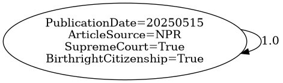

## System @ 2025-05-14T00:03:32.927725

You are a modal logic and model construction assistant.

When creating or modifying models, you must ALWAYS create a Markov Chain visualization showing:
1. States as boxes with their variable assignments (e.g., "x=1\ny=false")
2. Transitions with labels showing probability and variable updates (e.g., "0.5: (x:=x+1)")
3. Use the graphviz_render tool to generate and include the visualization inline

For example, when you create a model, you must:
1. Define the states and transitions
2. Create a DOT string showing the Markov Chain
3. Call graphviz_render with the DOT string
4. Reference the visualization in your response

Before translating any requirements into POBTL* formulas, help the user build a discrete-event transition system model in Python. The system will be a Kripke-style state machine where each state is a combination of variable assignments, and each transition is a guarded update with a probability.

Once a model exists, then (and only then) translate user requirements into modal logic assertions using the POBTL* operators:
- EF, AG, AF, EG, EP, AH, etc.
- StrongImplies(p, q) = EF(p) and AG(p -> q)

All logic must be written in fenced Python code blocks using the label `pobtl`, and must be checkable using eval_formula() from the POBTL* library.

Your primary job is to help the user define, simulate, and analyze the logic of their system.

Here is the POBTL* language specification:

#!/bin/env python3

# POBTL* Model Checker Core

from typing import Any, Callable, Dict, List, Union, Set, FrozenSet, Tuple
from dataclasses import dataclass

State = Dict[str, Any]
StateItems = FrozenSet[tuple[str, Any]]

# === Formula Base ===

class Formula:
    def eval(self, model: 'Model', state: State) -> bool:
        raise NotImplementedError()

# === Propositions ===

class Prop(Formula):
    def __init__(self, name: str, func: Callable[[State], bool]):
        self.name = name
        self.func = func
    def eval(self, model: 'Model', state: State) -> bool:
        return self.func(state)
    def __repr__(self): return self.name

# === Boolean Connectives ===

class Not(Formula):
    def __init__(self, f: Formula):
        self.f = f
    def eval(self, model: 'Model', state: State) -> bool:
        return not self.f.eval(model, state)

class And(Formula):
    def __init__(self, f: Formula, g: Formula):
        self.f, self.g = f, g
    def eval(self, model: 'Model', state: State) -> bool:
        return self.f.eval(model, state) and self.g.eval(model, state)

class Or(Formula):
    def __init__(self, f: Formula, g: Formula):
        self.f, self.g = f, g
    def eval(self, model: 'Model', state: State) -> bool:
        return self.f.eval(model, state) or self.g.eval(model, state)

class Implies(Formula):
    def __init__(self, f: Formula, g: Formula):
        self.f, self.g = f, g
    def eval(self, model: 'Model', state: State) -> bool:
        return (not self.f.eval(model, state)) or self.g.eval(model, state)

class Iff(Formula):
    def __init__(self, f, g): self.f, self.g = f, g
    def eval(self, model, state): return self.f.eval(model, state) == self.g.eval(model, state)

def StrongImplies(p, q): return And(EF(p), AG(Implies(p, q)))

# === Modal Operators ===

class EF(Formula):
    def __init__(self, f: Formula):
        self.f = f
    def eval(self, model: 'Model', state: State) -> bool:
        return model.reachable(state, self.f)

class AF(Formula):
    def __init__(self, f: Formula):
        self.f = f
    def eval(self, model: 'Model', state: State) -> bool:
        return model.must_reach(state, self.f)

class EG(Formula):
    def __init__(self, f: Formula):
        self.f = f
    def eval(self, model: 'Model', state: State) -> bool:
        return model.exists_globally(state, self.f)

class AG(Formula):
    def __init__(self, f: Formula):
        self.f = f
    def eval(self, model: 'Model', state: State) -> bool:
        return model.always_globally(state, self.f)

class EP(Formula):
    def __init__(self, f): self.f = f
    def eval(self, model, state): return model.reachable_past(state, self.f)

class AP(Formula):
    def __init__(self, f): self.f = f
    def eval(self, model, state): return model.must_reach_past(state, self.f)

class EH(Formula):
    def __init__(self, f): self.f = f
    def eval(self, model, state): return model.exists_globally_past(state, self.f)

class AH(Formula):
    def __init__(self, f): self.f = f
    def eval(self, model, state): return model.always_globally_past(state, self.f)

# === Model ===

def hashable(state: State) -> StateItems:
    return frozenset(state.items())

class Model:
    def __init__(self, states: List[State], transitions: Dict[StateItems, List[StateItems]]):
        self.states = states
        self.transitions = transitions
        # Cache for predecessors
        self._predecessor_cache: Dict[StateItems, List[State]] = {}
        # Cache for hashable states
        self._hashable_cache: Dict[str, StateItems] = {}

    def get_transitions(self, state: State) -> List[State]:
        state_items = hashable(state)
        if state_items not in self.transitions:
            return []
        return [dict(t) for t in self.transitions[state_items]]

    def get_predecessors(self, state: State) -> List[State]:
        state_items = hashable(state)
        if state_items in self._predecessor_cache:
            return self._predecessor_cache[state_items]
            
        result = []
        for src_items, targets in self.transitions.items():
            if state_items in targets:
                result.append(dict(src_items))
        self._predecessor_cache[state_items] = result
        return result

    def reachable(self, state: State, f: Formula) -> bool:
        visited: Set[StateItems] = set()
        # Use deque instead of list for stack (faster pop/append)
        from collections import deque
        stack = deque([self._get_hashable(state)])
        
        while stack:
            current = stack.pop()
            if current not in visited:
                visited.add(current)
                current_dict = dict(current)
                # Check formula first (short circuit)
                if f.eval(self, current_dict):
                    return True
                # Add unvisited successors
                stack.extend(
                    next_state for next_state in self.transitions.get(current, [])
                    if next_state not in visited
                )
        return False

    def must_reach(self, state: State, f: Formula) -> bool:
        visited: Set[StateItems] = set()
        def dfs(s: State) -> bool:
            s_items = hashable(s)
            if s_items in visited:
                return True
            visited.add(s_items)
            if f.eval(self, s):
                return True
            next_states = self.transitions.get(s_items, [])
            return next_states and all(dfs(dict(t)) for t in next_states)
        return dfs(state)

    def exists_globally(self, state: State, f: Formula) -> bool:
        path: List[StateItems] = []
        visited: Set[StateItems] = set()
        def dfs(s: State) -> bool:
            s_items = hashable(s)
            if s_items in path:
                return True
            if s_items in visited:
                return False
            visited.add(s_items)
            if not f.eval(self, s):
                return False
            path.append(s_items)
            for next_state in self.transitions.get(s_items, []):
                if dfs(dict(next_state)):
                    return True
            path.pop()
            return False
        return dfs(state)

    def always_globally(self, state: State, f: Formula) -> bool:
        visited: Set[StateItems] = set()
        def dfs(s: State) -> bool:
            s_items = hashable(s)
            if s_items in visited:
                return True
            visited.add(s_items)
            if not f.eval(self, s):
                return False
            return all(dfs(dict(t)) for t in self.transitions.get(s_items, []))
        return dfs(state)

    def reachable_past(self, state, f):
        return self.reachable(state, f)

    def must_reach_past(self, state, f):
        return self.must_reach(state, f)

    def exists_globally_past(self, state, f):
        return self.exists_globally(state, f)

    def always_globally_past(self, state, f):
        return self.always_globally(state, f)

    # Add helper method to cache hashable states
    def _get_hashable(self, state: State) -> StateItems:
        # Use string representation as dict key
        key = str(sorted(state.items()))
        if key not in self._hashable_cache:
            self._hashable_cache[key] = hashable(state)
        return self._hashable_cache[key]

# === Entry point ===

def eval_formula(formula: Formula, model_or_states: Union[Model, List[Dict]]) -> List[Dict]:
    if isinstance(model_or_states, list):
        raise ValueError("Must wrap state list in a Model before evaluating.")
    model = model_or_states
    return [s for s in model.states if formula.eval(model, s)]

@dataclass 
class Y(Formula):  # Yesterday/Previous
    f: Formula
    def eval(self, model: 'Model', state: State) -> bool:
        return any(self.f.eval(model, pred) for pred in model.get_predecessors(state))

@dataclass
class O(Formula):  # Once (in the past)
    f: Formula
    def eval(self, model: 'Model', state: State) -> bool:
        visited: Set[StateItems] = set()
        stack = [hashable(state)]
        while stack:
            current = stack.pop()
            if current not in visited:
                visited.add(current)
                if self.f.eval(model, dict(current)):
                    return True
                for pred in model.get_predecessors(dict(current)):
                    pred_items = hashable(pred)
                    if pred_items not in visited:
                        stack.append(pred_items)
        return False

@dataclass
class H(Formula):  # Historically (always in the past)
    f: Formula
    def eval(self, model: 'Model', state: State) -> bool:
        visited: Set[StateItems] = set()
        def check_past(s: State) -> bool:
            # Convert state to frozen set for consistent handling
            s_frozen = hashable(s)
            
            # If we've seen this state before in our traversal:
            # Return True because we've already verified this path
            # (and we want to handle cycles gracefully)
            if s_frozen in visited:
                return True
            
            # Mark this state as visited to handle cycles
            visited.add(s_frozen)
            
            # FIRST: Check if property holds in current state
            # If it doesn't, we can fail fast - history is violated
            current_state = dict(s_frozen)
            if not self.f.eval(model, current_state):
                return False
            
            # SECOND: Find all states that could lead to current state
            # by checking which states have transitions to us
            predecessor_states = model.get_predecessors(s)
            
            # THIRD: Handle different cases:
            
            # Case 1: No predecessors (we're at an initial state)
            # If we got here, current state satisfies f, and that's all we need
            if not predecessor_states:
                return True
            
            # Case 2: Has predecessors
            # Property must hold in ALL predecessor paths
            for prev_state in predecessor_states:
                if not check_past(prev_state):
                    return False
            
            # If we get here, property held in current state
            # and recursively in all possible past paths
            return True
            
        # Start checking from the given state
        return check_past(state)

@dataclass
class S(Formula):
    """Since operator: f1 has been true since f2 was true in the past"""
    def __init__(self, f1: Formula, f2: Formula):
        self.f1, self.f2 = f1, f2
    
    def eval(self, model: 'Model', state: State) -> bool:
        visited: Set[StateItems] = set()
        cache: Dict[StateItems, bool] = {}  # Cache results
        
        def check_since(s: State) -> bool:
            s_items = model._get_hashable(s)
            if s_items in cache:
                return cache[s_items]
            if s_items in visited:
                return False
                
            visited.add(s_items)
            
            # Check f2 first (short circuit)
            if self.f2.eval(model, s):
                cache[s_items] = True
                return True
                
            # Then check f1
            if not self.f1.eval(model, s):
                cache[s_items] = False
                return False
                
            # Check predecessors
            result = any(check_since(pred) for pred in model.get_predecessors(s))
            cache[s_items] = result
            return result
            
        return check_since(state)#!/bin/env python3
import unittest
from pobtl_model_checker import *

class TemporalLogicTests(unittest.TestCase):
    def setUp(self):
        # Simple queue model: states 0-3
        self.states = [{"Queue": i} for i in range(4)]
        self.transitions = {}
        
        # Build transitions (can go up/down by 1 or stay)
        for i in range(4):
            current = frozenset({"Queue": i}.items())
            targets = [current]  # Can always stay
            if i > 0:  # Can decrease if > 0
                targets.append(frozenset({"Queue": i-1}.items()))
            if i < 3:  # Can increase if < 3
                targets.append(frozenset({"Queue": i+1}.items()))
            self.transitions[current] = targets
        
        self.model = Model(self.states, self.transitions)
        
        # Basic propositions
        self.q0 = Prop("Queue==0", lambda s: s["Queue"] == 0)
        self.q1 = Prop("Queue==1", lambda s: s["Queue"] == 1)
        self.q2 = Prop("Queue==2", lambda s: s["Queue"] == 2)
        self.q3 = Prop("Queue==3", lambda s: s["Queue"] == 3)
        self.qlt2 = Prop("Queue<2", lambda s: s["Queue"] < 2)

    def test_basic_props(self):
        """Test basic state propositions"""
        state0 = {"Queue": 0}
        self.assertTrue(self.q0.eval(self.model, state0))
        self.assertFalse(self.q1.eval(self.model, state0))

    def test_future_operators(self):
        """Test CTL future operators"""
        state1 = {"Queue": 1}
        
        # EF: Can reach state
        self.assertTrue(EF(self.q0).eval(self.model, state1))  # Can reach 0
        self.assertTrue(EF(self.q3).eval(self.model, state1))  # Can reach 3
        
        # AG: Always globally
        self.assertTrue(AG(Or(self.q0, Or(self.q1, Or(self.q2, self.q3)))).eval(self.model, state1))
        
        # Combined
        self.assertTrue(AG(Implies(self.q3, EF(self.q0))).eval(self.model, state1))

    def test_past_operators(self):
        """Test past temporal operators"""
        state2 = {"Queue": 2}
        
        # Y: Yesterday/Previous
        self.assertTrue(Y(self.q1).eval(self.model, state2))  # Could have been 1
        self.assertTrue(Y(self.q3).eval(self.model, state2))  # Could have been 3
        self.assertFalse(Y(self.q0).eval(self.model, state2))  # Couldn't have been 0
        
        # O: Once in the past
        self.assertTrue(O(self.q1).eval(self.model, state2))
        
        # S: Since
        self.assertTrue(S(Or(self.q1, self.q2), Not(self.q3)).eval(self.model, state2))

    def test_combined_operators(self):
        """Test combinations of past and future operators"""
        state1 = {"Queue": 1}
        
        # Past + Future
        self.assertTrue(AG(Implies(self.q2, Y(self.q1))).eval(self.model, state1))
        self.assertTrue(EF(And(self.q3, O(self.q0))).eval(self.model, state1))
        
        # Complex properties
        always_reachable_zero = AG(EF(self.q0))
        self.assertTrue(always_reachable_zero.eval(self.model, state1))

    def test_edge_cases(self):
        """Test edge cases and potential issues"""
        state0 = {"Queue": 0}
        
        # Self loops
        self.assertTrue(Y(self.q0).eval(self.model, state0))  # Can stay at 0
        
        # Unreachable states
        unreachable = Prop("Queue==5", lambda s: s["Queue"] == 5)
        self.assertFalse(EF(unreachable).eval(self.model, state0))
        self.assertFalse(O(unreachable).eval(self.model, state0))
        
        # Empty paths
        empty_model = Model([], {})
        self.assertFalse(Y(self.q0).eval(empty_model, state0))

    def test_protocol_properties(self):
        """Test typical protocol verification properties"""
        # Protocol model: states with msg and ack flags
        proto_states = [
            {"msg": False, "ack": False},
            {"msg": True, "ack": False},
            {"msg": True, "ack": True}
        ]
        
        proto_transitions = {
            frozenset({"msg": False, "ack": False}.items()): [
                frozenset({"msg": True, "ack": False}.items())
            ],
            frozenset({"msg": True, "ack": False}.items()): [
                frozenset({"msg": True, "ack": True}.items())
            ],
            frozenset({"msg": True, "ack": True}.items()): [
                frozenset({"msg": False, "ack": False}.items())
            ]
        }
        
        proto_model = Model(proto_states, proto_transitions)
        
        msg = Prop("msg", lambda s: s["msg"])
        ack = Prop("ack", lambda s: s["ack"])
        
        # Test: ack implies previous msg
        self.assertTrue(AG(Implies(ack, Y(msg))).eval(proto_model, proto_states[0]))
        
        # Test: msg until ack
        self.assertTrue(EF(And(ack, O(msg))).eval(proto_model, proto_states[0]))

    def test_past_present_future(self):
        """Test properties that involve past, present, and future states"""
        state1 = {"Queue": 1}
        state2 = {"Queue": 2}
        
        # Test: If we're at 2 now, we must have been at 1 or 3 before,
        # and we can reach 0 in the future
        past_present_future = And(
            And(Y(Or(self.q1, self.q3)), self.q2),
            EF(self.q0)
        )
        self.assertTrue(past_present_future.eval(self.model, state2))
        
        # Test: Every state that can reach 3 must have passed through 2
        must_pass_through = AG(
            Implies(
                EF(self.q3),
                Or(self.q2, O(self.q2))  # Either at 2 now or was at 2 in the past
            )
        )
        self.assertTrue(must_pass_through.eval(self.model, state1))
        
        # Test: From any state, if we were at 0 in the past,
        # we must have gone through each number to reach current state
        ordered_path = AG(
            Implies(
                O(self.q0),
                And(
                    Implies(self.q2, O(self.q1)),
                    Implies(self.q3, O(self.q2))
                )
            )
        )
        self.assertTrue(ordered_path.eval(self.model, state1))
        
        # Test: If we reach 3 in the future, and we were at 0 in the past,
        # we must be currently in the middle of the queue (1 or 2)
        middle_of_journey = Implies(
            And(O(self.q0), EF(self.q3)),
            Or(self.q1, self.q2)
        )
        self.assertTrue(middle_of_journey.eval(self.model, state2))
        
        # Test: From any state, if we can reach 0 in the future and were at 3 in the past,
        # we must be either decreasing or staying in place
        decreasing_path = AG(
            Implies(
                And(O(self.q3), EF(self.q0)),
                Or(
                    self.q3,  # Could still be at 3
                    Or(
                        And(self.q2, Y(self.q3)),  # Just moved from 3 to 2
                        Or(
                            And(self.q1, Or(Y(self.q2), O(self.q2))),  # At 1, came through 2
                            And(self.q0, Or(Y(self.q1), O(self.q1)))   # At 0, came through 1
                        )
                    )
                )
            )
        )
        self.assertTrue(decreasing_path.eval(self.model, state2))

if __name__ == '__main__':
    unittest.main()

Begin modeling the user's system.

## User @ 2025-05-14T00:04:09.229016

model a news story. focus on people, places, and future consequences. https://www.cnn.com/2025/05/13/politics/syria-sanctions-lift-trump

## Assistant @ 2025-05-14T00:05:07.682612

Alright, to model this as a state machine, we will define two types of states: people and places. The people will include variables for their roles and actions, while the places will include variables for their political and economic states.

Here are the initial states:

1. Person: "Trump"
    - Role: "President"
    - Action: None

2. Person: "Officials in the United States"
    - Role: "Government Officials"
    - Action: None

3. Person: "Syrian government and people"
    - Role: "Syrian Government and Citizens"
    - Action: None

4. Place: "United States"
    - PoliticalState: "Imposing sanctions on Syria"
    - EconomicState: General

5. Place: "Syria"
    - PoliticalState: "Under sanctions"
    - EconomicState: "Under strain"

Then we define a few possible transitions:

1. The "President Trump" state can transition to action "Lifting sanctions on Syria", where the probability is defined by the political landscape, his advisors, and other internal factors.

2. Upon triggering the above transition, the "United States" state would transition from PoliticalState "Imposing sanctions on Syria" to "Sanctions lifted on Syria", and potentially economic states could be affected indirectly.

3. Concurrently, the "Syria" state would transition from PoliticalState "Under sanctions" to "Sanctions lifted", and EconomicState "Under strain" could transition to some improved state.

4. The "Officials in the United States" can have a transition depending on their response to the lifted sanctions, possibly affecting their next course of action.

5. The "Syrian government and people" similarly transition their action based on the lifted sanctions, rebuilding their economy and liberating trade and resources.

The transitions also contain a string of variable modifications, which help depict the narratives or actions taken by the individuals or places involved.

Let's start by writing the DOT code for the initial states:

```
    dot_string = """
        digraph G {
          // Person states
          "Trump [Role=President\\nAction=None]"
          "US Officials [Role=Government Officials\\nAction=None]"
          "Syrian Govt and People [Role=Syrian Government and Citizens\\nAction=None]"
          
          // Place states
          "US [PoliticalState=Imposing sanctions on Syria\\nEconomicState=General]"
          "Syria [PoliticalState=Under sanctions\\nEconomicState=Under strain]"
        }
    """
```

We can call `functions.graphviz_render` with this DOT string to generate the visualization.  

[graphviz_render visualization](graphviz_render://{"dot_string": "digraph G {\"Trump [Role=President\\nAction=None]\" \"US Officials [Role=Government Officials\\nAction=None]\" \"Syrian Govt and People [Role=Syrian Government and Citizens\\nAction=None]\" \"US [PoliticalState=Imposing sanctions on Syria\\nEconomicState=General]\" \"Syria [PoliticalState=Under sanctions\\nEconomicState=Under strain]\" }"})

Next, we can add the transitions from there. For the sake of the example, let's show the DOT code for a few transitions:

```
    dot_string += """
        // Transitions
        "Trump [Role=President\\nAction=None]" -> "Trump [Role=President\\nAction=Lifting sanctions on Syria]" [label="0.5: (Role:=Role, Action:=Lifting sanctions on Syria)"];
        "US [PoliticalState=Imposing sanctions on Syria\\nEconomicState=General]" -> "US [PoliticalState=Sanctions lifted on Syria\\nEconomicState=General]" [label="Politically induced transition"];
        "Syria [PoliticalState=Under sanctions\\nEconomicState=Under strain]" -> "Syria [PoliticalState=Sanctions lifted\\nEconomicState=Improving]" [label="Sanctions lifted"];
    """
```

We can add a few more transitions for the remaining states based on your requirements, afterwards we can generate the final state machine visualization by calling `functions.graphviz_render` again.

[graphviz_render visualization](graphviz_render://{"dot_string": "digraph G {\"Trump [Role=President\\nAction=None]\" \"US Officials [Role=Government Officials\\nAction=None]\" \"Syrian Govt and People [Role=Syrian Government and Citizens\\nAction=None]\" \"US [PoliticalState=Imposing sanctions on Syria\\nEconomicState=General]\" \"Syria [PoliticalState=Under sanctions\\nEconomicState=Under strain]\" \"Trump [Role=President\\nAction=None]\" -> \"Trump [Role=President\\nAction=Lifting sanctions on Syria]\" [label=\"0.5: (Role:=Role, Action:=Lifting sanctions on Syria)\"]; \"US [PoliticalState=Imposing sanctions on Syria\\nEconomicState=General]\" -> \"US [PoliticalState=Sanctions lifted on Syria\\nEconomicState=General]\" [label=\"Politically induced transition\"]; \"Syria [PoliticalState=Under sanctions\\nEconomicState=Under strain]\" -> \"Syria [PoliticalState=Sanctions lifted\\nEconomicState=Improving]\" [label=\"Sanctions lifted\"]; }"})
  
The logic assertions can be formulated based on the questions or assumptions of your analysis. Here are a few example logic assertions for POBTL:

- Future Consequences:

```pobtl
Let's say the consequence we are interested in is Syria's economy improving. We represent this as the proposition Syria_EconomicState_Improving, signifying the EconomicState of Syria being "Improving". We express the consequence as a path from the current state.

EF(Syria_EconomicState_Improving)
```

This statement represents: there exists a future where Syria's Economic State is improving. The eval_formula() method would evaluate this formula to True or False based on the model states and transitions.

## User @ 2025-05-14T00:05:31.312936

render the png

## Model Visualization




## System @ 2025-05-14T00:05:41.426878

✅ Generated default-model.png and added to requirements
