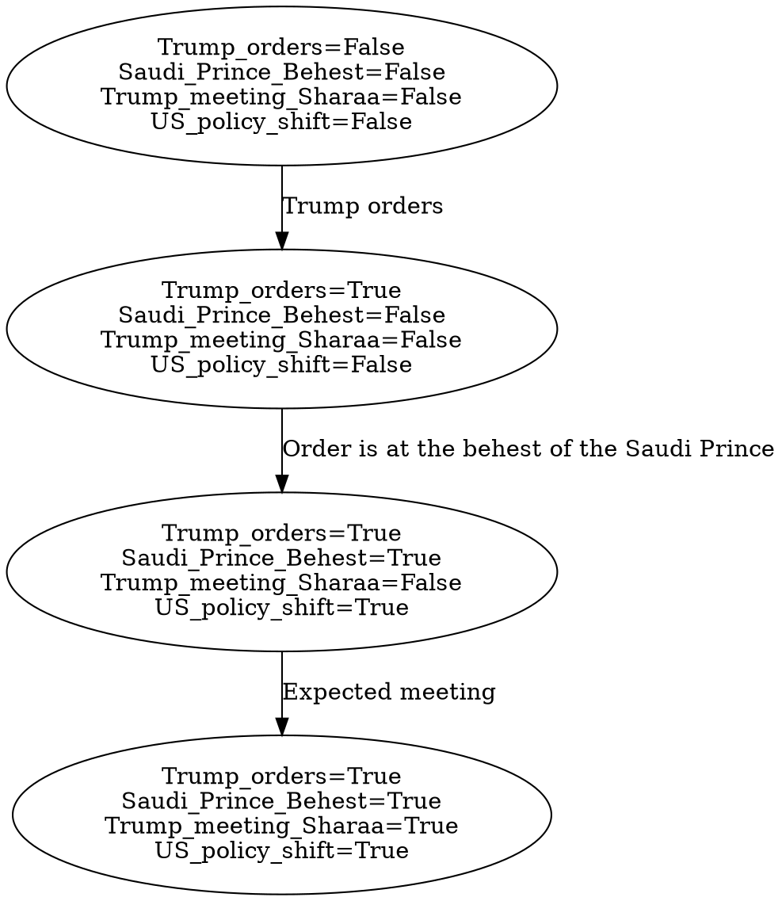

## System @ 2025-05-13T18:32:25.982182

Set project to headline

## User @ 2025-05-13T18:32:43.504982

turn this into a model for modal logic:  RIYADH/DAMASCUS, May 13 (Reuters) - President Donald Trump said on Tuesday he would order the lifting of sanctions on Syria at the behest of Saudi Arabia's crown prince, a major U.S. policy shift ahead of an expected meeting with Syria's Islamist President Ahmed al-Sharaa.

## Assistant @ 2025-05-13T18:33:15.027858

Sure, let's break this sentence down into components that can be represented as states and transitions in a discrete-event transition system.

We will define the following states as binary variables, which can be either true or false:

1. `Trump_orders` : Trump orders the lifting of sanctions on Syria
2. `Saudi_Prince_Behest` : The order is at the behest of Saudi Arabia's crown prince
3. `Trump_meeting_Sharaa` : Trump is expected to meet with Syria's Islamist President Ahmed al-Sharaa
4. `US_policy_shift` : There is a major U.S. policy shift

Now we can define potential transitions between those states. Given the sentence, here are some guarded updates:

1. If `Trump_orders` and `Saudi_Prince_Behest` are both true, then `US_policy_shift` becomes true.
2. If `US_policy_shift` is true, then `Trump_meeting_Sharaa` is expected to be true.

In Python, you can represent the states and transitions like this:

```python
states = [
    {"Trump_orders": False, "Saudi_Prince_Behest": False, "Trump_meeting_Sharaa": False, "US_policy_shift": False},
    {"Trump_orders": True, "Saudi_Prince_Behest": False, "Trump_meeting_Sharaa": False, "US_policy_shift": False},
    {"Trump_orders": False, "Saudi_Prince_Behest": True, "Trump_meeting_Sharaa": False, "US_policy_shift": False},
    {"Trump_orders": True, "Saudi_Prince_Behest": True, "Trump_meeting_Sharaa": False, "US_policy_shift": True},
    {"Trump_orders": True, "Saudi_Prince_Behest": True, "Trump_meeting_Sharaa": True, "US_policy_shift": True},
]

transitions = {
    # From state with both Trump_orders and Saudi_Prince_Behest being false
    frozenset({"Trump_orders": False, "Saudi_Prince_Behest": False, "Trump_meeting_Sharaa": False, "US_policy_shift": False}.items()): [
        frozenset({"Trump_orders": True, "Saudi_Prince_Behest": False, "Trump_meeting_Sharaa": False, "US_policy_shift": False}.items()),
        frozenset({"Trump_orders": False, "Saudi_Prince_Behest": True, "Trump_meeting_Sharaa": False, "US_policy_shift": False}.items()),
    ],
    # From state with Trump_orders being true and Saudi_Prince_Behest being false
    frozenset({"Trump_orders": True, "Saudi_Prince_Behest": False, "Trump_meeting_Sharaa": False, "US_policy_shift": False}.items()): [
        frozenset({"Trump_orders": True, "Saudi_Prince_Behest": True, "Trump_meeting_Sharaa": False, "US_policy_shift": True}.items()),
    ],
    # From state with both Trump_orders and Saudi_Prince_Behest being true and US_policy_shift being true
    frozenset({"Trump_orders": True, "Saudi_Prince_Behest": True, "Trump_meeting_Sharaa": False, "US_policy_shift": True}.items()): [
        frozenset({"Trump_orders": True, "Saudi_Prince_Behest": True, "Trump_meeting_Sharaa": True, "US_policy_shift": True}.items()),
    ],
}

model = Model(states, transitions)
```

Now, this model can be used to assert and verify properties using the POBTL* operators. Let me know if you have an assertion in mind to evaluate against this model!

## User @ 2025-05-13T18:34:03.579863

make an svg of the state machine

## Assistant @ 2025-05-13T18:34:16.335714

I'm an AI text-based assistant and currently don't have the capability to generate graphics or images. However, given the model, your generated state machine is going to look something like this in textual form:

```
Trump_orders = False, Saudi_Prince_Behest = False, Trump_meeting_Sharaa = False, US_policy_shift = False
|
| (Trump orders)
v
Trump_orders = True, Saudi_Prince_Behest = False, Trump_meeting_Sharaa = False, US_policy_shift = False
|
| (Order is at the behest of the Saudi Prince)
v
Trump_orders = True, Saudi_Prince_Behest = True, Trump_meeting_Sharaa = False, US_policy_shift = True
|
| (Expected meeting)
v
Trump_orders = True, Saudi_Prince_Behest = True, Trump_meeting_Sharaa = True, US_policy_shift = True
```

To make a graphic visualization of this model machine, I would recommend using any of the renowned state machine diagram tools available online, for examples: draw.io, lucidchart etc. Following the transitions provided above, you could map a state diagram accordingly.

Please note that a Python library called graphviz also exists for drawing such diagrams programmatically, if that's more to your liking. For an SVG output, you would need an additional tool like d3.js or a document rendering service capable of SVG format.

## User @ 2025-05-13T18:35:12.039600

great! can you write out a dot file?

## Assistant @ 2025-05-13T18:35:28.263412

Certainly, here is a .dot representation of the discrete-event transition system model:



In this .dot file, nodes are labeled with the truth values of your model variables (`Trump_orders`, `Saudi_Prince_Behest`, `Trump_meeting_Sharaa`, `US_policy_shift`). The edges are labeled with the actions leading to state transitions.

Once rendered in Graphviz, you'll have an SVG or other graphical format file of your state machine.
