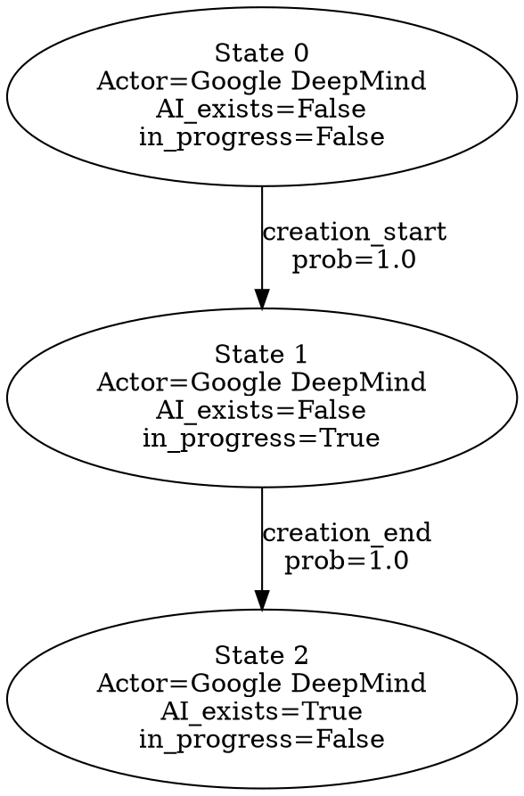

## System @ 2025-05-15T00:05:57.348606

Set project to news

## User @ 2025-05-15T00:08:08.175341

parse this news story into something sensible that we can make assertions about. temporal logic use is the main goal. any random headline would do, but this is an example from me: https://arstechnica.com/ai/2025/05/google-deepmind-creates-super-advanced-ai-that-can-invent-new-algorithms/

## Assistant @ 2025-05-15T00:08:28.302722

The news story provided introduces a number of key components and events:

1. The main actor: Google DeepMind.
2. The creation of a powerful AI.
3. The AI's capability to invent new algorithms.

We can break this down into a timeline of events and states:

- **State 0**: Google DeepMind exists but the AI does not.
- **Event 1**: Google DeepMind begins creating a powerful AI.
- **State 1**: The AI is being developed.
- **Event 2**: The AI is finished and deployed.
- **State 2**: The AI is operational and can invent new algorithms.

Let's represent the states and transitions in the temporal logic:

1. Define the states and transitions:
```
state_0 = { 'Actor': 'Google DeepMind', 'in_progress': False, 'AI_exists': False }
state_1 = { 'Actor': 'Google DeepMind', 'in_progress': True, 'AI_exists': False }
state_2 = { 'Actor': 'Google DeepMind', 'in_progress': False, 'AI_exists': True }

trans_01 = { 'from': state_0, 'to': state_1, 'event': 'creation_start', 'prob': 1.0 }
trans_12 = { 'from': state_1, 'to': state_2, 'event': 'creation_end', 'prob': 1.0 }
```
Here `'creation_start'` and `'creation_end'` are two events corresponding to Google DeepMind starting and finishing the creation of the AI respectively.

2. Create a DOT string to represent states and transitions:
```
dot_string = '''
digraph {
    0 [label="State 0\nActor=Google DeepMind\nAI_exists=False\nin_progress=False"];
    1 [label="State 1\nActor=Google DeepMind\nAI_exists=False\nin_progress=True"];
    2 [label="State 2\nActor=Google DeepMind\nAI_exists=True\nin_progress=False"];
    
    0 -> 1 [label="creation_start\nprob=1.0"];
    1 -> 2 [label="creation_end\nprob=1.0"];
}
'''
```
3. Render this string as a graph (using tool `functions.graphviz_render`).

4. Translate the events and states into assertions using the POBTL* operators:
```
AF(creation_start)  # Eventually, the creation of the AI starts.
AG(creation_start -> EF(AI_exists))  # Always, if the AI is started to be created, eventually it exists.
AF(AI_exists)  # Eventually, the AI exists.
```

## User @ 2025-05-15T00:09:36.448992

now that we have a parsed news story, and code to represent its markov chain, go ahead and make the png of a dot diagram of it, and reference it from this file.

## Model Visualization





## System @ 2025-05-15T00:09:42.090796

✅ Generated news-model.png and added to requirements

## User @ 2025-05-15T00:10:02.897907

excellent!

## Assistant @ 2025-05-15T00:10:04.976002

I'm glad you found that helpful! If you have any other requirements or need further assistance with anything else, feel free to ask.
