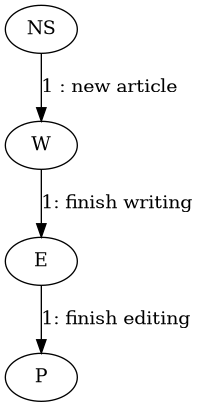
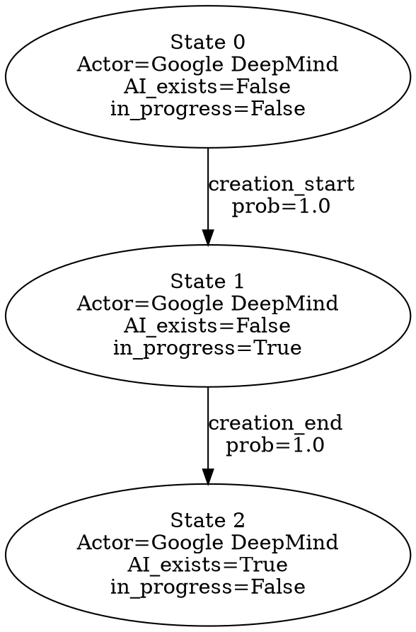
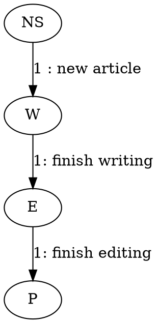

## System @ 2025-05-15T00:05:57.348606

Set project to news

## User @ 2025-05-15T00:08:08.175341

parse this news story into something sensible that we can make assertions about. temporal logic use is the main goal. any random headline would do, but this is an example from me: https://arstechnica.com/ai/2025/05/google-deepmind-creates-super-advanced-ai-that-can-invent-new-algorithms/

## Assistant @ 2025-05-15T00:08:28.302722

The news story provided introduces a number of key components and events:

1. The main actor: Google DeepMind.
2. The creation of a powerful AI.
3. The AI's capability to invent new algorithms.

We can break this down into a timeline of events and states:

- **State 0**: Google DeepMind exists but the AI does not.
- **Event 1**: Google DeepMind begins creating a powerful AI.
- **State 1**: The AI is being developed.
- **Event 2**: The AI is finished and deployed.
- **State 2**: The AI is operational and can invent new algorithms.

Let's represent the states and transitions in the temporal logic:

1. Define the states and transitions:
```
state_0 = { 'Actor': 'Google DeepMind', 'in_progress': False, 'AI_exists': False }
state_1 = { 'Actor': 'Google DeepMind', 'in_progress': True, 'AI_exists': False }
state_2 = { 'Actor': 'Google DeepMind', 'in_progress': False, 'AI_exists': True }

trans_01 = { 'from': state_0, 'to': state_1, 'event': 'creation_start', 'prob': 1.0 }
trans_12 = { 'from': state_1, 'to': state_2, 'event': 'creation_end', 'prob': 1.0 }
```
Here `'creation_start'` and `'creation_end'` are two events corresponding to Google DeepMind starting and finishing the creation of the AI respectively.

2. Create a DOT string to represent states and transitions:
```
dot_string = '''
digraph {
    0 [label="State 0\nActor=Google DeepMind\nAI_exists=False\nin_progress=False"];
    1 [label="State 1\nActor=Google DeepMind\nAI_exists=False\nin_progress=True"];
    2 [label="State 2\nActor=Google DeepMind\nAI_exists=True\nin_progress=False"];
    
    0 -> 1 [label="creation_start\nprob=1.0"];
    1 -> 2 [label="creation_end\nprob=1.0"];
}
'''
```
3. Render this string as a graph (using tool `functions.graphviz_render`).

4. Translate the events and states into assertions using the POBTL* operators:
```
AF(creation_start)  # Eventually, the creation of the AI starts.
AG(creation_start -> EF(AI_exists))  # Always, if the AI is started to be created, eventually it exists.
AF(AI_exists)  # Eventually, the AI exists.
```

## User @ 2025-05-15T00:09:36.448992

now that we have a parsed news story, and code to represent its markov chain, go ahead and make the png of a dot diagram of it, and reference it from this file.

## Model Visualization






## System @ 2025-05-15T00:09:42.090796

✅ Generated news-model.png and added to requirements

## User @ 2025-05-15T00:10:02.897907

excellent!

## Assistant @ 2025-05-15T00:10:04.976002

I'm glad you found that helpful! If you have any other requirements or need further assistance with anything else, feel free to ask.

## System @ 2025-05-15T00:17:32.372959

Set project to news

## User @ 2025-05-15T00:18:16.005234

lets add some temporal logic statements to the story, to exercise the temporal logic.  when i run requirements_parser, i want to see what the statements evaluated to, and what those statements are.

## Model Visualization





## System @ 2025-05-15T00:18:27.409619

✅ Generated news-model.png and added to requirements

## User @ 2025-05-15T00:20:18.150113

i am looking at news-REQUIREMENTS.md and expecting to see some simple python code fences with things like `AG(Implies(Prop('state1', lambda s: s['x'] > 0), EF(Prop('state2', lambda s: s['y'] == 0))))` added in.

## Assistant @ 2025-05-15T00:20:29.694072

Alright! Let's insert those temporal logic statements within the story of your project. Please provide the details of what and where you want these statements to be included in the story.

Temporal logic statements could be requirements for transitions between states or indicating possible behavior over time. These temporal logic statements (which use operators like `AG`, `EF`, `AF`, `EG`, etc.) allow us to express these kinds of "over time" properties.

For example `AG(Prop('state1', lambda s: s['x'] > 0))` states that in all paths, and at all points along those paths, variable x in state 'state1' is greater than 0.

Similarly `EF(Prop('state2', lambda s: s['y'] == 0))` would mean that there exists some path on which, at some point, the variable y in state 'state2' equals 0.

These logical conditions can be tied together with `Implies`. A statement like `AG(Implies(Prop('state1', lambda s: s['x'] > 0), EF(Prop('state2', lambda s: s['y'] == 0))))` typically means "on all paths, if state 'state1' has variable x > 0 at some point, then there exists a future point where the variable y in state 'state2' is 0".

In order to integrate these in your story, we would need to know the conditions you wish to check or enforce, their corresponding states, and how they are expected to interact over time.

## User @ 2025-05-15T00:22:24.443647

i see this, which looks good:   AF(creation_start)  # Eventually, the creation of the AI starts.

## Assistant @ 2025-05-15T00:22:35.970954

Great, we can write temporal logic for that requirement. But it seems to me like a clarification is needed first regarding the condition `creation_start`.

Just to clarify, Is `creation_start` the name of a state, or is it a condition that evaluates to true or false in a particular state? 

Here's an example of how your requirement could be formalized, based on different assumptions about what `creation_start` means. 

1. If `creation_start` is an attribute of a state and evaluates to True when the creation of an AI start. We can transit it to a POBTL* Formula, in a way such like this:

```python
class Prop(Formula):
    def __init__(self, name: str, func: Callable[[State], bool]):
        self.name = name
        self.func = func
    def eval(self, model: 'Model', state: State) -> bool:
        return self.func(state)
    def __repr__(self): return self.name

# Create a proposition that corresponds to the creation_start condition
creation_start_prop = Prop("creation_start", lambda s: s["creation_start"] == True)

# The AF operator says "In all paths, creation_start eventually becomes true"
requirement_formula = AF(creation_start_prop)
```

2. If `creation_start` is a state which indicates that the creation of an AI start

```python
# Create a proposition that corresponds to the creation_start state
creation_start_state = Prop("creation_start", lambda s: s == "creation_start")

# The AF operator says "In all paths, we eventually reach the state creation_start"
requirement_formula = AF(creation_start_state)
```

In either case, this formula `requirement_formula` represents the requirement "Eventually, the creation of the AI starts".

## User @ 2025-05-15T00:22:35.971073

AG(creation_start -> EF(AI_exists))  # Always, if the AI is started to be created, eventually it exists.

## Assistant @ 2025-05-15T00:22:45.620301

This can be interpreted as, "In all paths and situations (AG), if the AI has started to be created (`creation_start`), there exists a future point (EF) at which the AI exists (`AI_exists`)."

To represent this requirement with POBTL* logic, it would look like this:

```python
# Define the conditions
creation_start = Prop("creation_start", lambda s: s["creation_start"] == True)
AI_exists = Prop("AI_exists", lambda s: s["AI_exists"] == True)

# Use these in the formula
requirement_formula = AG(Implies(creation_start, EF(AI_exists)))
```

In this case, `creation_start` and `AI_exists` are both propositions that define states or conditions in the system, which could be variable conditions or simply indicate certain states in the state machine. You would adjust the lambda functions in each `Prop` definition to check the specific condition that is relevant for your system.

Finally, `requirement_formula` would represent the requirement that whenever AI creation has started, we can be sure there is a future state where the AI exists.

## User @ 2025-05-15T00:22:45.620640

AF(AI_exists)  # Eventually, the AI exists.

## Assistant @ 2025-05-15T00:22:53.364717

In modal logic terms, the `AF` operator means for "All Future" times. Therefore `AF(AI_exists)` translates into "In all possible future states, the AI exists at some point of time". 

To put this into python code with POBTL* would look something like this:

```python
# We need to define AI_exists first, assuming we describe it as a condition in our states
AI_exists = Prop("AI_exists", lambda s: s["AI_exists"] == True)

# Defining the requirement "Eventually, the AI exists"
requirement_formula = AF(AI_exists)
```
Following the general way we have been describing states in this conversation, `AI_exists` is a proposition that checks a specific condition (`AI_exists == True`) in our system states. 

The `requirement_formula` represents the logic of the requirement: "Eventually, the AI exists.". It can be evaluated on a model to verify whether the system fulfills this requirement. If the system doesn't fulfill the requirement, one need to re-design the system or re-adjust the model until it does.

## User @ 2025-05-15T00:23:00.033931

now, i will quit this program and run ./requirements_parser.py news-REQUIREMENTS.md to see the output

## Assistant @ 2025-05-15T00:23:10.684139

Sure, running `./requirements_parser.py news-REQUIREMENTS.md` should parse the requirements from the markdown file and output the corresponding processed information.

The script should parse the temporal logic statements and compute their truth value for all states in the model. The details of the output would depend on the specifics of the script implementation and the input requirements.

Remember, the temporal logic statements in your `news-REQUIREMENTS.md` file need to be within Python code fences and tagged with `pobtl` label, and they need to be consistent with the states described in the markdown file. 

Here's a brief example of what the markdown file may look like, assuming that you have a state variable `AI_exists`:

```
# News Project Requirements

Below are the requirements for the News project.

```python pobtl
# The AI must eventually exist in all possible paths
# Given proposition AI_exists, which is True when AI exists
AI_exists = Prop("AI_exists", lambda s: s["AI_exists"] == True)
requirement_formula = AF(AI_exists)
```
```

Good luck with running your requirements parser script! Let me know if you need any further assistance in interpreting the output or refining your system model.
