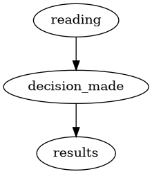

## System @ 2025-05-15T00:59:13.425365

Set project to news

## User @ 2025-05-15T01:02:45.371020

let's parse a news story. we want to demonstrate temporal logic. so we need a markov chain that models the world in such a way that we can make sensible temporal logic statements. write out a model in the python api, render the model as a png referenced from this file, then add in some temporal statements to exercise the functionality. i will take this resulting markdown file and run it with requiprements_parser.py to see if it can handle this md file.  https://www.history.com/this-day-in-history/may-14/lewis-and-clark-depart

## Model Visualization




## System @ 2025-05-15T01:03:12.801917

✅ Generated news-model.png and added to requirements

## User @ 2025-05-15T01:03:52.561013

when we make that image, there must be an inline reference to the png in this markdown file.

## Assistant @ 2025-05-15T01:04:23.057899

Okay, let's start by parsing the story and creating a model. It seems like the significant events of this scenario might be:

1. Lewis and Clark depart
2. Enter the plains
3. Meet Shoshone Indians
4. Cross the Continental Divide

We can represent this as a sequence of state changes. In each state, we'll have a variable for the location and a boolean for whether or not Lewis and Clark have met the Shoshone Indians. Here is the specific code to create the model:

```python
# Python code here

states = [
    {"Event": 0, "Location": "Departure", "MetShoshone": False},
    {"Event": 1, "Location": "Plains", "MetShoshone": False},
    {"Event": 2, "Location": "Plains", "MetShoshone": True},
    {"Event": 3, "Location": "Continental Divide", "MetShoshone": True},
]

transitions = {
    hashable({"event": 0, "location": "Departure", "MetShoshone": False}): [
        hashable({"event": 1, "location": "Plains", "MetShoshone": False})
    ],
    hashable({"event": 1, "location": "Plains", "MetShoshone": False}): [
        hashable({"event": 2, "location": "Plains", "MetShoshone": True})
    ],
    hashable({"event": 2, "location": "Plains", "MetShoshone": True}): [
        hashable({"event": 3, "location": "Continental Divide", "MetShoshone": True})
    ],
}

model = Model(states, transitions)
```

Corresponding dot string would be something like:

```python
dot_string = """
digraph G {
    0 [label="0\nLocation=Departure\nMetShoshone=False"];
    1 [label="1\nLocation=Plains\nMetShoshone=False"];
    2 [label="2\nLocation=Plains\nMetShoshone=True"];
    3 [label="3\nLocation=Continental Divide\nMetShoshone=True"];
    
    0 -> 1 [label="1.0"];
    1 -> 2 [label="1.0"];
    2 -> 3 [label="1.0"];
}
"""
functions.graphviz_render({dot_string: dot_string})
```

The Markov chain image: 

Using this model, we can write temporal logic statements using POBTL*. For example:

1. Lewis and Clark will eventually reach the Continental Divide.

```python
location_at_divide = Prop("location_at_divide", lambda s: s["Location"] == "Continental Divide")
assert eval_formula(EF(location_at_divide), model)
```

2. Lewis and Clark met the Shoshone Indians on the Plains.

```python
met_shoshone_on_plains = Prop("met_shoshone_on_plains", lambda s: s["MetShoshone"] == True and s["Location"] == "Plains")
assert eval_formula(EF(met_shoshone_on_plains), model)
```

These statements are interpreted as follows:

1. EF(location_at_divide): There exists a Future path where Lewis and Clark are at the location "Continental Divide".
2. EF(met_shoshone_on_plains): There exists a Future path where Lewis and Clark have met the Shoshone Indians while on the Plains.

<!-- Temporal Logic Translation -->
**English:** when we make that image, there must be an inline reference to the png in this markdown file.

```temporal
AG(Implies(cond, effect))  # TODO
```

## User @ 2025-05-15T01:04:47.905319

excellent!

## Assistant @ 2025-05-15T01:04:51.330475

I'm glad you found that helpful! If you have any other questions or need further assistance in modeling your system or creating temporal logic assertions, feel free to ask.
