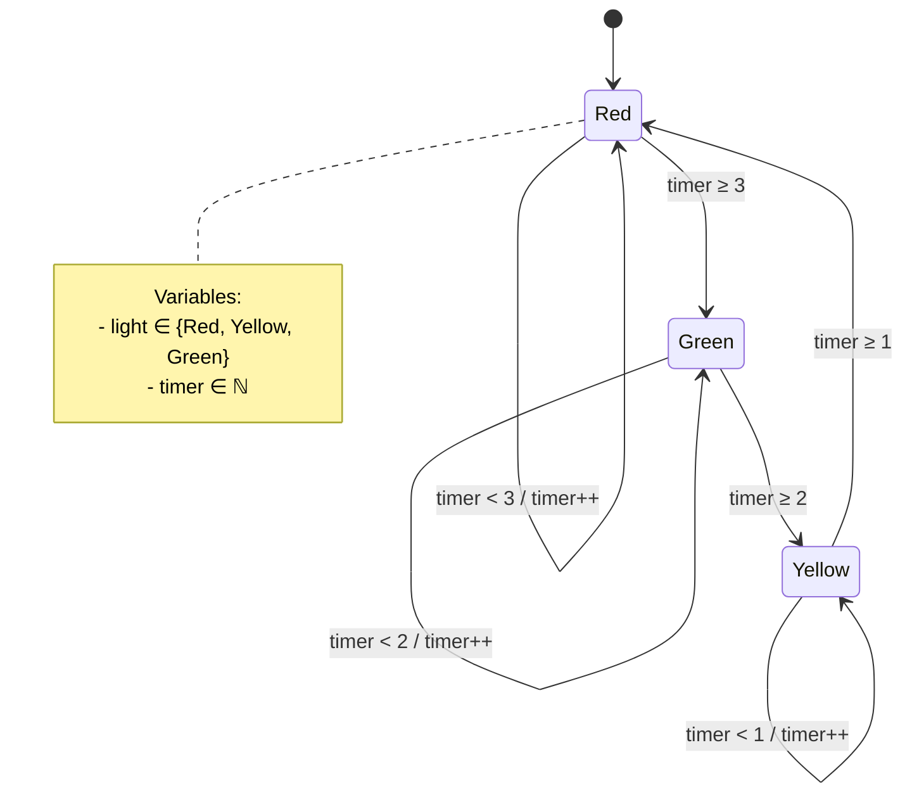
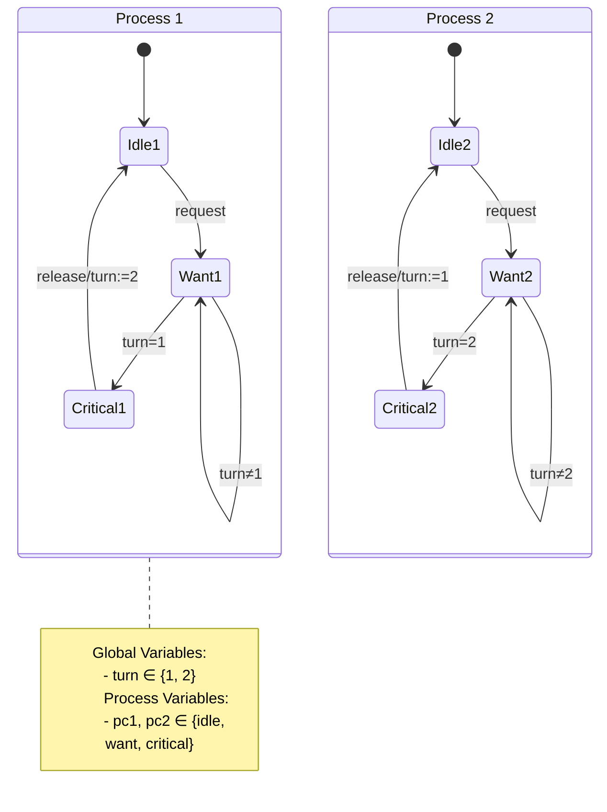
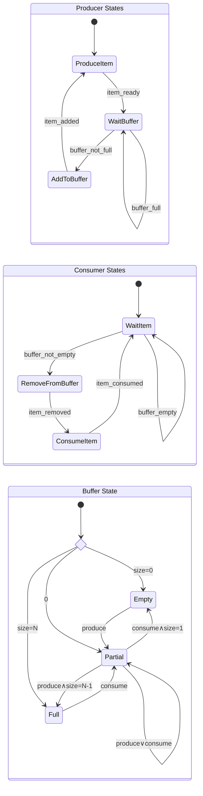
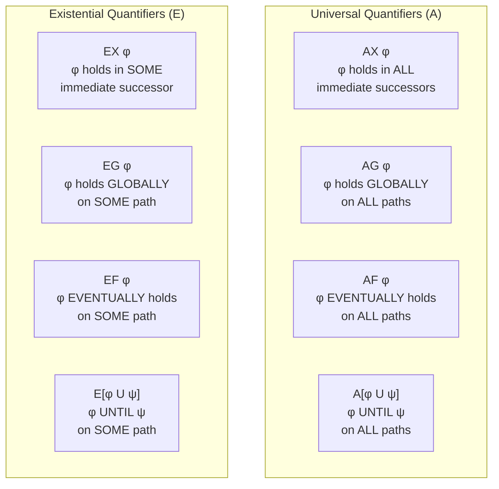

# CTL Model Checking with Z3

This repository demonstrates how to use Z3 SMT solver for **Computation Tree Logic (CTL)** model checking. CTL allows you to reason about properties of state machines with branching time semantics.

## Overview

CTL extends propositional logic with temporal operators that quantify over computation trees:
- **Path Quantifiers**: `A` (all paths) and `E` (exists path)  
- **Temporal Operators**: `X` (next), `G` (globally), `F` (finally), `U` (until)

## State Machine Examples

### 1. Traffic Light Controller

A simple traffic light that cycles through Red → Green → Yellow → Red with timing constraints.



**State Variables:**
- `light`: Current light color (0=Red, 1=Yellow, 2=Green)
- `timer`: Time spent in current state

**Transitions:**
- **Red → Green**: When `timer ≥ 3`, reset timer
- **Green → Yellow**: When `timer ≥ 2`, reset timer  
- **Yellow → Red**: When `timer ≥ 1`, reset timer
- **Self-loops**: Increment timer when guard not met

**CTL Properties:**
- `AG(Red → EF Green)`: "If red, then green is eventually reachable"
- `EF Green`: "Green is eventually reachable"
- `AG(¬(Red ∧ Green))`: "Never red and green simultaneously"

### 2. Two-Process Mutual Exclusion

Peterson's algorithm for mutual exclusion between two processes.



**State Variables:**
- `pc1`, `pc2`: Program counters (0=idle, 1=want, 2=critical)
- `turn`: Whose turn to enter critical section (1 or 2)

**Transitions:**
- **Idle → Want**: Process requests critical section
- **Want → Critical**: Process enters when it's their turn
- **Critical → Idle**: Process exits and gives turn to other

**CTL Properties:**
- `AG(¬(pc1=critical ∧ pc2=critical))`: "Mutual exclusion holds"
- `AG(pc1=want → AF(pc1=critical))`: "No starvation for process 1"
- `AG(pc2=want → AF(pc2=critical))`: "No starvation for process 2"

### 3. Producer-Consumer with Buffer

A producer-consumer system with a bounded buffer.



**State Variables:**
- `producer_state`: Current producer state
- `consumer_state`: Current consumer state  
- `buffer_size`: Number of items in buffer (0 ≤ size ≤ N)

**CTL Properties:**
- `AG(buffer_size ≤ N)`: "Buffer never overflows"
- `AG(buffer_size ≥ 0)`: "Buffer never underflows"
- `AG(producer_waiting → EF(¬buffer_full))`: "Producer eventually proceeds"
- `AG(consumer_waiting → EF(¬buffer_empty))`: "Consumer eventually proceeds"

## CTL Operator Semantics

### Path Quantifiers
- **A**: For **all** computation paths from current state
- **E**: There **exists** a computation path from current state

### Temporal Operators  
- **X φ** (Next): φ holds in the immediate next state
- **G φ** (Globally): φ holds in all future states
- **F φ** (Finally): φ holds in some future state
- **φ U ψ** (Until): φ holds until ψ becomes true

### Combined CTL Operators



## Z3 Implementation Strategy

### 1. Bounded Model Checking
- Create state variables for k time steps: `state_0, state_1, ..., state_k`
- Encode transition relation between consecutive states
- Model CTL operators as constraints over bounded sequences

### 2. State Representation
```python
# State variables for step i
state_i = {
    'var1': Int(f'var1_{i}'),
    'var2': Bool(f'var2_{i}'),  
    'valid': Bool(f'valid_{i}')  # Reachability flag
}
```

### 3. Transition Encoding
```python
# Guard → Assignments
transition = And(
    guard_condition(current_state),
    next_state['var1'] == new_value,
    next_state['var2'] == new_bool_value
)
```

### 4. CTL Property Verification
```python
# Check AG φ (φ holds globally on all paths)
def check_AG(phi):
    solver.add(Not(And([
        Implies(states[i]['valid'], phi(states[i])) 
        for i in range(k)
    ])))
    return solver.check() == unsat  # Unsatisfiable means property holds
```

## Usage Examples

### Traffic Light Verification
```python
# Property: "Green is eventually reachable"
property_EF_green = EF(lambda s: s['light'] == 2)

# Property: "Always: if red, then eventually green"  
property_AG_red_implies_EF_green = AG(
    lambda s: Implies(s['light'] == 0, EF_green_from_state(s))
)
```

### Mutual Exclusion Verification
```python
# Property: "Mutual exclusion always holds"
property_mutex = AG(
    lambda s: Not(And(s['pc1'] == 2, s['pc2'] == 2))
)

# Property: "No starvation - wanting eventually leads to critical"
property_no_starvation = AG(
    lambda s: Implies(s['pc1'] == 1, AF(lambda t: t['pc1'] == 2))
)
```

## Running the Examples

1. Install Z3: `pip install z3-solver`
2. Run the traffic light example: `python traffic_light_ctl.py`
3. Run the mutex example: `python mutex_ctl.py`
4. Check verification results and counterexample traces

## Key Benefits of Z3 for CTL

- **SMT Solving**: Handles complex arithmetic and data structures
- **Counterexamples**: Provides concrete execution traces when properties fail
- **Scalability**: Efficient bounded model checking for practical systems
- **Integration**: Easy to embed in larger verification workflows

## Limitations

- **Bounded Checking**: May miss bugs requiring longer traces
- **State Explosion**: Large state spaces can be challenging
- **Liveness**: Some liveness properties need fairness constraints

## Further Reading

- [Z3 Tutorial](https://ericpony.github.io/z3py-tutorial/guide-examples.htm)
- [CTL Model Checking](https://en.wikipedia.org/wiki/Computation_tree_logic)
- [Bounded Model Checking](https://www.cs.cmu.edu/~emc/papers/clarke-biere-raimi-zhu.pdf)