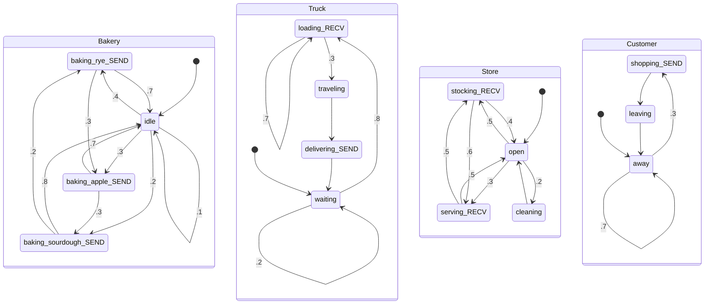
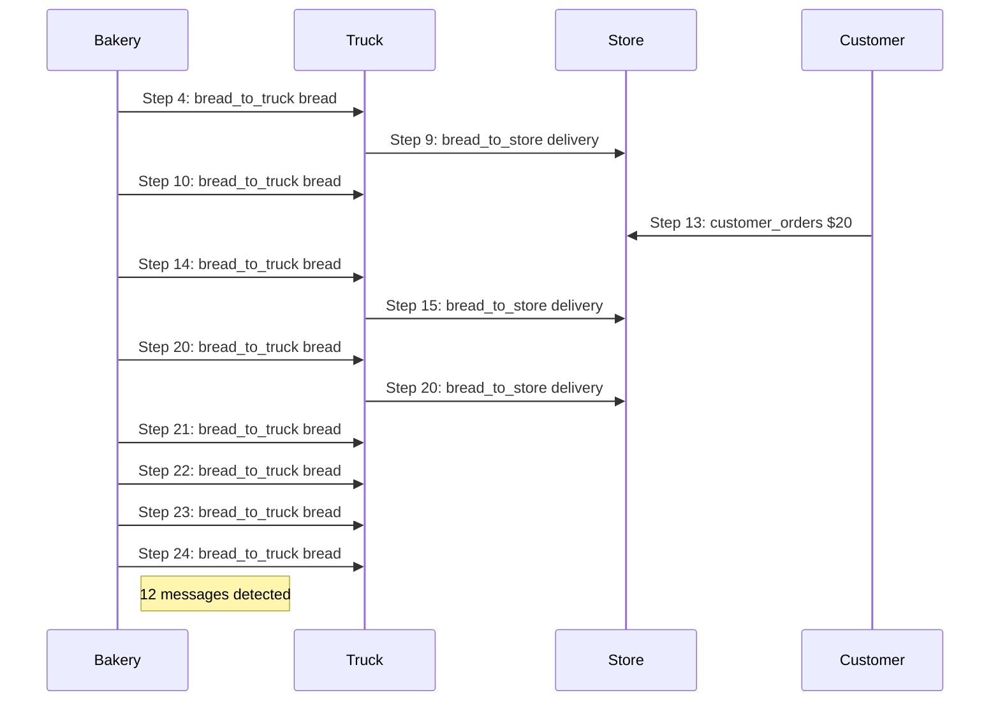
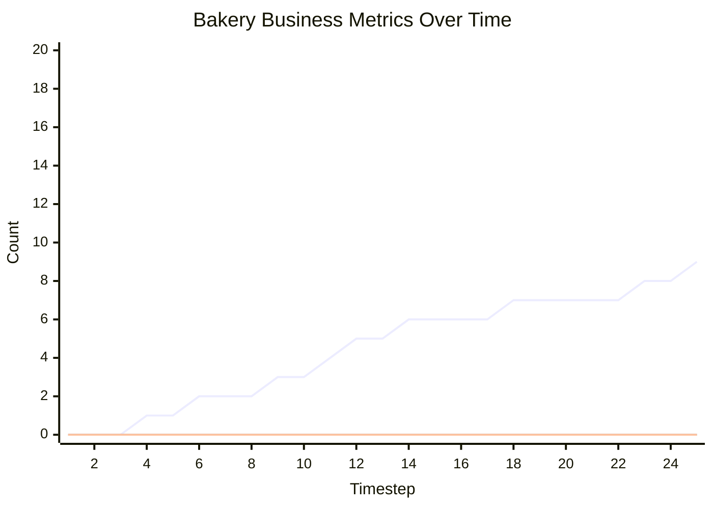

# Message Passing Markov Chain Business Process Simulation

This document contains an executable specification of a bakery business process using Message Passing Markov Chains.

## Synchronous Channel Example

```
=== STARTING SIMULATION ===
Initial state: {'ActorA': 'idle', 'ActorB': 'waiting'}

=== TIMESTEP 1 ===
ActorA: idle -> sending | Variables: {'counter': 0}
ActorB: waiting (stayed)

=== TIMESTEP 2 ===
    -> ActorA BLOCKED sending to ActorB
ActorA: sending (stayed) [BLOCKED] | Variables: {'counter': 1}
ActorB: waiting (stayed)

*** System reached stable state at timestep 2 ***

=== SIMULATION COMPLETE ===
Final state: {'ActorA': 'sending', 'ActorB': 'waiting'}
```

## Bakery Business Process Simulation

```
=== STARTING SIMULATION ===
Initial state: {'Bakery': 'idle', 'Truck': 'waiting', 'Store': 'open', 'Customer': 'away'}

=== TIMESTEP 1 ===
Bakery: idle (stayed) | Variables: {'breads_baked': 0, 'production_value': 0}
Truck: waiting -> loading | Variables: {'cargo': [], 'loads_received': 0, 'deliveries_made': 0}
Store: open -> stocking | Variables: {'inventory': [], 'items_stocked': 0, 'items_sold': 0, 'revenue': 0}
Customer: away (stayed) | Variables: {'purchases_attempted': 0, 'money_spent': 0}

=== TIMESTEP 2 ===
Bakery: idle -> baking_sourdough | Variables: {'breads_baked': 0, 'production_value': 0}
    -> Truck BLOCKED waiting to receive
Truck: loading (stayed) [BLOCKED] | Variables: {'cargo': [], 'loads_received': 0, 'deliveries_made': 0}
    -> Store BLOCKED waiting to receive
Store: stocking (stayed) [BLOCKED] | Variables: {'inventory': [], 'items_stocked': 0, 'items_sold': 0, 'revenue': 0}
Customer: away (stayed) | Variables: {'purchases_attempted': 0, 'money_spent': 0}

=== TIMESTEP 3 ===
    -> Bakery baked Sourdough ($10)
    -> Bakery sent {'type': 'Sourdough', 'price': 10} to Truck
Bakery: baking_sourdough -> idle | Variables: {'breads_baked': 1, 'production_value': 10}
    -> Truck received {'type': 'Sourdough', 'price': 10} into bread
Truck: loading (stayed) | Variables: {'cargo': [], 'loads_received': 0, 'deliveries_made': 0, 'bread': {'type': 'Sourdough', 'price': 10}}
    -> Store BLOCKED waiting to receive
Store: stocking (stayed) [BLOCKED] | Variables: {'inventory': [], 'items_stocked': 0, 'items_sold': 0, 'revenue': 0}
Customer: away (stayed) | Variables: {'purchases_attempted': 0, 'money_spent': 0}

=== TIMESTEP 4 ===
Bakery: idle -> baking_rye | Variables: {'breads_baked': 1, 'production_value': 10}
    -> Truck loaded Sourdough bread
    -> Truck BLOCKED waiting to receive
Truck: loading (stayed) [BLOCKED] | Variables: {'cargo': [{'type': 'Sourdough', 'price': 10}], 'loads_received': 1, 'deliveries_made': 0, 'bread': {'type': 'Sourdough', 'price': 10}}
    -> Store BLOCKED waiting to receive
Store: stocking (stayed) [BLOCKED] | Variables: {'inventory': [], 'items_stocked': 0, 'items_sold': 0, 'revenue': 0}
Customer: away (stayed) | Variables: {'purchases_attempted': 0, 'money_spent': 0}

=== TIMESTEP 5 ===
    -> Bakery baked Rye ($12)
    -> Bakery sent {'type': 'Rye', 'price': 12} to Truck
Bakery: baking_rye -> idle | Variables: {'breads_baked': 2, 'production_value': 22}
    -> Truck received {'type': 'Rye', 'price': 12} into bread
Truck: loading -> traveling | Variables: {'cargo': [{'type': 'Sourdough', 'price': 10}], 'loads_received': 1, 'deliveries_made': 0, 'bread': {'type': 'Rye', 'price': 12}}
    -> Store BLOCKED waiting to receive
Store: stocking (stayed) [BLOCKED] | Variables: {'inventory': [], 'items_stocked': 0, 'items_sold': 0, 'revenue': 0}
Customer: away (stayed) | Variables: {'purchases_attempted': 0, 'money_spent': 0}

=== TIMESTEP 6 ===
Bakery: idle (stayed) | Variables: {'breads_baked': 2, 'production_value': 22}
Truck: traveling -> delivering | Variables: {'cargo': [{'type': 'Sourdough', 'price': 10}], 'loads_received': 1, 'deliveries_made': 0, 'bread': {'type': 'Rye', 'price': 12}}
    -> Store BLOCKED waiting to receive
Store: stocking (stayed) [BLOCKED] | Variables: {'inventory': [], 'items_stocked': 0, 'items_sold': 0, 'revenue': 0}
Customer: away -> shopping | Variables: {'purchases_attempted': 0, 'money_spent': 0}

=== TIMESTEP 7 ===
Bakery: idle -> baking_apple | Variables: {'breads_baked': 2, 'production_value': 22}
    -> DEBUG: Truck attempting delivery, cargo: 1 items
    -> Truck delivering Sourdough to store
    -> DEBUG: Resolved 'delivering_bread' to {'type': 'Sourdough', 'price': 10}
    -> Truck sent {'type': 'Sourdough', 'price': 10} to Store
    -> DEBUG: Truck delivery SUCCESS! Channel capacity: 3
Truck: delivering -> waiting | Variables: {'cargo': [], 'loads_received': 1, 'deliveries_made': 1, 'bread': {'type': 'Rye', 'price': 12}, 'delivering_bread': {'type': 'Sourdough', 'price': 10}}
    -> Store received {'type': 'Sourdough', 'price': 10} into bread_delivery
Store: stocking -> open | Variables: {'inventory': [], 'items_stocked': 0, 'items_sold': 0, 'revenue': 0, 'bread_delivery': {'type': 'Sourdough', 'price': 10}}
    -> Customer attempting to buy bread with $20
    -> DEBUG: Resolved 'current_payment' to 20
    -> Customer sent 20 to Store
Customer: shopping -> leaving | Variables: {'purchases_attempted': 1, 'money_spent': 20, 'current_payment': 20}

=== TIMESTEP 8 ===
    -> Bakery baked Apple ($15)
    -> Bakery sent {'type': 'Apple', 'price': 15} to Truck
Bakery: baking_apple -> idle | Variables: {'breads_baked': 3, 'production_value': 37}
Truck: waiting (stayed) | Variables: {'cargo': [], 'loads_received': 1, 'deliveries_made': 1, 'bread': {'type': 'Rye', 'price': 12}, 'delivering_bread': {'type': 'Sourdough', 'price': 10}}
Store: open -> stocking | Variables: {'inventory': [], 'items_stocked': 0, 'items_sold': 0, 'revenue': 0, 'bread_delivery': {'type': 'Sourdough', 'price': 10}}
Customer: leaving -> away | Variables: {'purchases_attempted': 1, 'money_spent': 20, 'current_payment': 20}

=== TIMESTEP 9 ===
Bakery: idle -> baking_rye | Variables: {'breads_baked': 3, 'production_value': 37}
Truck: waiting -> loading | Variables: {'cargo': [], 'loads_received': 1, 'deliveries_made': 1, 'bread': {'type': 'Rye', 'price': 12}, 'delivering_bread': {'type': 'Sourdough', 'price': 10}}
    -> DEBUG: Store received bread_delivery: {'type': 'Sourdough', 'price': 10} (type: <class 'dict'>)
    -> Store stocked Sourdough on shelves
    -> Store BLOCKED waiting to receive
Store: stocking (stayed) [BLOCKED] | Variables: {'inventory': [{'type': 'Sourdough', 'price': 10}], 'items_stocked': 1, 'items_sold': 0, 'revenue': 0, 'bread_delivery': {'type': 'Sourdough', 'price': 10}}
Customer: away (stayed) | Variables: {'purchases_attempted': 1, 'money_spent': 20, 'current_payment': 20}

=== TIMESTEP 10 ===
    -> Bakery baked Rye ($12)
    -> Bakery sent {'type': 'Rye', 'price': 12} to Truck
Bakery: baking_rye -> baking_apple | Variables: {'breads_baked': 4, 'production_value': 49}
    -> Truck loaded Rye bread
    -> Truck received {'type': 'Apple', 'price': 15} into bread
Truck: loading -> traveling | Variables: {'cargo': [{'type': 'Rye', 'price': 12}], 'loads_received': 2, 'deliveries_made': 1, 'bread': {'type': 'Apple', 'price': 15}, 'delivering_bread': {'type': 'Sourdough', 'price': 10}}
    -> Store BLOCKED waiting to receive
Store: stocking (stayed) [BLOCKED] | Variables: {'inventory': [{'type': 'Sourdough', 'price': 10}], 'items_stocked': 1, 'items_sold': 0, 'revenue': 0, 'bread_delivery': {'type': 'Sourdough', 'price': 10}}
Customer: away (stayed) | Variables: {'purchases_attempted': 1, 'money_spent': 20, 'current_payment': 20}

=== TIMESTEP 11 ===
    -> Bakery baked Apple ($15)
    -> Bakery sent {'type': 'Apple', 'price': 15} to Truck
Bakery: baking_apple -> idle | Variables: {'breads_baked': 5, 'production_value': 64}
Truck: traveling -> delivering | Variables: {'cargo': [{'type': 'Rye', 'price': 12}], 'loads_received': 2, 'deliveries_made': 1, 'bread': {'type': 'Apple', 'price': 15}, 'delivering_bread': {'type': 'Sourdough', 'price': 10}}
    -> Store BLOCKED waiting to receive
Store: stocking (stayed) [BLOCKED] | Variables: {'inventory': [{'type': 'Sourdough', 'price': 10}], 'items_stocked': 1, 'items_sold': 0, 'revenue': 0, 'bread_delivery': {'type': 'Sourdough', 'price': 10}}
Customer: away (stayed) | Variables: {'purchases_attempted': 1, 'money_spent': 20, 'current_payment': 20}

=== TIMESTEP 12 ===
Bakery: idle -> baking_rye | Variables: {'breads_baked': 5, 'production_value': 64}
    -> DEBUG: Truck attempting delivery, cargo: 1 items
    -> Truck delivering Rye to store
    -> DEBUG: Resolved 'delivering_bread' to {'type': 'Rye', 'price': 12}
    -> Truck sent {'type': 'Rye', 'price': 12} to Store
    -> DEBUG: Truck delivery SUCCESS! Channel capacity: 3
Truck: delivering -> waiting | Variables: {'cargo': [], 'loads_received': 2, 'deliveries_made': 2, 'bread': {'type': 'Apple', 'price': 15}, 'delivering_bread': {'type': 'Rye', 'price': 12}}
    -> Store received {'type': 'Rye', 'price': 12} into bread_delivery
Store: stocking -> serving | Variables: {'inventory': [{'type': 'Sourdough', 'price': 10}], 'items_stocked': 1, 'items_sold': 0, 'revenue': 0, 'bread_delivery': {'type': 'Rye', 'price': 12}}
Customer: away (stayed) | Variables: {'purchases_attempted': 1, 'money_spent': 20, 'current_payment': 20}

=== TIMESTEP 13 ===
    -> Bakery baked Rye ($12)
    -> Bakery BLOCKED sending to Truck
Bakery: baking_rye (stayed) [BLOCKED] | Variables: {'breads_baked': 6, 'production_value': 76}
Truck: waiting -> loading | Variables: {'cargo': [], 'loads_received': 2, 'deliveries_made': 2, 'bread': {'type': 'Apple', 'price': 15}, 'delivering_bread': {'type': 'Rye', 'price': 12}}
    -> Store received 20 into customer_payment
Store: serving -> open | Variables: {'inventory': [{'type': 'Sourdough', 'price': 10}], 'items_stocked': 1, 'items_sold': 0, 'revenue': 0, 'bread_delivery': {'type': 'Rye', 'price': 12}, 'customer_payment': 20}
Customer: away (stayed) | Variables: {'purchases_attempted': 1, 'money_spent': 20, 'current_payment': 20}

=== TIMESTEP 14 ===
    -> Bakery BLOCKED sending to Truck
Bakery: baking_rye (stayed) [BLOCKED] | Variables: {'breads_baked': 6, 'production_value': 76}
    -> Truck loaded Apple bread
    -> Truck received {'type': 'Rye', 'price': 12} into bread
Truck: loading -> traveling | Variables: {'cargo': [{'type': 'Apple', 'price': 15}], 'loads_received': 3, 'deliveries_made': 2, 'bread': {'type': 'Rye', 'price': 12}, 'delivering_bread': {'type': 'Rye', 'price': 12}}
Store: open -> stocking | Variables: {'inventory': [{'type': 'Sourdough', 'price': 10}], 'items_stocked': 1, 'items_sold': 0, 'revenue': 0, 'bread_delivery': {'type': 'Rye', 'price': 12}, 'customer_payment': 20}
Customer: away (stayed) | Variables: {'purchases_attempted': 1, 'money_spent': 20, 'current_payment': 20}

=== TIMESTEP 15 ===
    -> Bakery sent {'type': 'Rye', 'price': 12} to Truck
Bakery: baking_rye -> idle | Variables: {'breads_baked': 6, 'production_value': 76}
Truck: traveling -> delivering | Variables: {'cargo': [{'type': 'Apple', 'price': 15}], 'loads_received': 3, 'deliveries_made': 2, 'bread': {'type': 'Rye', 'price': 12}, 'delivering_bread': {'type': 'Rye', 'price': 12}}
    -> DEBUG: Store received bread_delivery: {'type': 'Rye', 'price': 12} (type: <class 'dict'>)
    -> Store stocked Rye on shelves
    -> Store BLOCKED waiting to receive
Store: stocking (stayed) [BLOCKED] | Variables: {'inventory': [{'type': 'Sourdough', 'price': 10}, {'type': 'Rye', 'price': 12}], 'items_stocked': 2, 'items_sold': 0, 'revenue': 0, 'bread_delivery': {'type': 'Rye', 'price': 12}, 'customer_payment': 20}
Customer: away (stayed) | Variables: {'purchases_attempted': 1, 'money_spent': 20, 'current_payment': 20}

=== TIMESTEP 16 ===
Bakery: idle -> baking_apple | Variables: {'breads_baked': 6, 'production_value': 76}
    -> DEBUG: Truck attempting delivery, cargo: 1 items
    -> Truck delivering Apple to store
    -> DEBUG: Resolved 'delivering_bread' to {'type': 'Apple', 'price': 15}
    -> Truck sent {'type': 'Apple', 'price': 15} to Store
    -> DEBUG: Truck delivery SUCCESS! Channel capacity: 3
Truck: delivering -> waiting | Variables: {'cargo': [], 'loads_received': 3, 'deliveries_made': 3, 'bread': {'type': 'Rye', 'price': 12}, 'delivering_bread': {'type': 'Apple', 'price': 15}}
    -> Store received {'type': 'Apple', 'price': 15} into bread_delivery
Store: stocking -> open | Variables: {'inventory': [{'type': 'Sourdough', 'price': 10}, {'type': 'Rye', 'price': 12}], 'items_stocked': 2, 'items_sold': 0, 'revenue': 0, 'bread_delivery': {'type': 'Apple', 'price': 15}, 'customer_payment': 20}
Customer: away (stayed) | Variables: {'purchases_attempted': 1, 'money_spent': 20, 'current_payment': 20}

=== TIMESTEP 17 ===
    -> Bakery baked Apple ($15)
    -> Bakery BLOCKED sending to Truck
Bakery: baking_apple (stayed) [BLOCKED] | Variables: {'breads_baked': 7, 'production_value': 91}
Truck: waiting (stayed) | Variables: {'cargo': [], 'loads_received': 3, 'deliveries_made': 3, 'bread': {'type': 'Rye', 'price': 12}, 'delivering_bread': {'type': 'Apple', 'price': 15}}
Store: open -> cleaning | Variables: {'inventory': [{'type': 'Sourdough', 'price': 10}, {'type': 'Rye', 'price': 12}], 'items_stocked': 2, 'items_sold': 0, 'revenue': 0, 'bread_delivery': {'type': 'Apple', 'price': 15}, 'customer_payment': 20}
Customer: away (stayed) | Variables: {'purchases_attempted': 1, 'money_spent': 20, 'current_payment': 20}

=== TIMESTEP 18 ===
    -> Bakery BLOCKED sending to Truck
Bakery: baking_apple (stayed) [BLOCKED] | Variables: {'breads_baked': 7, 'production_value': 91}
Truck: waiting (stayed) | Variables: {'cargo': [], 'loads_received': 3, 'deliveries_made': 3, 'bread': {'type': 'Rye', 'price': 12}, 'delivering_bread': {'type': 'Apple', 'price': 15}}
Store: cleaning -> open | Variables: {'inventory': [{'type': 'Sourdough', 'price': 10}, {'type': 'Rye', 'price': 12}], 'items_stocked': 2, 'items_sold': 0, 'revenue': 0, 'bread_delivery': {'type': 'Apple', 'price': 15}, 'customer_payment': 20}
Customer: away -> shopping | Variables: {'purchases_attempted': 1, 'money_spent': 20, 'current_payment': 20}

=== TIMESTEP 19 ===
    -> Bakery BLOCKED sending to Truck
Bakery: baking_apple (stayed) [BLOCKED] | Variables: {'breads_baked': 7, 'production_value': 91}
Truck: waiting -> loading | Variables: {'cargo': [], 'loads_received': 3, 'deliveries_made': 3, 'bread': {'type': 'Rye', 'price': 12}, 'delivering_bread': {'type': 'Apple', 'price': 15}}
Store: open -> stocking | Variables: {'inventory': [{'type': 'Sourdough', 'price': 10}, {'type': 'Rye', 'price': 12}], 'items_stocked': 2, 'items_sold': 0, 'revenue': 0, 'bread_delivery': {'type': 'Apple', 'price': 15}, 'customer_payment': 20}
    -> Customer attempting to buy bread with $15
    -> DEBUG: Resolved 'current_payment' to 15
    -> Customer sent 15 to Store
Customer: shopping -> leaving | Variables: {'purchases_attempted': 2, 'money_spent': 35, 'current_payment': 15}

=== TIMESTEP 20 ===
    -> Bakery BLOCKED sending to Truck
Bakery: baking_apple (stayed) [BLOCKED] | Variables: {'breads_baked': 7, 'production_value': 91}
    -> Truck loaded Rye bread
    -> Truck received {'type': 'Apple', 'price': 15} into bread
Truck: loading (stayed) | Variables: {'cargo': [{'type': 'Rye', 'price': 12}], 'loads_received': 4, 'deliveries_made': 3, 'bread': {'type': 'Apple', 'price': 15}, 'delivering_bread': {'type': 'Apple', 'price': 15}}
    -> DEBUG: Store received bread_delivery: {'type': 'Apple', 'price': 15} (type: <class 'dict'>)
    -> Store stocked Apple on shelves
    -> Store BLOCKED waiting to receive
Store: stocking (stayed) [BLOCKED] | Variables: {'inventory': [{'type': 'Sourdough', 'price': 10}, {'type': 'Rye', 'price': 12}, {'type': 'Apple', 'price': 15}], 'items_stocked': 3, 'items_sold': 0, 'revenue': 0, 'bread_delivery': {'type': 'Apple', 'price': 15}, 'customer_payment': 20}
Customer: leaving -> away | Variables: {'purchases_attempted': 2, 'money_spent': 35, 'current_payment': 15}

=== TIMESTEP 21 ===
    -> Bakery sent {'type': 'Apple', 'price': 15} to Truck
Bakery: baking_apple -> baking_sourdough | Variables: {'breads_baked': 7, 'production_value': 91}
    -> Truck loaded Apple bread
    -> Truck received {'type': 'Rye', 'price': 12} into bread
Truck: loading (stayed) | Variables: {'cargo': [{'type': 'Rye', 'price': 12}, {'type': 'Apple', 'price': 15}], 'loads_received': 5, 'deliveries_made': 3, 'bread': {'type': 'Rye', 'price': 12}, 'delivering_bread': {'type': 'Apple', 'price': 15}}
    -> Store BLOCKED waiting to receive
Store: stocking (stayed) [BLOCKED] | Variables: {'inventory': [{'type': 'Sourdough', 'price': 10}, {'type': 'Rye', 'price': 12}, {'type': 'Apple', 'price': 15}], 'items_stocked': 3, 'items_sold': 0, 'revenue': 0, 'bread_delivery': {'type': 'Apple', 'price': 15}, 'customer_payment': 20}
Customer: away (stayed) | Variables: {'purchases_attempted': 2, 'money_spent': 35, 'current_payment': 15}

=== TIMESTEP 22 ===
    -> Bakery baked Sourdough ($10)
    -> Bakery sent {'type': 'Sourdough', 'price': 10} to Truck
Bakery: baking_sourdough -> idle | Variables: {'breads_baked': 8, 'production_value': 101}
    -> Truck loaded Rye bread
    -> Truck received {'type': 'Apple', 'price': 15} into bread
Truck: loading (stayed) | Variables: {'cargo': [{'type': 'Rye', 'price': 12}, {'type': 'Apple', 'price': 15}, {'type': 'Rye', 'price': 12}], 'loads_received': 6, 'deliveries_made': 3, 'bread': {'type': 'Apple', 'price': 15}, 'delivering_bread': {'type': 'Apple', 'price': 15}}
    -> Store BLOCKED waiting to receive
Store: stocking (stayed) [BLOCKED] | Variables: {'inventory': [{'type': 'Sourdough', 'price': 10}, {'type': 'Rye', 'price': 12}, {'type': 'Apple', 'price': 15}], 'items_stocked': 3, 'items_sold': 0, 'revenue': 0, 'bread_delivery': {'type': 'Apple', 'price': 15}, 'customer_payment': 20}
Customer: away (stayed) | Variables: {'purchases_attempted': 2, 'money_spent': 35, 'current_payment': 15}

=== TIMESTEP 23 ===
Bakery: idle -> baking_sourdough | Variables: {'breads_baked': 8, 'production_value': 101}
    -> Truck loaded Apple bread
    -> Truck received {'type': 'Sourdough', 'price': 10} into bread
Truck: loading (stayed) | Variables: {'cargo': [{'type': 'Rye', 'price': 12}, {'type': 'Apple', 'price': 15}, {'type': 'Rye', 'price': 12}, {'type': 'Apple', 'price': 15}], 'loads_received': 7, 'deliveries_made': 3, 'bread': {'type': 'Sourdough', 'price': 10}, 'delivering_bread': {'type': 'Apple', 'price': 15}}
    -> Store BLOCKED waiting to receive
Store: stocking (stayed) [BLOCKED] | Variables: {'inventory': [{'type': 'Sourdough', 'price': 10}, {'type': 'Rye', 'price': 12}, {'type': 'Apple', 'price': 15}], 'items_stocked': 3, 'items_sold': 0, 'revenue': 0, 'bread_delivery': {'type': 'Apple', 'price': 15}, 'customer_payment': 20}
Customer: away (stayed) | Variables: {'purchases_attempted': 2, 'money_spent': 35, 'current_payment': 15}

=== TIMESTEP 24 ===
    -> Bakery baked Sourdough ($10)
    -> Bakery sent {'type': 'Sourdough', 'price': 10} to Truck
Bakery: baking_sourdough -> baking_rye | Variables: {'breads_baked': 9, 'production_value': 111}
    -> Truck loaded Sourdough bread
    -> Truck received {'type': 'Sourdough', 'price': 10} into bread
Truck: loading (stayed) | Variables: {'cargo': [{'type': 'Rye', 'price': 12}, {'type': 'Apple', 'price': 15}, {'type': 'Rye', 'price': 12}, {'type': 'Apple', 'price': 15}, {'type': 'Sourdough', 'price': 10}], 'loads_received': 8, 'deliveries_made': 3, 'bread': {'type': 'Sourdough', 'price': 10}, 'delivering_bread': {'type': 'Apple', 'price': 15}}
    -> Store BLOCKED waiting to receive
Store: stocking (stayed) [BLOCKED] | Variables: {'inventory': [{'type': 'Sourdough', 'price': 10}, {'type': 'Rye', 'price': 12}, {'type': 'Apple', 'price': 15}], 'items_stocked': 3, 'items_sold': 0, 'revenue': 0, 'bread_delivery': {'type': 'Apple', 'price': 15}, 'customer_payment': 20}
Customer: away -> shopping | Variables: {'purchases_attempted': 2, 'money_spent': 35, 'current_payment': 15}

=== TIMESTEP 25 ===
    -> Bakery baked Rye ($12)
    -> Bakery sent {'type': 'Rye', 'price': 12} to Truck
Bakery: baking_rye -> idle | Variables: {'breads_baked': 10, 'production_value': 123}
    -> Truck loaded Sourdough bread
    -> Truck received {'type': 'Rye', 'price': 12} into bread
Truck: loading -> traveling | Variables: {'cargo': [{'type': 'Rye', 'price': 12}, {'type': 'Apple', 'price': 15}, {'type': 'Rye', 'price': 12}, {'type': 'Apple', 'price': 15}, {'type': 'Sourdough', 'price': 10}, {'type': 'Sourdough', 'price': 10}], 'loads_received': 9, 'deliveries_made': 3, 'bread': {'type': 'Rye', 'price': 12}, 'delivering_bread': {'type': 'Apple', 'price': 15}}
    -> Store BLOCKED waiting to receive
Store: stocking (stayed) [BLOCKED] | Variables: {'inventory': [{'type': 'Sourdough', 'price': 10}, {'type': 'Rye', 'price': 12}, {'type': 'Apple', 'price': 15}], 'items_stocked': 3, 'items_sold': 0, 'revenue': 0, 'bread_delivery': {'type': 'Apple', 'price': 15}, 'customer_payment': 20}
    -> Customer attempting to buy bread with $10
    -> DEBUG: Resolved 'current_payment' to 10
    -> Customer BLOCKED sending to Store
Customer: shopping (stayed) [BLOCKED] | Variables: {'purchases_attempted': 3, 'money_spent': 45, 'current_payment': 10}

=== SIMULATION COMPLETE ===
Final state: {'Bakery': 'idle', 'Truck': 'traveling', 'Store': 'stocking', 'Customer': 'shopping'}
```

## Business Metrics Analysis

- **Production**: 9 breads baked, $111 value
- **Logistics**: 8 loads received, 3 deliveries made
- **Retail**: 3 stocked, 0 sold, $0 revenue
- **Customer**: 2 attempts, $35 spent
- **Efficiency**: 100.00% waste rate, $0.00 revenue/bread
- **Satisfaction**: 0.00% customer satisfaction

**Inventory Status:**
- Unsold inventory: 3 items
- Truck cargo remaining: 6 items

## Temporal Logic Questions

With this executable model, we can now ask CTL-style temporal logic questions:

- **Safety**: Did we ever have zero inventory? (Check if Store.inventory was ever empty)
- **Liveness**: What's the maximum revenue we can achieve? (Analyze revenue growth patterns)
- **Reachability**: Is waste inevitable? (Check if production always exceeds sales)
- **Optimization**: Can customers always find bread? (Check inventory vs. customer arrival patterns)
- **Performance**: What's the optimal production rate? (Minimize waste while maximizing revenue)

============================================================
# STATE MACHINE DIAGRAM
============================================================



============================================================
# INTERACTION DIAGRAM
============================================================



============================================================
# METRICS TIMELINE
============================================================



---

**Generated by Message Passing Markov Chain Framework**

*This specification can be version controlled, tested, and formally verified.*
