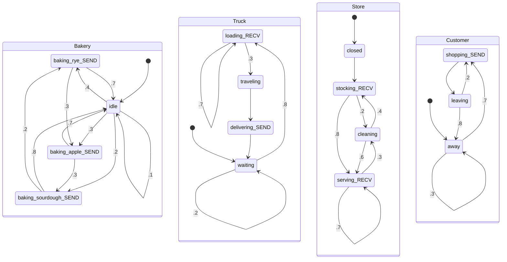
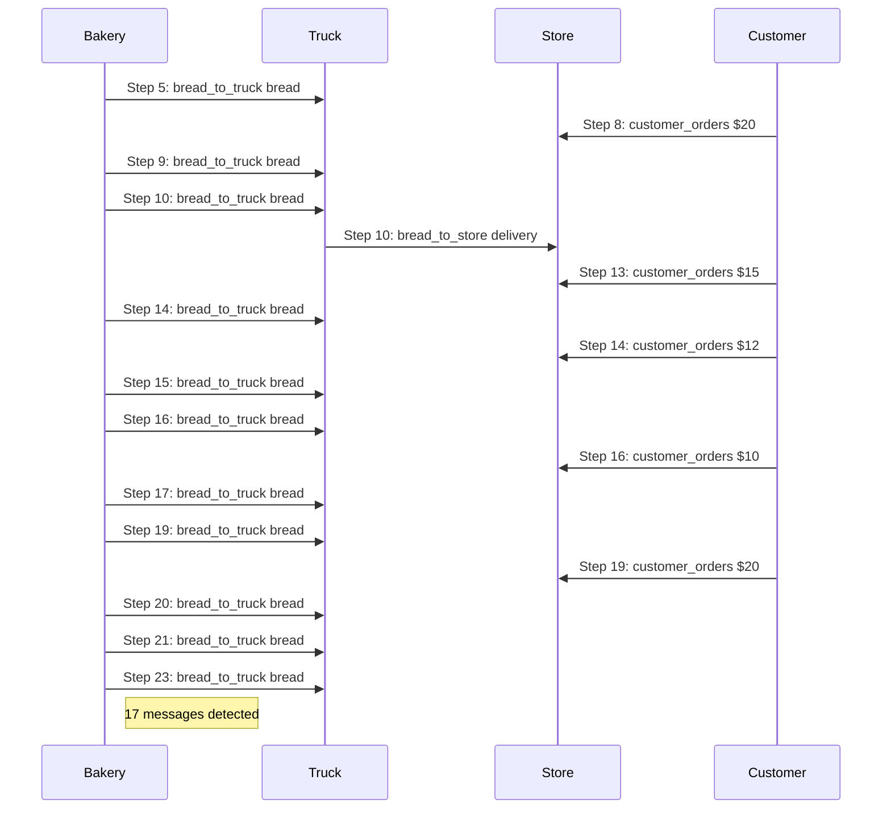
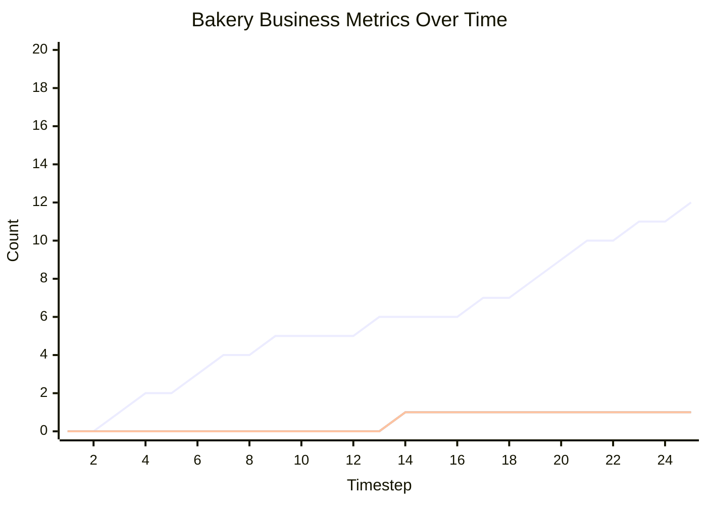

# Message Passing Markov Chain Business Process Simulation

This document contains an executable specification of a bakery business process using Message Passing Markov Chains.

## Synchronous Channel Example

```
=== STARTING SIMULATION ===
Initial state: {'ActorA': 'idle', 'ActorB': 'waiting'}

=== TIMESTEP 1 ===
ActorA: idle -> sending | Variables: {'counter': 0}
ActorB: waiting (stayed)

=== TIMESTEP 2 ===
    -> ActorA BLOCKED sending to ActorB
ActorA: sending (stayed) [BLOCKED] | Variables: {'counter': 1}
ActorB: waiting (stayed)

*** System reached stable state at timestep 2 ***

=== SIMULATION COMPLETE ===
Final state: {'ActorA': 'sending', 'ActorB': 'waiting'}
```

## Bakery Business Process Simulation

```
=== STARTING SIMULATION ===
Initial state: {'Bakery': 'idle', 'Truck': 'waiting', 'Store': 'closed', 'Customer': 'away'}

=== TIMESTEP 1 ===
Bakery: idle -> baking_apple | Variables: {'breads_baked': 0, 'production_value': 0}
Truck: waiting (stayed) | Variables: {'cargo': [], 'loads_received': 0, 'deliveries_made': 0}
Store: closed -> stocking | Variables: {'inventory': [], 'items_stocked': 0, 'items_sold': 0, 'revenue': 0, 'store_open': False}
Customer: away (stayed) | Variables: {'purchases_attempted': 0, 'money_spent': 0} | Activity: away

=== TIMESTEP 2 ===
    -> Bakery baked Apple ($15)
    -> Bakery sent {'type': 'Apple', 'price': 15} to Truck
Bakery: baking_apple -> baking_sourdough | Variables: {'breads_baked': 1, 'production_value': 15}
Truck: waiting (stayed) | Variables: {'cargo': [], 'loads_received': 0, 'deliveries_made': 0}
    -> Store BLOCKED waiting to receive
Store: stocking (stayed) [BLOCKED] | Variables: {'inventory': [], 'items_stocked': 0, 'items_sold': 0, 'revenue': 0, 'store_open': False}
Customer: away (stayed) | Variables: {'purchases_attempted': 0, 'money_spent': 0} | Activity: away

=== TIMESTEP 3 ===
    -> Bakery baked Sourdough ($10)
    -> Bakery sent {'type': 'Sourdough', 'price': 10} to Truck
Bakery: baking_sourdough -> idle | Variables: {'breads_baked': 2, 'production_value': 25}
Truck: waiting -> loading | Variables: {'cargo': [], 'loads_received': 0, 'deliveries_made': 0}
    -> Store BLOCKED waiting to receive
Store: stocking (stayed) [BLOCKED] | Variables: {'inventory': [], 'items_stocked': 0, 'items_sold': 0, 'revenue': 0, 'store_open': False}
Customer: away -> shopping | Variables: {'purchases_attempted': 0, 'money_spent': 0} | Activity: shopping

=== TIMESTEP 4 ===
Bakery: idle -> baking_rye | Variables: {'breads_baked': 2, 'production_value': 25}
    -> Truck received {'type': 'Apple', 'price': 15} into bread
Truck: loading (stayed) | Variables: {'cargo': [], 'loads_received': 0, 'deliveries_made': 0, 'bread': {'type': 'Apple', 'price': 15}}
    -> Store BLOCKED waiting to receive
Store: stocking (stayed) [BLOCKED] | Variables: {'inventory': [], 'items_stocked': 0, 'items_sold': 0, 'revenue': 0, 'store_open': False}
    -> Customer attempting to buy bread with $20 (attempt #1)
    -> DEBUG: Resolved 'current_payment' to 20
    -> Customer sent 20 to Store
Customer: shopping -> leaving | Variables: {'purchases_attempted': 1, 'money_spent': 20, 'current_payment': 20} | Activity: leaving

=== TIMESTEP 5 ===
    -> Bakery baked Rye ($12)
    -> Bakery sent {'type': 'Rye', 'price': 12} to Truck
Bakery: baking_rye -> baking_apple | Variables: {'breads_baked': 3, 'production_value': 37}
    -> Truck loaded Apple bread
    -> Truck received {'type': 'Sourdough', 'price': 10} into bread
Truck: loading -> traveling | Variables: {'cargo': [{'type': 'Apple', 'price': 15}], 'loads_received': 1, 'deliveries_made': 0, 'bread': {'type': 'Sourdough', 'price': 10}}
    -> Store BLOCKED waiting to receive
Store: stocking (stayed) [BLOCKED] | Variables: {'inventory': [], 'items_stocked': 0, 'items_sold': 0, 'revenue': 0, 'store_open': False}
Customer: leaving -> away | Variables: {'purchases_attempted': 1, 'money_spent': 20, 'current_payment': 20} | Activity: away

=== TIMESTEP 6 ===
    -> Bakery baked Apple ($15)
    -> Bakery sent {'type': 'Apple', 'price': 15} to Truck
Bakery: baking_apple -> idle | Variables: {'breads_baked': 4, 'production_value': 52}
Truck: traveling -> delivering | Variables: {'cargo': [{'type': 'Apple', 'price': 15}], 'loads_received': 1, 'deliveries_made': 0, 'bread': {'type': 'Sourdough', 'price': 10}}
    -> Store BLOCKED waiting to receive
Store: stocking (stayed) [BLOCKED] | Variables: {'inventory': [], 'items_stocked': 0, 'items_sold': 0, 'revenue': 0, 'store_open': False}
Customer: away (stayed) | Variables: {'purchases_attempted': 1, 'money_spent': 20, 'current_payment': 20} | Activity: away

=== TIMESTEP 7 ===
Bakery: idle -> baking_apple | Variables: {'breads_baked': 4, 'production_value': 52}
    -> DEBUG: Truck attempting delivery, cargo: 1 items
    -> Truck delivering Apple to store
    -> DEBUG: Resolved 'delivering_bread' to {'type': 'Apple', 'price': 15}
    -> Truck sent {'type': 'Apple', 'price': 15} to Store
    -> DEBUG: Truck delivery SUCCESS! Channel capacity: 3
Truck: delivering -> waiting | Variables: {'cargo': [], 'loads_received': 1, 'deliveries_made': 1, 'bread': {'type': 'Sourdough', 'price': 10}, 'delivering_bread': {'type': 'Apple', 'price': 15}}
    -> Store received {'type': 'Apple', 'price': 15} into bread_delivery
Store: stocking -> serving | Variables: {'inventory': [], 'items_stocked': 0, 'items_sold': 0, 'revenue': 0, 'store_open': False, 'bread_delivery': {'type': 'Apple', 'price': 15}}
Customer: away (stayed) | Variables: {'purchases_attempted': 1, 'money_spent': 20, 'current_payment': 20} | Activity: away

=== TIMESTEP 8 ===
    -> Bakery baked Apple ($15)
    -> Bakery BLOCKED sending to Truck
Bakery: baking_apple (stayed) [BLOCKED] | Variables: {'breads_baked': 5, 'production_value': 67}
Truck: waiting -> loading | Variables: {'cargo': [], 'loads_received': 1, 'deliveries_made': 1, 'bread': {'type': 'Sourdough', 'price': 10}, 'delivering_bread': {'type': 'Apple', 'price': 15}}
    -> DEBUG: Store serving, inventory: 0 items
    -> Store idle - no inventory, no customers
    -> Store received 20 into customer_payment
    -> DEBUG: Store received payment $20, inventory: 0 items
Store: serving -> cleaning | Variables: {'inventory': [], 'items_stocked': 0, 'items_sold': 0, 'revenue': 0, 'store_open': False, 'bread_delivery': {'type': 'Apple', 'price': 15}, 'customer_payment': 20}
Customer: away -> shopping | Variables: {'purchases_attempted': 1, 'money_spent': 20, 'current_payment': 20} | Activity: shopping

=== TIMESTEP 9 ===
    -> Bakery BLOCKED sending to Truck
Bakery: baking_apple (stayed) [BLOCKED] | Variables: {'breads_baked': 5, 'production_value': 67}
    -> Truck loaded Sourdough bread
    -> Truck received {'type': 'Rye', 'price': 12} into bread
Truck: loading (stayed) | Variables: {'cargo': [{'type': 'Sourdough', 'price': 10}], 'loads_received': 2, 'deliveries_made': 1, 'bread': {'type': 'Rye', 'price': 12}, 'delivering_bread': {'type': 'Apple', 'price': 15}}
Store: cleaning -> stocking | Variables: {'inventory': [], 'items_stocked': 0, 'items_sold': 0, 'revenue': 0, 'store_open': False, 'bread_delivery': {'type': 'Apple', 'price': 15}, 'customer_payment': 20}
    -> Customer attempting to buy bread with $15 (attempt #2)
    -> DEBUG: Resolved 'current_payment' to 15
    -> Customer sent 15 to Store
Customer: shopping -> leaving | Variables: {'purchases_attempted': 2, 'money_spent': 35, 'current_payment': 15} | Activity: leaving

=== TIMESTEP 10 ===
    -> Bakery sent {'type': 'Apple', 'price': 15} to Truck
Bakery: baking_apple -> idle | Variables: {'breads_baked': 5, 'production_value': 67}
    -> Truck loaded Rye bread
    -> Truck received {'type': 'Apple', 'price': 15} into bread
Truck: loading -> traveling | Variables: {'cargo': [{'type': 'Sourdough', 'price': 10}, {'type': 'Rye', 'price': 12}], 'loads_received': 3, 'deliveries_made': 1, 'bread': {'type': 'Apple', 'price': 15}, 'delivering_bread': {'type': 'Apple', 'price': 15}}
    -> DEBUG: Store received bread_delivery: {'type': 'Apple', 'price': 15} (type: <class 'dict'>)
    -> STORE OPENS! First delivery arrived: Apple
    -> Store BLOCKED waiting to receive
Store: stocking (stayed) [BLOCKED] | Variables: {'inventory': [{'type': 'Apple', 'price': 15}], 'items_stocked': 1, 'items_sold': 0, 'revenue': 0, 'store_open': True, 'bread_delivery': {'type': 'Apple', 'price': 15}, 'customer_payment': 20}
Customer: leaving -> away | Variables: {'purchases_attempted': 2, 'money_spent': 35, 'current_payment': 15} | Activity: away

=== TIMESTEP 11 ===
Bakery: idle -> baking_apple | Variables: {'breads_baked': 5, 'production_value': 67}
Truck: traveling -> delivering | Variables: {'cargo': [{'type': 'Sourdough', 'price': 10}, {'type': 'Rye', 'price': 12}], 'loads_received': 3, 'deliveries_made': 1, 'bread': {'type': 'Apple', 'price': 15}, 'delivering_bread': {'type': 'Apple', 'price': 15}}
    -> Store BLOCKED waiting to receive
Store: stocking (stayed) [BLOCKED] | Variables: {'inventory': [{'type': 'Apple', 'price': 15}], 'items_stocked': 1, 'items_sold': 0, 'revenue': 0, 'store_open': True, 'bread_delivery': {'type': 'Apple', 'price': 15}, 'customer_payment': 20}
Customer: away (stayed) | Variables: {'purchases_attempted': 2, 'money_spent': 35, 'current_payment': 15} | Activity: away

=== TIMESTEP 12 ===
    -> Bakery baked Apple ($15)
    -> Bakery sent {'type': 'Apple', 'price': 15} to Truck
Bakery: baking_apple -> idle | Variables: {'breads_baked': 6, 'production_value': 82}
    -> DEBUG: Truck attempting delivery, cargo: 2 items
    -> Truck delivering Sourdough to store
    -> DEBUG: Resolved 'delivering_bread' to {'type': 'Sourdough', 'price': 10}
    -> Truck sent {'type': 'Sourdough', 'price': 10} to Store
    -> DEBUG: Truck delivery SUCCESS! Channel capacity: 3
Truck: delivering -> waiting | Variables: {'cargo': [{'type': 'Rye', 'price': 12}], 'loads_received': 3, 'deliveries_made': 2, 'bread': {'type': 'Apple', 'price': 15}, 'delivering_bread': {'type': 'Sourdough', 'price': 10}}
    -> Store received {'type': 'Sourdough', 'price': 10} into bread_delivery
Store: stocking -> serving | Variables: {'inventory': [{'type': 'Apple', 'price': 15}], 'items_stocked': 1, 'items_sold': 0, 'revenue': 0, 'store_open': True, 'bread_delivery': {'type': 'Sourdough', 'price': 10}, 'customer_payment': 20}
Customer: away -> shopping | Variables: {'purchases_attempted': 2, 'money_spent': 35, 'current_payment': 15} | Activity: shopping

=== TIMESTEP 13 ===
Bakery: idle (stayed) | Variables: {'breads_baked': 6, 'production_value': 82}
Truck: waiting -> loading | Variables: {'cargo': [{'type': 'Rye', 'price': 12}], 'loads_received': 3, 'deliveries_made': 2, 'bread': {'type': 'Apple', 'price': 15}, 'delivering_bread': {'type': 'Sourdough', 'price': 10}}
    -> DEBUG: Store serving, inventory: 1 items
    -> Store sold Apple for $15 (paid $20)
    -> Store received 15 into customer_payment
    -> DEBUG: Store received payment $15, inventory: 0 items
Store: serving (stayed) | Variables: {'inventory': [], 'items_stocked': 1, 'items_sold': 1, 'revenue': 15, 'store_open': True, 'bread_delivery': {'type': 'Sourdough', 'price': 10}, 'customer_payment': 15}
    -> Customer attempting to buy bread with $12 (attempt #3)
    -> DEBUG: Resolved 'current_payment' to 12
    -> Customer sent 12 to Store
Customer: shopping -> leaving | Variables: {'purchases_attempted': 3, 'money_spent': 47, 'current_payment': 12} | Activity: leaving

=== TIMESTEP 14 ===
Bakery: idle (stayed) | Variables: {'breads_baked': 6, 'production_value': 82}
    -> Truck loaded Apple bread
    -> Truck received {'type': 'Apple', 'price': 15} into bread
Truck: loading (stayed) | Variables: {'cargo': [{'type': 'Rye', 'price': 12}, {'type': 'Apple', 'price': 15}], 'loads_received': 4, 'deliveries_made': 2, 'bread': {'type': 'Apple', 'price': 15}, 'delivering_bread': {'type': 'Sourdough', 'price': 10}}
    -> DEBUG: Store serving, inventory: 0 items
    -> Store has no bread to sell (customer disappointed)
    -> Store received 12 into customer_payment
    -> DEBUG: Store received payment $12, inventory: 0 items
Store: serving -> cleaning | Variables: {'inventory': [], 'items_stocked': 1, 'items_sold': 1, 'revenue': 15, 'store_open': True, 'bread_delivery': {'type': 'Sourdough', 'price': 10}, 'customer_payment': 12}
Customer: leaving -> shopping | Variables: {'purchases_attempted': 3, 'money_spent': 47, 'current_payment': 12} | Activity: shopping

=== TIMESTEP 15 ===
Bakery: idle -> baking_rye | Variables: {'breads_baked': 6, 'production_value': 82}
    -> Truck loaded Apple bread
    -> Truck received {'type': 'Apple', 'price': 15} into bread
Truck: loading (stayed) | Variables: {'cargo': [{'type': 'Rye', 'price': 12}, {'type': 'Apple', 'price': 15}, {'type': 'Apple', 'price': 15}], 'loads_received': 5, 'deliveries_made': 2, 'bread': {'type': 'Apple', 'price': 15}, 'delivering_bread': {'type': 'Sourdough', 'price': 10}}
Store: cleaning -> serving | Variables: {'inventory': [], 'items_stocked': 1, 'items_sold': 1, 'revenue': 15, 'store_open': True, 'bread_delivery': {'type': 'Sourdough', 'price': 10}, 'customer_payment': 12}
    -> Customer attempting to buy bread with $10 (attempt #4)
    -> DEBUG: Resolved 'current_payment' to 10
    -> Customer sent 10 to Store
Customer: shopping -> leaving | Variables: {'purchases_attempted': 4, 'money_spent': 57, 'current_payment': 10} | Activity: leaving

=== TIMESTEP 16 ===
    -> Bakery baked Rye ($12)
    -> Bakery sent {'type': 'Rye', 'price': 12} to Truck
Bakery: baking_rye -> idle | Variables: {'breads_baked': 7, 'production_value': 94}
    -> Truck loaded Apple bread
    -> Truck received {'type': 'Rye', 'price': 12} into bread
Truck: loading (stayed) | Variables: {'cargo': [{'type': 'Rye', 'price': 12}, {'type': 'Apple', 'price': 15}, {'type': 'Apple', 'price': 15}, {'type': 'Apple', 'price': 15}], 'loads_received': 6, 'deliveries_made': 2, 'bread': {'type': 'Rye', 'price': 12}, 'delivering_bread': {'type': 'Sourdough', 'price': 10}}
    -> DEBUG: Store serving, inventory: 0 items
    -> Store has no bread to sell (customer disappointed)
    -> Store received 10 into customer_payment
    -> DEBUG: Store received payment $10, inventory: 0 items
Store: serving (stayed) | Variables: {'inventory': [], 'items_stocked': 1, 'items_sold': 1, 'revenue': 15, 'store_open': True, 'bread_delivery': {'type': 'Sourdough', 'price': 10}, 'customer_payment': 10}
Customer: leaving -> away | Variables: {'purchases_attempted': 4, 'money_spent': 57, 'current_payment': 10} | Activity: away

=== TIMESTEP 17 ===
Bakery: idle -> baking_rye | Variables: {'breads_baked': 7, 'production_value': 94}
    -> Truck loaded Rye bread
    -> Truck BLOCKED waiting to receive
Truck: loading (stayed) [BLOCKED] | Variables: {'cargo': [{'type': 'Rye', 'price': 12}, {'type': 'Apple', 'price': 15}, {'type': 'Apple', 'price': 15}, {'type': 'Apple', 'price': 15}, {'type': 'Rye', 'price': 12}], 'loads_received': 7, 'deliveries_made': 2, 'bread': {'type': 'Rye', 'price': 12}, 'delivering_bread': {'type': 'Sourdough', 'price': 10}}
    -> DEBUG: Store serving, inventory: 0 items
    -> Store has no bread to sell (customer disappointed)
    -> Store BLOCKED waiting to receive
Store: serving (stayed) [BLOCKED] | Variables: {'inventory': [], 'items_stocked': 1, 'items_sold': 1, 'revenue': 15, 'store_open': True, 'bread_delivery': {'type': 'Sourdough', 'price': 10}, 'customer_payment': 10}
Customer: away -> shopping | Variables: {'purchases_attempted': 4, 'money_spent': 57, 'current_payment': 10} | Activity: shopping

=== TIMESTEP 18 ===
    -> Bakery baked Rye ($12)
    -> Bakery sent {'type': 'Rye', 'price': 12} to Truck
Bakery: baking_rye -> baking_apple | Variables: {'breads_baked': 8, 'production_value': 106}
    -> Truck received {'type': 'Rye', 'price': 12} into bread
Truck: loading (stayed) | Variables: {'cargo': [{'type': 'Rye', 'price': 12}, {'type': 'Apple', 'price': 15}, {'type': 'Apple', 'price': 15}, {'type': 'Apple', 'price': 15}, {'type': 'Rye', 'price': 12}], 'loads_received': 7, 'deliveries_made': 2, 'bread': {'type': 'Rye', 'price': 12}, 'delivering_bread': {'type': 'Sourdough', 'price': 10}}
    -> Store BLOCKED waiting to receive
Store: serving (stayed) [BLOCKED] | Variables: {'inventory': [], 'items_stocked': 1, 'items_sold': 1, 'revenue': 15, 'store_open': True, 'bread_delivery': {'type': 'Sourdough', 'price': 10}, 'customer_payment': 10}
    -> Customer attempting to buy bread with $20 (attempt #5)
    -> DEBUG: Resolved 'current_payment' to 20
    -> Customer sent 20 to Store
Customer: shopping -> leaving | Variables: {'purchases_attempted': 5, 'money_spent': 77, 'current_payment': 20} | Activity: leaving

=== TIMESTEP 19 ===
    -> Bakery baked Apple ($15)
    -> Bakery sent {'type': 'Apple', 'price': 15} to Truck
Bakery: baking_apple -> baking_sourdough | Variables: {'breads_baked': 9, 'production_value': 121}
    -> Truck loaded Rye bread
    -> Truck received {'type': 'Apple', 'price': 15} into bread
Truck: loading (stayed) | Variables: {'cargo': [{'type': 'Rye', 'price': 12}, {'type': 'Apple', 'price': 15}, {'type': 'Apple', 'price': 15}, {'type': 'Apple', 'price': 15}, {'type': 'Rye', 'price': 12}, {'type': 'Rye', 'price': 12}], 'loads_received': 8, 'deliveries_made': 2, 'bread': {'type': 'Apple', 'price': 15}, 'delivering_bread': {'type': 'Sourdough', 'price': 10}}
    -> Store received 20 into customer_payment
    -> DEBUG: Store received payment $20, inventory: 0 items
Store: serving -> cleaning | Variables: {'inventory': [], 'items_stocked': 1, 'items_sold': 1, 'revenue': 15, 'store_open': True, 'bread_delivery': {'type': 'Sourdough', 'price': 10}, 'customer_payment': 20}
Customer: leaving -> away | Variables: {'purchases_attempted': 5, 'money_spent': 77, 'current_payment': 20} | Activity: away

=== TIMESTEP 20 ===
    -> Bakery baked Sourdough ($10)
    -> Bakery sent {'type': 'Sourdough', 'price': 10} to Truck
Bakery: baking_sourdough -> idle | Variables: {'breads_baked': 10, 'production_value': 131}
    -> Truck loaded Apple bread
    -> Truck received {'type': 'Sourdough', 'price': 10} into bread
Truck: loading (stayed) | Variables: {'cargo': [{'type': 'Rye', 'price': 12}, {'type': 'Apple', 'price': 15}, {'type': 'Apple', 'price': 15}, {'type': 'Apple', 'price': 15}, {'type': 'Rye', 'price': 12}, {'type': 'Rye', 'price': 12}, {'type': 'Apple', 'price': 15}], 'loads_received': 9, 'deliveries_made': 2, 'bread': {'type': 'Sourdough', 'price': 10}, 'delivering_bread': {'type': 'Sourdough', 'price': 10}}
Store: cleaning -> serving | Variables: {'inventory': [], 'items_stocked': 1, 'items_sold': 1, 'revenue': 15, 'store_open': True, 'bread_delivery': {'type': 'Sourdough', 'price': 10}, 'customer_payment': 20}
Customer: away (stayed) | Variables: {'purchases_attempted': 5, 'money_spent': 77, 'current_payment': 20} | Activity: away

=== TIMESTEP 21 ===
Bakery: idle -> baking_apple | Variables: {'breads_baked': 10, 'production_value': 131}
    -> Truck loaded Sourdough bread
    -> Truck BLOCKED waiting to receive
Truck: loading (stayed) [BLOCKED] | Variables: {'cargo': [{'type': 'Rye', 'price': 12}, {'type': 'Apple', 'price': 15}, {'type': 'Apple', 'price': 15}, {'type': 'Apple', 'price': 15}, {'type': 'Rye', 'price': 12}, {'type': 'Rye', 'price': 12}, {'type': 'Apple', 'price': 15}, {'type': 'Sourdough', 'price': 10}], 'loads_received': 10, 'deliveries_made': 2, 'bread': {'type': 'Sourdough', 'price': 10}, 'delivering_bread': {'type': 'Sourdough', 'price': 10}}
    -> DEBUG: Store serving, inventory: 0 items
    -> Store has no bread to sell (customer disappointed)
    -> Store BLOCKED waiting to receive
Store: serving (stayed) [BLOCKED] | Variables: {'inventory': [], 'items_stocked': 1, 'items_sold': 1, 'revenue': 15, 'store_open': True, 'bread_delivery': {'type': 'Sourdough', 'price': 10}, 'customer_payment': 20}
Customer: away -> shopping | Variables: {'purchases_attempted': 5, 'money_spent': 77, 'current_payment': 20} | Activity: shopping

=== TIMESTEP 22 ===
    -> Bakery baked Apple ($15)
    -> Bakery sent {'type': 'Apple', 'price': 15} to Truck
Bakery: baking_apple -> idle | Variables: {'breads_baked': 11, 'production_value': 146}
    -> Truck received {'type': 'Apple', 'price': 15} into bread
Truck: loading (stayed) | Variables: {'cargo': [{'type': 'Rye', 'price': 12}, {'type': 'Apple', 'price': 15}, {'type': 'Apple', 'price': 15}, {'type': 'Apple', 'price': 15}, {'type': 'Rye', 'price': 12}, {'type': 'Rye', 'price': 12}, {'type': 'Apple', 'price': 15}, {'type': 'Sourdough', 'price': 10}], 'loads_received': 10, 'deliveries_made': 2, 'bread': {'type': 'Apple', 'price': 15}, 'delivering_bread': {'type': 'Sourdough', 'price': 10}}
    -> Store BLOCKED waiting to receive
Store: serving (stayed) [BLOCKED] | Variables: {'inventory': [], 'items_stocked': 1, 'items_sold': 1, 'revenue': 15, 'store_open': True, 'bread_delivery': {'type': 'Sourdough', 'price': 10}, 'customer_payment': 20}
    -> Customer attempting to buy bread with $20 (attempt #6)
    -> DEBUG: Resolved 'current_payment' to 20
    -> Customer sent 20 to Store
Customer: shopping -> leaving | Variables: {'purchases_attempted': 6, 'money_spent': 97, 'current_payment': 20} | Activity: leaving

=== TIMESTEP 23 ===
Bakery: idle -> baking_rye | Variables: {'breads_baked': 11, 'production_value': 146}
    -> Truck loaded Apple bread
    -> Truck BLOCKED waiting to receive
Truck: loading (stayed) [BLOCKED] | Variables: {'cargo': [{'type': 'Rye', 'price': 12}, {'type': 'Apple', 'price': 15}, {'type': 'Apple', 'price': 15}, {'type': 'Apple', 'price': 15}, {'type': 'Rye', 'price': 12}, {'type': 'Rye', 'price': 12}, {'type': 'Apple', 'price': 15}, {'type': 'Sourdough', 'price': 10}, {'type': 'Apple', 'price': 15}], 'loads_received': 11, 'deliveries_made': 2, 'bread': {'type': 'Apple', 'price': 15}, 'delivering_bread': {'type': 'Sourdough', 'price': 10}}
    -> Store received 20 into customer_payment
    -> DEBUG: Store received payment $20, inventory: 0 items
Store: serving (stayed) | Variables: {'inventory': [], 'items_stocked': 1, 'items_sold': 1, 'revenue': 15, 'store_open': True, 'bread_delivery': {'type': 'Sourdough', 'price': 10}, 'customer_payment': 20}
Customer: leaving -> away | Variables: {'purchases_attempted': 6, 'money_spent': 97, 'current_payment': 20} | Activity: away

=== TIMESTEP 24 ===
    -> Bakery baked Rye ($12)
    -> Bakery sent {'type': 'Rye', 'price': 12} to Truck
Bakery: baking_rye -> baking_apple | Variables: {'breads_baked': 12, 'production_value': 158}
    -> Truck received {'type': 'Rye', 'price': 12} into bread
Truck: loading -> traveling | Variables: {'cargo': [{'type': 'Rye', 'price': 12}, {'type': 'Apple', 'price': 15}, {'type': 'Apple', 'price': 15}, {'type': 'Apple', 'price': 15}, {'type': 'Rye', 'price': 12}, {'type': 'Rye', 'price': 12}, {'type': 'Apple', 'price': 15}, {'type': 'Sourdough', 'price': 10}, {'type': 'Apple', 'price': 15}], 'loads_received': 11, 'deliveries_made': 2, 'bread': {'type': 'Rye', 'price': 12}, 'delivering_bread': {'type': 'Sourdough', 'price': 10}}
    -> DEBUG: Store serving, inventory: 0 items
    -> Store has no bread to sell (customer disappointed)
    -> Store BLOCKED waiting to receive
Store: serving (stayed) [BLOCKED] | Variables: {'inventory': [], 'items_stocked': 1, 'items_sold': 1, 'revenue': 15, 'store_open': True, 'bread_delivery': {'type': 'Sourdough', 'price': 10}, 'customer_payment': 20}
Customer: away -> shopping | Variables: {'purchases_attempted': 6, 'money_spent': 97, 'current_payment': 20} | Activity: shopping

=== TIMESTEP 25 ===
    -> Bakery baked Apple ($15)
    -> Bakery sent {'type': 'Apple', 'price': 15} to Truck
Bakery: baking_apple -> idle | Variables: {'breads_baked': 13, 'production_value': 173}
Truck: traveling -> delivering | Variables: {'cargo': [{'type': 'Rye', 'price': 12}, {'type': 'Apple', 'price': 15}, {'type': 'Apple', 'price': 15}, {'type': 'Apple', 'price': 15}, {'type': 'Rye', 'price': 12}, {'type': 'Rye', 'price': 12}, {'type': 'Apple', 'price': 15}, {'type': 'Sourdough', 'price': 10}, {'type': 'Apple', 'price': 15}], 'loads_received': 11, 'deliveries_made': 2, 'bread': {'type': 'Rye', 'price': 12}, 'delivering_bread': {'type': 'Sourdough', 'price': 10}}
    -> Store BLOCKED waiting to receive
Store: serving (stayed) [BLOCKED] | Variables: {'inventory': [], 'items_stocked': 1, 'items_sold': 1, 'revenue': 15, 'store_open': True, 'bread_delivery': {'type': 'Sourdough', 'price': 10}, 'customer_payment': 20}
    -> Customer attempting to buy bread with $12 (attempt #7)
    -> DEBUG: Resolved 'current_payment' to 12
    -> Customer sent 12 to Store
Customer: shopping -> leaving | Variables: {'purchases_attempted': 7, 'money_spent': 109, 'current_payment': 12} | Activity: leaving

=== SIMULATION COMPLETE ===
Final state: {'Bakery': 'idle', 'Truck': 'delivering', 'Store': 'serving', 'Customer': 'leaving'}
```

## Business Metrics Analysis

- **Production**: 12 breads baked, $158 value
- **Logistics**: 11 loads received, 2 deliveries made
- **Retail**: 1 stocked, 1 sold, $15 revenue
- **Customer**: 6 attempts, $97 spent
- **Efficiency**: 91.67% waste rate, $15.00 revenue/bread
- **Satisfaction**: 16.67% customer satisfaction

**Inventory Status:**
- Unsold inventory: 0 items
- Truck cargo remaining: 9 items

## Temporal Logic Questions

With this executable model, we can now ask CTL-style temporal logic questions:

- **Safety**: Did we ever have zero inventory? (Check if Store.inventory was ever empty)
- **Liveness**: What's the maximum revenue we can achieve? (Analyze revenue growth patterns)
- **Reachability**: Is waste inevitable? (Check if production always exceeds sales)
- **Optimization**: Can customers always find bread? (Check inventory vs. customer arrival patterns)
- **Performance**: What's the optimal production rate? (Minimize waste while maximizing revenue)

============================================================
# STATE MACHINE DIAGRAM
============================================================



============================================================
# INTERACTION DIAGRAM
============================================================



============================================================
# METRICS TIMELINE
============================================================



---

**Generated by Message Passing Markov Chain Framework**

*This specification can be version controlled, tested, and formally verified.*
