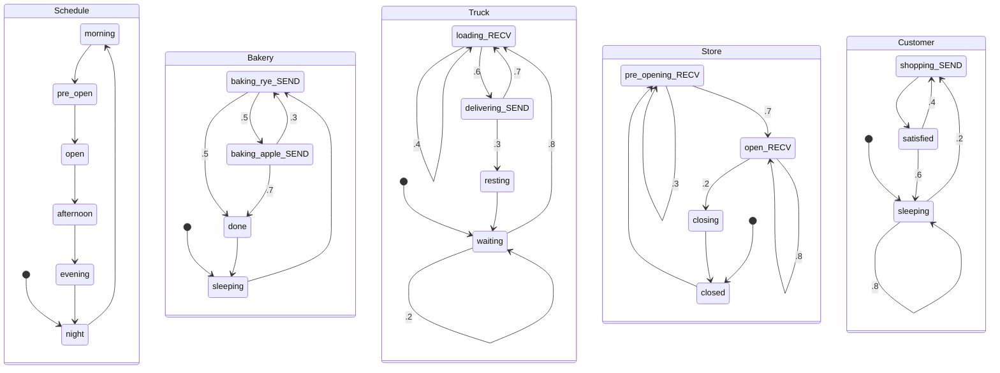
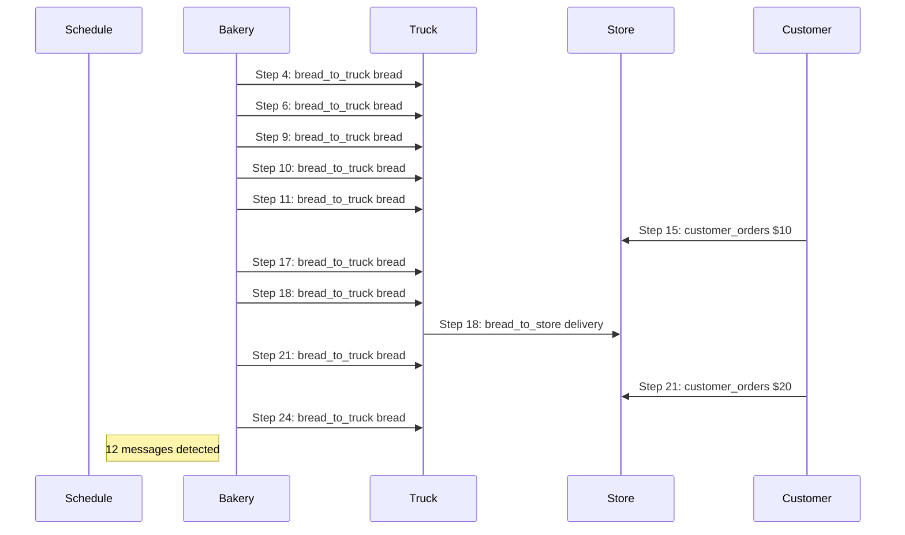
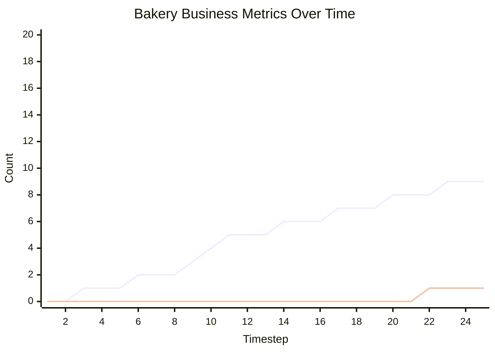

# Message Passing Markov Chain Business Process Simulation

This document contains an executable specification of a bakery business process using Message Passing Markov Chains.

## Synchronous Channel Example

```
=== STARTING SIMULATION ===
Initial state: {'ActorA': 'idle', 'ActorB': 'waiting'}

=== TIMESTEP 1 ===
ActorA: idle -> sending | Variables: {'counter': 0}
ActorB: waiting -> receiving

=== TIMESTEP 2 ===
    -> ActorA BLOCKED sending to ActorB
ActorA: sending (stayed) [BLOCKED] | Variables: {'counter': 1}
    -> ActorB received 42 into received_value
ActorB: receiving -> processing | Variables: {'received_value': 42}

=== TIMESTEP 3 ===
    -> ActorA BLOCKED sending to ActorB
ActorA: sending (stayed) [BLOCKED] | Variables: {'counter': 1}
ActorB: processing -> done | Variables: {'received_value': 42, 'processed': True}

=== TIMESTEP 4 ===
    -> ActorA BLOCKED sending to ActorB
ActorA: sending (stayed) [BLOCKED] | Variables: {'counter': 1}
ActorB: done (stayed) | Variables: {'received_value': 42, 'processed': True}

*** System reached stable state at timestep 4 ***

=== SIMULATION COMPLETE ===
Final state: {'ActorA': 'sending', 'ActorB': 'done'}
```

## Scheduled Bakery Business Process

```
=== STARTING SIMULATION ===
Initial state: {'Schedule': 'night', 'Bakery': 'sleeping', 'Truck': 'waiting', 'Store': 'closed', 'Customer': 'sleeping'}

=== TIMESTEP 1 ===
    -> SCHEDULE: 5:00 AM - Bakers start (Step 1)
Schedule: night -> morning | Variables: {'current_time': 'night', 'time_step': 1}
Bakery: sleeping -> baking_rye | Variables: {'breads_baked': 0, 'production_value': 0}
Truck: waiting (stayed) | Variables: {'cargo': [], 'loads_received': 0, 'deliveries_made': 0}
Store: closed -> pre_opening | Variables: {'inventory': [], 'items_stocked': 0, 'items_sold': 0, 'revenue': 0, 'ready_to_open': False}
Customer: sleeping -> shopping | Variables: {'purchases_attempted': 0, 'money_spent': 0} | Activity: shopping

=== TIMESTEP 2 ===
    -> SCHEDULE: 7:00 AM - Bread ready, delivery window (Step 2)
Schedule: morning -> pre_open | Variables: {'current_time': 'morning', 'time_step': 2}
    -> Bakery baked Rye ($12) - Early morning production
    -> Bakery sent {'type': 'Rye', 'price': 12} to Truck
Bakery: baking_rye -> done | Variables: {'breads_baked': 1, 'production_value': 12}
Truck: waiting -> loading | Variables: {'cargo': [], 'loads_received': 0, 'deliveries_made': 0}
    -> Store BLOCKED waiting to receive
Store: pre_opening (stayed) [BLOCKED] | Variables: {'inventory': [], 'items_stocked': 0, 'items_sold': 0, 'revenue': 0, 'ready_to_open': False}
    -> Customer shopping at open store with $10 - Proper timing!
    -> DEBUG: Resolved 'current_payment' to 10
    -> Customer sent 10 to Store
Customer: shopping -> satisfied | Variables: {'purchases_attempted': 1, 'money_spent': 10, 'current_payment': 10} | Activity: satisfied

=== TIMESTEP 3 ===
    -> SCHEDULE: 10:30 AM - Final delivery push (Step 3)
Schedule: pre_open -> open | Variables: {'current_time': 'pre_open', 'time_step': 3}
Bakery: done -> sleeping | Variables: {'breads_baked': 1, 'production_value': 12}
    -> Truck received {'type': 'Rye', 'price': 12} into bread
Truck: loading (stayed) | Variables: {'cargo': [], 'loads_received': 0, 'deliveries_made': 0, 'bread': {'type': 'Rye', 'price': 12}}
    -> Store BLOCKED waiting to receive
Store: pre_opening (stayed) [BLOCKED] | Variables: {'inventory': [], 'items_stocked': 0, 'items_sold': 0, 'revenue': 0, 'ready_to_open': False}
Customer: satisfied -> sleeping | Variables: {'purchases_attempted': 1, 'money_spent': 10, 'current_payment': 10} | Activity: sleeping

=== TIMESTEP 4 ===
    -> SCHEDULE: 11:00 AM - Store opens (Step 4)
Schedule: open -> afternoon | Variables: {'current_time': 'open', 'time_step': 4}
Bakery: sleeping -> baking_rye | Variables: {'breads_baked': 1, 'production_value': 12}
    -> Truck loaded Rye bread (Morning rush)
    -> Truck BLOCKED waiting to receive
Truck: loading (stayed) [BLOCKED] | Variables: {'cargo': [{'type': 'Rye', 'price': 12}], 'loads_received': 1, 'deliveries_made': 0, 'bread': {'type': 'Rye', 'price': 12}}
    -> Store BLOCKED waiting to receive
Store: pre_opening (stayed) [BLOCKED] | Variables: {'inventory': [], 'items_stocked': 0, 'items_sold': 0, 'revenue': 0, 'ready_to_open': False}
Customer: sleeping (stayed) | Variables: {'purchases_attempted': 1, 'money_spent': 10, 'current_payment': 10} | Activity: sleeping

=== TIMESTEP 5 ===
    -> SCHEDULE: 1:00 PM - Peak customer time (Step 5)
Schedule: afternoon -> evening | Variables: {'current_time': 'afternoon', 'time_step': 5}
    -> Bakery baked Rye ($12) - Early morning production
    -> Bakery sent {'type': 'Rye', 'price': 12} to Truck
Bakery: baking_rye -> done | Variables: {'breads_baked': 2, 'production_value': 24}
    -> Truck received {'type': 'Rye', 'price': 12} into bread
Truck: loading (stayed) | Variables: {'cargo': [{'type': 'Rye', 'price': 12}], 'loads_received': 1, 'deliveries_made': 0, 'bread': {'type': 'Rye', 'price': 12}}
    -> Store BLOCKED waiting to receive
Store: pre_opening (stayed) [BLOCKED] | Variables: {'inventory': [], 'items_stocked': 0, 'items_sold': 0, 'revenue': 0, 'ready_to_open': False}
Customer: sleeping (stayed) | Variables: {'purchases_attempted': 1, 'money_spent': 10, 'current_payment': 10} | Activity: sleeping

=== TIMESTEP 6 ===
    -> SCHEDULE: 5:00 PM - Closing soon (Step 6)
Schedule: evening -> night | Variables: {'current_time': 'evening', 'time_step': 6}
Bakery: done -> sleeping | Variables: {'breads_baked': 2, 'production_value': 24}
    -> Truck loaded Rye bread (Morning rush)
    -> Truck BLOCKED waiting to receive
Truck: loading (stayed) [BLOCKED] | Variables: {'cargo': [{'type': 'Rye', 'price': 12}, {'type': 'Rye', 'price': 12}], 'loads_received': 2, 'deliveries_made': 0, 'bread': {'type': 'Rye', 'price': 12}}
    -> Store BLOCKED waiting to receive
Store: pre_opening (stayed) [BLOCKED] | Variables: {'inventory': [], 'items_stocked': 0, 'items_sold': 0, 'revenue': 0, 'ready_to_open': False}
Customer: sleeping (stayed) | Variables: {'purchases_attempted': 1, 'money_spent': 10, 'current_payment': 10} | Activity: sleeping

=== TIMESTEP 7 ===
    -> SCHEDULE: 5:00 AM - Bakers start (Step 7)
Schedule: night -> morning | Variables: {'current_time': 'night', 'time_step': 7}
Bakery: sleeping -> baking_rye | Variables: {'breads_baked': 2, 'production_value': 24}
    -> Truck BLOCKED waiting to receive
Truck: loading (stayed) [BLOCKED] | Variables: {'cargo': [{'type': 'Rye', 'price': 12}, {'type': 'Rye', 'price': 12}], 'loads_received': 2, 'deliveries_made': 0, 'bread': {'type': 'Rye', 'price': 12}}
    -> Store BLOCKED waiting to receive
Store: pre_opening (stayed) [BLOCKED] | Variables: {'inventory': [], 'items_stocked': 0, 'items_sold': 0, 'revenue': 0, 'ready_to_open': False}
Customer: sleeping (stayed) | Variables: {'purchases_attempted': 1, 'money_spent': 10, 'current_payment': 10} | Activity: sleeping

=== TIMESTEP 8 ===
    -> SCHEDULE: 7:00 AM - Bread ready, delivery window (Step 8)
Schedule: morning -> pre_open | Variables: {'current_time': 'morning', 'time_step': 8}
    -> Bakery baked Rye ($12) - Early morning production
    -> Bakery sent {'type': 'Rye', 'price': 12} to Truck
Bakery: baking_rye -> baking_apple | Variables: {'breads_baked': 3, 'production_value': 36}
    -> Truck received {'type': 'Rye', 'price': 12} into bread
Truck: loading (stayed) | Variables: {'cargo': [{'type': 'Rye', 'price': 12}, {'type': 'Rye', 'price': 12}], 'loads_received': 2, 'deliveries_made': 0, 'bread': {'type': 'Rye', 'price': 12}}
    -> Store BLOCKED waiting to receive
Store: pre_opening (stayed) [BLOCKED] | Variables: {'inventory': [], 'items_stocked': 0, 'items_sold': 0, 'revenue': 0, 'ready_to_open': False}
Customer: sleeping (stayed) | Variables: {'purchases_attempted': 1, 'money_spent': 10, 'current_payment': 10} | Activity: sleeping

=== TIMESTEP 9 ===
    -> SCHEDULE: 10:30 AM - Final delivery push (Step 9)
Schedule: pre_open -> open | Variables: {'current_time': 'pre_open', 'time_step': 9}
    -> Bakery baked Apple ($15) - Early morning production
    -> Bakery sent {'type': 'Apple', 'price': 15} to Truck
Bakery: baking_apple -> baking_rye | Variables: {'breads_baked': 4, 'production_value': 51}
    -> Truck loaded Rye bread (Morning rush)
    -> Truck received {'type': 'Apple', 'price': 15} into bread
Truck: loading (stayed) | Variables: {'cargo': [{'type': 'Rye', 'price': 12}, {'type': 'Rye', 'price': 12}, {'type': 'Rye', 'price': 12}], 'loads_received': 3, 'deliveries_made': 0, 'bread': {'type': 'Apple', 'price': 15}}
    -> Store BLOCKED waiting to receive
Store: pre_opening (stayed) [BLOCKED] | Variables: {'inventory': [], 'items_stocked': 0, 'items_sold': 0, 'revenue': 0, 'ready_to_open': False}
Customer: sleeping (stayed) | Variables: {'purchases_attempted': 1, 'money_spent': 10, 'current_payment': 10} | Activity: sleeping

=== TIMESTEP 10 ===
    -> SCHEDULE: 11:00 AM - Store opens (Step 10)
Schedule: open -> afternoon | Variables: {'current_time': 'open', 'time_step': 10}
    -> Bakery baked Rye ($12) - Early morning production
    -> Bakery sent {'type': 'Rye', 'price': 12} to Truck
Bakery: baking_rye -> done | Variables: {'breads_baked': 5, 'production_value': 63}
    -> Truck loaded Apple bread (Morning rush)
    -> Truck received {'type': 'Rye', 'price': 12} into bread
Truck: loading (stayed) | Variables: {'cargo': [{'type': 'Rye', 'price': 12}, {'type': 'Rye', 'price': 12}, {'type': 'Rye', 'price': 12}, {'type': 'Apple', 'price': 15}], 'loads_received': 4, 'deliveries_made': 0, 'bread': {'type': 'Rye', 'price': 12}}
    -> Store BLOCKED waiting to receive
Store: pre_opening (stayed) [BLOCKED] | Variables: {'inventory': [], 'items_stocked': 0, 'items_sold': 0, 'revenue': 0, 'ready_to_open': False}
Customer: sleeping (stayed) | Variables: {'purchases_attempted': 1, 'money_spent': 10, 'current_payment': 10} | Activity: sleeping

=== TIMESTEP 11 ===
    -> SCHEDULE: 1:00 PM - Peak customer time (Step 11)
Schedule: afternoon -> evening | Variables: {'current_time': 'afternoon', 'time_step': 11}
Bakery: done -> sleeping | Variables: {'breads_baked': 5, 'production_value': 63}
    -> Truck loaded Rye bread (Morning rush)
    -> Truck BLOCKED waiting to receive
Truck: loading (stayed) [BLOCKED] | Variables: {'cargo': [{'type': 'Rye', 'price': 12}, {'type': 'Rye', 'price': 12}, {'type': 'Rye', 'price': 12}, {'type': 'Apple', 'price': 15}, {'type': 'Rye', 'price': 12}], 'loads_received': 5, 'deliveries_made': 0, 'bread': {'type': 'Rye', 'price': 12}}
    -> Store BLOCKED waiting to receive
Store: pre_opening (stayed) [BLOCKED] | Variables: {'inventory': [], 'items_stocked': 0, 'items_sold': 0, 'revenue': 0, 'ready_to_open': False}
Customer: sleeping (stayed) | Variables: {'purchases_attempted': 1, 'money_spent': 10, 'current_payment': 10} | Activity: sleeping

=== TIMESTEP 12 ===
    -> SCHEDULE: 5:00 PM - Closing soon (Step 12)
Schedule: evening -> night | Variables: {'current_time': 'evening', 'time_step': 12}
Bakery: sleeping -> baking_rye | Variables: {'breads_baked': 5, 'production_value': 63}
    -> Truck BLOCKED waiting to receive
Truck: loading (stayed) [BLOCKED] | Variables: {'cargo': [{'type': 'Rye', 'price': 12}, {'type': 'Rye', 'price': 12}, {'type': 'Rye', 'price': 12}, {'type': 'Apple', 'price': 15}, {'type': 'Rye', 'price': 12}], 'loads_received': 5, 'deliveries_made': 0, 'bread': {'type': 'Rye', 'price': 12}}
    -> Store BLOCKED waiting to receive
Store: pre_opening (stayed) [BLOCKED] | Variables: {'inventory': [], 'items_stocked': 0, 'items_sold': 0, 'revenue': 0, 'ready_to_open': False}
Customer: sleeping (stayed) | Variables: {'purchases_attempted': 1, 'money_spent': 10, 'current_payment': 10} | Activity: sleeping

=== TIMESTEP 13 ===
    -> SCHEDULE: 5:00 AM - Bakers start (Step 13)
Schedule: night -> morning | Variables: {'current_time': 'night', 'time_step': 13}
    -> Bakery baked Rye ($12) - Early morning production
    -> Bakery sent {'type': 'Rye', 'price': 12} to Truck
Bakery: baking_rye -> done | Variables: {'breads_baked': 6, 'production_value': 75}
    -> Truck received {'type': 'Rye', 'price': 12} into bread
Truck: loading -> delivering | Variables: {'cargo': [{'type': 'Rye', 'price': 12}, {'type': 'Rye', 'price': 12}, {'type': 'Rye', 'price': 12}, {'type': 'Apple', 'price': 15}, {'type': 'Rye', 'price': 12}], 'loads_received': 5, 'deliveries_made': 0, 'bread': {'type': 'Rye', 'price': 12}}
    -> Store BLOCKED waiting to receive
Store: pre_opening (stayed) [BLOCKED] | Variables: {'inventory': [], 'items_stocked': 0, 'items_sold': 0, 'revenue': 0, 'ready_to_open': False}
Customer: sleeping (stayed) | Variables: {'purchases_attempted': 1, 'money_spent': 10, 'current_payment': 10} | Activity: sleeping

=== TIMESTEP 14 ===
    -> SCHEDULE: 7:00 AM - Bread ready, delivery window (Step 14)
Schedule: morning -> pre_open | Variables: {'current_time': 'morning', 'time_step': 14}
Bakery: done -> sleeping | Variables: {'breads_baked': 6, 'production_value': 75}
    -> Truck delivering Rye - PRE-OPENING delivery
    -> DEBUG: Resolved 'delivering_bread' to {'type': 'Rye', 'price': 12}
    -> Truck sent {'type': 'Rye', 'price': 12} to Store
    -> DEBUG: Truck delivery SUCCESS! Channel capacity: 3
Truck: delivering -> resting | Variables: {'cargo': [{'type': 'Rye', 'price': 12}, {'type': 'Rye', 'price': 12}, {'type': 'Apple', 'price': 15}, {'type': 'Rye', 'price': 12}], 'loads_received': 5, 'deliveries_made': 1, 'bread': {'type': 'Rye', 'price': 12}, 'delivering_bread': {'type': 'Rye', 'price': 12}}
    -> Store received {'type': 'Rye', 'price': 12} into bread_delivery
Store: pre_opening -> open | Variables: {'inventory': [], 'items_stocked': 0, 'items_sold': 0, 'revenue': 0, 'ready_to_open': False, 'bread_delivery': {'type': 'Rye', 'price': 12}}
Customer: sleeping (stayed) | Variables: {'purchases_attempted': 1, 'money_spent': 10, 'current_payment': 10} | Activity: sleeping

=== TIMESTEP 15 ===
    -> SCHEDULE: 10:30 AM - Final delivery push (Step 15)
Schedule: pre_open -> open | Variables: {'current_time': 'pre_open', 'time_step': 15}
Bakery: sleeping -> baking_rye | Variables: {'breads_baked': 6, 'production_value': 75}
Truck: resting -> waiting | Variables: {'cargo': [{'type': 'Rye', 'price': 12}, {'type': 'Rye', 'price': 12}, {'type': 'Apple', 'price': 15}, {'type': 'Rye', 'price': 12}], 'loads_received': 5, 'deliveries_made': 1, 'bread': {'type': 'Rye', 'price': 12}, 'delivering_bread': {'type': 'Rye', 'price': 12}}
    -> Store received 10 into customer_payment
    -> DEBUG: Store received payment $10, inventory: 0 items
Store: open -> closing | Variables: {'inventory': [], 'items_stocked': 0, 'items_sold': 0, 'revenue': 0, 'ready_to_open': False, 'bread_delivery': {'type': 'Rye', 'price': 12}, 'customer_payment': 10}
Customer: sleeping (stayed) | Variables: {'purchases_attempted': 1, 'money_spent': 10, 'current_payment': 10} | Activity: sleeping

=== TIMESTEP 16 ===
    -> SCHEDULE: 11:00 AM - Store opens (Step 16)
Schedule: open -> afternoon | Variables: {'current_time': 'open', 'time_step': 16}
    -> Bakery baked Rye ($12) - Early morning production
    -> Bakery sent {'type': 'Rye', 'price': 12} to Truck
Bakery: baking_rye -> done | Variables: {'breads_baked': 7, 'production_value': 87}
Truck: waiting -> loading | Variables: {'cargo': [{'type': 'Rye', 'price': 12}, {'type': 'Rye', 'price': 12}, {'type': 'Apple', 'price': 15}, {'type': 'Rye', 'price': 12}], 'loads_received': 5, 'deliveries_made': 1, 'bread': {'type': 'Rye', 'price': 12}, 'delivering_bread': {'type': 'Rye', 'price': 12}}
Store: closing -> closed | Variables: {'inventory': [], 'items_stocked': 0, 'items_sold': 0, 'revenue': 0, 'ready_to_open': False, 'bread_delivery': {'type': 'Rye', 'price': 12}, 'customer_payment': 10}
Customer: sleeping -> shopping | Variables: {'purchases_attempted': 1, 'money_spent': 10, 'current_payment': 10} | Activity: shopping

=== TIMESTEP 17 ===
    -> SCHEDULE: 1:00 PM - Peak customer time (Step 17)
Schedule: afternoon -> evening | Variables: {'current_time': 'afternoon', 'time_step': 17}
Bakery: done -> sleeping | Variables: {'breads_baked': 7, 'production_value': 87}
    -> Truck loaded Rye bread (Morning rush)
    -> Truck received {'type': 'Rye', 'price': 12} into bread
Truck: loading (stayed) | Variables: {'cargo': [{'type': 'Rye', 'price': 12}, {'type': 'Rye', 'price': 12}, {'type': 'Apple', 'price': 15}, {'type': 'Rye', 'price': 12}, {'type': 'Rye', 'price': 12}], 'loads_received': 6, 'deliveries_made': 1, 'bread': {'type': 'Rye', 'price': 12}, 'delivering_bread': {'type': 'Rye', 'price': 12}}
Store: closed -> pre_opening | Variables: {'inventory': [], 'items_stocked': 0, 'items_sold': 0, 'revenue': 0, 'ready_to_open': False, 'bread_delivery': {'type': 'Rye', 'price': 12}, 'customer_payment': 10}
    -> Customer shopping at open store with $20 - Proper timing!
    -> DEBUG: Resolved 'current_payment' to 20
    -> Customer sent 20 to Store
Customer: shopping -> satisfied | Variables: {'purchases_attempted': 2, 'money_spent': 30, 'current_payment': 20} | Activity: satisfied

=== TIMESTEP 18 ===
    -> SCHEDULE: 5:00 PM - Closing soon (Step 18)
Schedule: evening -> night | Variables: {'current_time': 'evening', 'time_step': 18}
Bakery: sleeping -> baking_rye | Variables: {'breads_baked': 7, 'production_value': 87}
    -> Truck loaded Rye bread (Morning rush)
    -> Truck BLOCKED waiting to receive
Truck: loading (stayed) [BLOCKED] | Variables: {'cargo': [{'type': 'Rye', 'price': 12}, {'type': 'Rye', 'price': 12}, {'type': 'Apple', 'price': 15}, {'type': 'Rye', 'price': 12}, {'type': 'Rye', 'price': 12}, {'type': 'Rye', 'price': 12}], 'loads_received': 7, 'deliveries_made': 1, 'bread': {'type': 'Rye', 'price': 12}, 'delivering_bread': {'type': 'Rye', 'price': 12}}
    -> Store stocked Rye - READY TO OPEN at 11 AM!
    -> Store BLOCKED waiting to receive
Store: pre_opening (stayed) [BLOCKED] | Variables: {'inventory': [{'type': 'Rye', 'price': 12}], 'items_stocked': 1, 'items_sold': 0, 'revenue': 0, 'ready_to_open': True, 'bread_delivery': {'type': 'Rye', 'price': 12}, 'customer_payment': 10}
Customer: satisfied -> shopping | Variables: {'purchases_attempted': 2, 'money_spent': 30, 'current_payment': 20} | Activity: shopping

=== TIMESTEP 19 ===
    -> SCHEDULE: 5:00 AM - Bakers start (Step 19)
Schedule: night -> morning | Variables: {'current_time': 'night', 'time_step': 19}
    -> Bakery baked Rye ($12) - Early morning production
    -> Bakery sent {'type': 'Rye', 'price': 12} to Truck
Bakery: baking_rye -> done | Variables: {'breads_baked': 8, 'production_value': 99}
    -> Truck received {'type': 'Rye', 'price': 12} into bread
Truck: loading -> delivering | Variables: {'cargo': [{'type': 'Rye', 'price': 12}, {'type': 'Rye', 'price': 12}, {'type': 'Apple', 'price': 15}, {'type': 'Rye', 'price': 12}, {'type': 'Rye', 'price': 12}, {'type': 'Rye', 'price': 12}], 'loads_received': 7, 'deliveries_made': 1, 'bread': {'type': 'Rye', 'price': 12}, 'delivering_bread': {'type': 'Rye', 'price': 12}}
    -> Store BLOCKED waiting to receive
Store: pre_opening (stayed) [BLOCKED] | Variables: {'inventory': [{'type': 'Rye', 'price': 12}], 'items_stocked': 1, 'items_sold': 0, 'revenue': 0, 'ready_to_open': True, 'bread_delivery': {'type': 'Rye', 'price': 12}, 'customer_payment': 10}
    -> Customer shopping at open store with $20 - Proper timing!
    -> DEBUG: Resolved 'current_payment' to 20
    -> Customer sent 20 to Store
Customer: shopping -> satisfied | Variables: {'purchases_attempted': 3, 'money_spent': 50, 'current_payment': 20} | Activity: satisfied

=== TIMESTEP 20 ===
    -> SCHEDULE: 7:00 AM - Bread ready, delivery window (Step 20)
Schedule: morning -> pre_open | Variables: {'current_time': 'morning', 'time_step': 20}
Bakery: done -> sleeping | Variables: {'breads_baked': 8, 'production_value': 99}
    -> Truck delivering Rye - PRE-OPENING delivery
    -> DEBUG: Resolved 'delivering_bread' to {'type': 'Rye', 'price': 12}
    -> Truck sent {'type': 'Rye', 'price': 12} to Store
    -> DEBUG: Truck delivery SUCCESS! Channel capacity: 3
Truck: delivering -> loading | Variables: {'cargo': [{'type': 'Rye', 'price': 12}, {'type': 'Apple', 'price': 15}, {'type': 'Rye', 'price': 12}, {'type': 'Rye', 'price': 12}, {'type': 'Rye', 'price': 12}], 'loads_received': 7, 'deliveries_made': 2, 'bread': {'type': 'Rye', 'price': 12}, 'delivering_bread': {'type': 'Rye', 'price': 12}}
    -> Store received {'type': 'Rye', 'price': 12} into bread_delivery
Store: pre_opening -> open | Variables: {'inventory': [{'type': 'Rye', 'price': 12}], 'items_stocked': 1, 'items_sold': 0, 'revenue': 0, 'ready_to_open': True, 'bread_delivery': {'type': 'Rye', 'price': 12}, 'customer_payment': 10}
Customer: satisfied -> sleeping | Variables: {'purchases_attempted': 3, 'money_spent': 50, 'current_payment': 20} | Activity: sleeping

=== TIMESTEP 21 ===
    -> SCHEDULE: 10:30 AM - Final delivery push (Step 21)
Schedule: pre_open -> open | Variables: {'current_time': 'pre_open', 'time_step': 21}
Bakery: sleeping -> baking_rye | Variables: {'breads_baked': 8, 'production_value': 99}
    -> Truck loaded Rye bread (Morning rush)
    -> Truck BLOCKED waiting to receive
Truck: loading (stayed) [BLOCKED] | Variables: {'cargo': [{'type': 'Rye', 'price': 12}, {'type': 'Apple', 'price': 15}, {'type': 'Rye', 'price': 12}, {'type': 'Rye', 'price': 12}, {'type': 'Rye', 'price': 12}, {'type': 'Rye', 'price': 12}], 'loads_received': 8, 'deliveries_made': 2, 'bread': {'type': 'Rye', 'price': 12}, 'delivering_bread': {'type': 'Rye', 'price': 12}}
    -> Store sold Rye for $12 - Customer satisfied!
    -> Store received 20 into customer_payment
    -> DEBUG: Store received payment $20, inventory: 0 items
Store: open (stayed) | Variables: {'inventory': [], 'items_stocked': 1, 'items_sold': 1, 'revenue': 12, 'ready_to_open': True, 'bread_delivery': {'type': 'Rye', 'price': 12}, 'customer_payment': 20}
Customer: sleeping -> shopping | Variables: {'purchases_attempted': 3, 'money_spent': 50, 'current_payment': 20} | Activity: shopping

=== TIMESTEP 22 ===
    -> SCHEDULE: 11:00 AM - Store opens (Step 22)
Schedule: open -> afternoon | Variables: {'current_time': 'open', 'time_step': 22}
    -> Bakery baked Rye ($12) - Early morning production
    -> Bakery sent {'type': 'Rye', 'price': 12} to Truck
Bakery: baking_rye -> done | Variables: {'breads_baked': 9, 'production_value': 111}
    -> Truck received {'type': 'Rye', 'price': 12} into bread
Truck: loading -> delivering | Variables: {'cargo': [{'type': 'Rye', 'price': 12}, {'type': 'Apple', 'price': 15}, {'type': 'Rye', 'price': 12}, {'type': 'Rye', 'price': 12}, {'type': 'Rye', 'price': 12}, {'type': 'Rye', 'price': 12}], 'loads_received': 8, 'deliveries_made': 2, 'bread': {'type': 'Rye', 'price': 12}, 'delivering_bread': {'type': 'Rye', 'price': 12}}
    -> Store has no bread - Customer disappointed (shouldn't happen with schedule!)
    -> Store received 20 into customer_payment
    -> DEBUG: Store received payment $20, inventory: 0 items
Store: open (stayed) | Variables: {'inventory': [], 'items_stocked': 1, 'items_sold': 1, 'revenue': 12, 'ready_to_open': True, 'bread_delivery': {'type': 'Rye', 'price': 12}, 'customer_payment': 20}
    -> Customer shopping at open store with $20 - Proper timing!
    -> DEBUG: Resolved 'current_payment' to 20
    -> Customer sent 20 to Store
Customer: shopping -> satisfied | Variables: {'purchases_attempted': 4, 'money_spent': 70, 'current_payment': 20} | Activity: satisfied

=== TIMESTEP 23 ===
    -> SCHEDULE: 1:00 PM - Peak customer time (Step 23)
Schedule: afternoon -> evening | Variables: {'current_time': 'afternoon', 'time_step': 23}
Bakery: done -> sleeping | Variables: {'breads_baked': 9, 'production_value': 111}
    -> Truck delivering Rye - PRE-OPENING delivery
    -> DEBUG: Resolved 'delivering_bread' to {'type': 'Rye', 'price': 12}
    -> Truck sent {'type': 'Rye', 'price': 12} to Store
    -> DEBUG: Truck delivery SUCCESS! Channel capacity: 3
Truck: delivering -> loading | Variables: {'cargo': [{'type': 'Apple', 'price': 15}, {'type': 'Rye', 'price': 12}, {'type': 'Rye', 'price': 12}, {'type': 'Rye', 'price': 12}, {'type': 'Rye', 'price': 12}], 'loads_received': 8, 'deliveries_made': 3, 'bread': {'type': 'Rye', 'price': 12}, 'delivering_bread': {'type': 'Rye', 'price': 12}}
    -> Store has no bread - Customer disappointed (shouldn't happen with schedule!)
    -> Store received 20 into customer_payment
    -> DEBUG: Store received payment $20, inventory: 0 items
Store: open (stayed) | Variables: {'inventory': [], 'items_stocked': 1, 'items_sold': 1, 'revenue': 12, 'ready_to_open': True, 'bread_delivery': {'type': 'Rye', 'price': 12}, 'customer_payment': 20}
Customer: satisfied -> sleeping | Variables: {'purchases_attempted': 4, 'money_spent': 70, 'current_payment': 20} | Activity: sleeping

=== TIMESTEP 24 ===
    -> SCHEDULE: 5:00 PM - Closing soon (Step 24)
Schedule: evening -> night | Variables: {'current_time': 'evening', 'time_step': 24}
Bakery: sleeping -> baking_rye | Variables: {'breads_baked': 9, 'production_value': 111}
    -> Truck loaded Rye bread (Morning rush)
    -> Truck BLOCKED waiting to receive
Truck: loading (stayed) [BLOCKED] | Variables: {'cargo': [{'type': 'Apple', 'price': 15}, {'type': 'Rye', 'price': 12}, {'type': 'Rye', 'price': 12}, {'type': 'Rye', 'price': 12}, {'type': 'Rye', 'price': 12}, {'type': 'Rye', 'price': 12}], 'loads_received': 9, 'deliveries_made': 3, 'bread': {'type': 'Rye', 'price': 12}, 'delivering_bread': {'type': 'Rye', 'price': 12}}
    -> Store has no bread - Customer disappointed (shouldn't happen with schedule!)
    -> Store BLOCKED waiting to receive
Store: open (stayed) [BLOCKED] | Variables: {'inventory': [], 'items_stocked': 1, 'items_sold': 1, 'revenue': 12, 'ready_to_open': True, 'bread_delivery': {'type': 'Rye', 'price': 12}, 'customer_payment': 20}
Customer: sleeping (stayed) | Variables: {'purchases_attempted': 4, 'money_spent': 70, 'current_payment': 20} | Activity: sleeping

=== TIMESTEP 25 ===
    -> SCHEDULE: 5:00 AM - Bakers start (Step 25)
Schedule: night -> morning | Variables: {'current_time': 'night', 'time_step': 25}
    -> Bakery baked Rye ($12) - Early morning production
    -> Bakery sent {'type': 'Rye', 'price': 12} to Truck
Bakery: baking_rye -> baking_apple | Variables: {'breads_baked': 10, 'production_value': 123}
    -> Truck received {'type': 'Rye', 'price': 12} into bread
Truck: loading -> delivering | Variables: {'cargo': [{'type': 'Apple', 'price': 15}, {'type': 'Rye', 'price': 12}, {'type': 'Rye', 'price': 12}, {'type': 'Rye', 'price': 12}, {'type': 'Rye', 'price': 12}, {'type': 'Rye', 'price': 12}], 'loads_received': 9, 'deliveries_made': 3, 'bread': {'type': 'Rye', 'price': 12}, 'delivering_bread': {'type': 'Rye', 'price': 12}}
    -> Store BLOCKED waiting to receive
Store: open (stayed) [BLOCKED] | Variables: {'inventory': [], 'items_stocked': 1, 'items_sold': 1, 'revenue': 12, 'ready_to_open': True, 'bread_delivery': {'type': 'Rye', 'price': 12}, 'customer_payment': 20}
Customer: sleeping -> shopping | Variables: {'purchases_attempted': 4, 'money_spent': 70, 'current_payment': 20} | Activity: shopping

=== SIMULATION COMPLETE ===
Final state: {'Schedule': 'morning', 'Bakery': 'baking_apple', 'Truck': 'delivering', 'Store': 'open', 'Customer': 'shopping'}
```

## Business Metrics Analysis

- **Production**: 9 breads baked, $111 value
- **Logistics**: 9 loads received, 3 deliveries made
- **Retail**: 1 stocked, 1 sold, $12 revenue
- **Customer**: 4 attempts, $70 spent
- **Efficiency**: 88.89% waste rate, $12.00 revenue/bread
- **Satisfaction**: 25.00% customer satisfaction

**Inventory Status:**
- Unsold inventory: 0 items
- Truck cargo remaining: 6 items

## Temporal Logic Questions

With this executable model, we can now ask CTL-style temporal logic questions:

- **Safety**: Did we ever have zero inventory? (Check if Store.inventory was ever empty)
- **Liveness**: What's the maximum revenue we can achieve? (Analyze revenue growth patterns)
- **Reachability**: Is waste inevitable? (Check if production always exceeds sales)
- **Optimization**: Can customers always find bread? (Check inventory vs. customer arrival patterns)
- **Performance**: What's the optimal production rate? (Minimize waste while maximizing revenue)

============================================================
# STATE MACHINE DIAGRAM
============================================================



============================================================
# INTERACTION DIAGRAM
============================================================



============================================================
# METRICS TIMELINE
============================================================



---

**Generated by Message Passing Markov Chain Framework**

*This specification can be version controlled, tested, and formally verified.*
