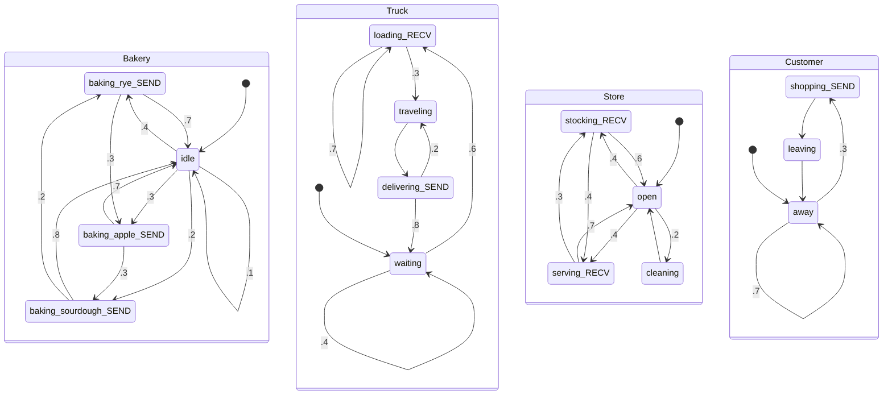
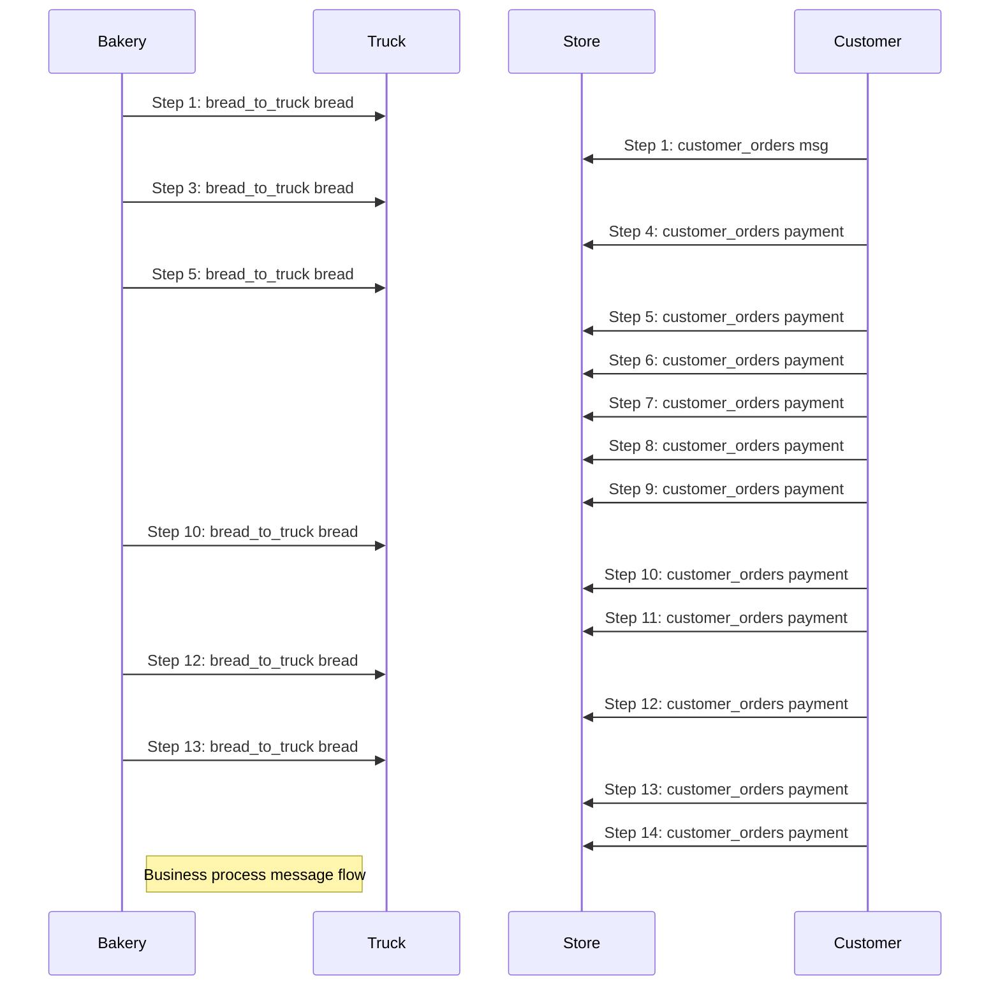
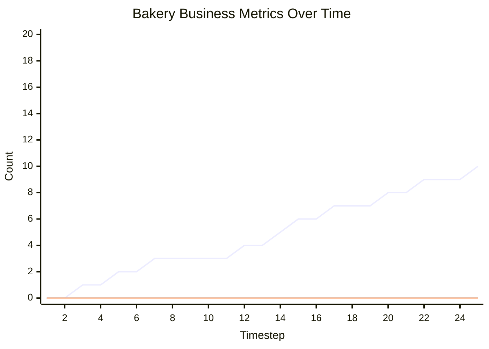

# Message Passing Markov Chain Business Process Simulation

This document contains an executable specification of a bakery business process using Message Passing Markov Chains.

## Synchronous Channel Example

```
=== STARTING SIMULATION ===
Initial state: {'ActorA': 'idle', 'ActorB': 'waiting'}

=== TIMESTEP 1 ===
ActorA: idle -> sending | Variables: {'counter': 0}
ActorB: waiting (stayed)

=== TIMESTEP 2 ===
    -> ActorA BLOCKED sending to ActorB
ActorA: sending (stayed) [BLOCKED] | Variables: {'counter': 1}
ActorB: waiting (stayed)

*** System reached stable state at timestep 2 ***

=== SIMULATION COMPLETE ===
Final state: {'ActorA': 'sending', 'ActorB': 'waiting'}
```

## Bakery Business Process Simulation

```
=== STARTING SIMULATION ===
Initial state: {'Bakery': 'idle', 'Truck': 'waiting', 'Store': 'open', 'Customer': 'away'}

=== TIMESTEP 1 ===
Bakery: idle -> baking_rye | Variables: {'breads_baked': 0, 'production_value': 0}
Truck: waiting -> loading | Variables: {'cargo': [], 'loads_received': 0, 'deliveries_made': 0}
Store: open -> stocking | Variables: {'inventory': [], 'items_stocked': 0, 'items_sold': 0, 'revenue': 0}
Customer: away -> shopping | Variables: {'purchases_attempted': 0, 'money_spent': 0}

=== TIMESTEP 2 ===
    -> Bakery baked Rye ($12)
    -> Bakery sent {'type': 'Rye', 'price': 12} to Truck
Bakery: baking_rye -> idle | Variables: {'breads_baked': 1, 'production_value': 12}
    -> Truck received {'type': 'Rye', 'price': 12} into bread
Truck: loading (stayed) | Variables: {'cargo': [], 'loads_received': 0, 'deliveries_made': 0, 'bread': {'type': 'Rye', 'price': 12}}
    -> Store BLOCKED waiting to receive
Store: stocking (stayed) [BLOCKED] | Variables: {'inventory': [], 'items_stocked': 0, 'items_sold': 0, 'revenue': 0}
    -> Customer attempting to buy bread with $10
    -> DEBUG: Resolved 'current_payment' to 10
    -> Customer sent 10 to Store
Customer: shopping -> leaving | Variables: {'purchases_attempted': 1, 'money_spent': 10, 'current_payment': 10}

=== TIMESTEP 3 ===
Bakery: idle -> baking_rye | Variables: {'breads_baked': 1, 'production_value': 12}
    -> Truck loaded Rye bread
    -> Truck BLOCKED waiting to receive
Truck: loading (stayed) [BLOCKED] | Variables: {'cargo': [{'type': 'Rye', 'price': 12}], 'loads_received': 1, 'deliveries_made': 0, 'bread': {'type': 'Rye', 'price': 12}}
    -> Store BLOCKED waiting to receive
Store: stocking (stayed) [BLOCKED] | Variables: {'inventory': [], 'items_stocked': 0, 'items_sold': 0, 'revenue': 0}
Customer: leaving -> away | Variables: {'purchases_attempted': 1, 'money_spent': 10, 'current_payment': 10}

=== TIMESTEP 4 ===
    -> Bakery baked Rye ($12)
    -> Bakery sent {'type': 'Rye', 'price': 12} to Truck
Bakery: baking_rye -> idle | Variables: {'breads_baked': 2, 'production_value': 24}
    -> Truck received {'type': 'Rye', 'price': 12} into bread
Truck: loading (stayed) | Variables: {'cargo': [{'type': 'Rye', 'price': 12}], 'loads_received': 1, 'deliveries_made': 0, 'bread': {'type': 'Rye', 'price': 12}}
    -> Store BLOCKED waiting to receive
Store: stocking (stayed) [BLOCKED] | Variables: {'inventory': [], 'items_stocked': 0, 'items_sold': 0, 'revenue': 0}
Customer: away -> shopping | Variables: {'purchases_attempted': 1, 'money_spent': 10, 'current_payment': 10}

=== TIMESTEP 5 ===
Bakery: idle -> baking_sourdough | Variables: {'breads_baked': 2, 'production_value': 24}
    -> Truck loaded Rye bread
    -> Truck BLOCKED waiting to receive
Truck: loading (stayed) [BLOCKED] | Variables: {'cargo': [{'type': 'Rye', 'price': 12}, {'type': 'Rye', 'price': 12}], 'loads_received': 2, 'deliveries_made': 0, 'bread': {'type': 'Rye', 'price': 12}}
    -> Store BLOCKED waiting to receive
Store: stocking (stayed) [BLOCKED] | Variables: {'inventory': [], 'items_stocked': 0, 'items_sold': 0, 'revenue': 0}
    -> Customer attempting to buy bread with $10
    -> DEBUG: Resolved 'current_payment' to 10
    -> Customer BLOCKED sending to Store
Customer: shopping (stayed) [BLOCKED] | Variables: {'purchases_attempted': 2, 'money_spent': 20, 'current_payment': 10}

=== TIMESTEP 6 ===
    -> Bakery baked Sourdough ($10)
    -> Bakery sent {'type': 'Sourdough', 'price': 10} to Truck
Bakery: baking_sourdough -> idle | Variables: {'breads_baked': 3, 'production_value': 34}
    -> Truck received {'type': 'Sourdough', 'price': 10} into bread
Truck: loading (stayed) | Variables: {'cargo': [{'type': 'Rye', 'price': 12}, {'type': 'Rye', 'price': 12}], 'loads_received': 2, 'deliveries_made': 0, 'bread': {'type': 'Sourdough', 'price': 10}}
    -> Store BLOCKED waiting to receive
Store: stocking (stayed) [BLOCKED] | Variables: {'inventory': [], 'items_stocked': 0, 'items_sold': 0, 'revenue': 0}
    -> DEBUG: Resolved 'current_payment' to 10
    -> Customer BLOCKED sending to Store
Customer: shopping (stayed) [BLOCKED] | Variables: {'purchases_attempted': 2, 'money_spent': 20, 'current_payment': 10}

=== TIMESTEP 7 ===
Bakery: idle (stayed) | Variables: {'breads_baked': 3, 'production_value': 34}
    -> Truck loaded Sourdough bread
    -> Truck BLOCKED waiting to receive
Truck: loading (stayed) [BLOCKED] | Variables: {'cargo': [{'type': 'Rye', 'price': 12}, {'type': 'Rye', 'price': 12}, {'type': 'Sourdough', 'price': 10}], 'loads_received': 3, 'deliveries_made': 0, 'bread': {'type': 'Sourdough', 'price': 10}}
    -> Store BLOCKED waiting to receive
Store: stocking (stayed) [BLOCKED] | Variables: {'inventory': [], 'items_stocked': 0, 'items_sold': 0, 'revenue': 0}
    -> DEBUG: Resolved 'current_payment' to 10
    -> Customer BLOCKED sending to Store
Customer: shopping (stayed) [BLOCKED] | Variables: {'purchases_attempted': 2, 'money_spent': 20, 'current_payment': 10}

=== TIMESTEP 8 ===
Bakery: idle (stayed) | Variables: {'breads_baked': 3, 'production_value': 34}
    -> Truck BLOCKED waiting to receive
Truck: loading (stayed) [BLOCKED] | Variables: {'cargo': [{'type': 'Rye', 'price': 12}, {'type': 'Rye', 'price': 12}, {'type': 'Sourdough', 'price': 10}], 'loads_received': 3, 'deliveries_made': 0, 'bread': {'type': 'Sourdough', 'price': 10}}
    -> Store BLOCKED waiting to receive
Store: stocking (stayed) [BLOCKED] | Variables: {'inventory': [], 'items_stocked': 0, 'items_sold': 0, 'revenue': 0}
    -> DEBUG: Resolved 'current_payment' to 10
    -> Customer BLOCKED sending to Store
Customer: shopping (stayed) [BLOCKED] | Variables: {'purchases_attempted': 2, 'money_spent': 20, 'current_payment': 10}

=== TIMESTEP 9 ===
Bakery: idle (stayed) | Variables: {'breads_baked': 3, 'production_value': 34}
    -> Truck BLOCKED waiting to receive
Truck: loading (stayed) [BLOCKED] | Variables: {'cargo': [{'type': 'Rye', 'price': 12}, {'type': 'Rye', 'price': 12}, {'type': 'Sourdough', 'price': 10}], 'loads_received': 3, 'deliveries_made': 0, 'bread': {'type': 'Sourdough', 'price': 10}}
    -> Store BLOCKED waiting to receive
Store: stocking (stayed) [BLOCKED] | Variables: {'inventory': [], 'items_stocked': 0, 'items_sold': 0, 'revenue': 0}
    -> DEBUG: Resolved 'current_payment' to 10
    -> Customer BLOCKED sending to Store
Customer: shopping (stayed) [BLOCKED] | Variables: {'purchases_attempted': 2, 'money_spent': 20, 'current_payment': 10}

=== TIMESTEP 10 ===
Bakery: idle -> baking_sourdough | Variables: {'breads_baked': 3, 'production_value': 34}
    -> Truck BLOCKED waiting to receive
Truck: loading (stayed) [BLOCKED] | Variables: {'cargo': [{'type': 'Rye', 'price': 12}, {'type': 'Rye', 'price': 12}, {'type': 'Sourdough', 'price': 10}], 'loads_received': 3, 'deliveries_made': 0, 'bread': {'type': 'Sourdough', 'price': 10}}
    -> Store BLOCKED waiting to receive
Store: stocking (stayed) [BLOCKED] | Variables: {'inventory': [], 'items_stocked': 0, 'items_sold': 0, 'revenue': 0}
    -> DEBUG: Resolved 'current_payment' to 10
    -> Customer BLOCKED sending to Store
Customer: shopping (stayed) [BLOCKED] | Variables: {'purchases_attempted': 2, 'money_spent': 20, 'current_payment': 10}

=== TIMESTEP 11 ===
    -> Bakery baked Sourdough ($10)
    -> Bakery sent {'type': 'Sourdough', 'price': 10} to Truck
Bakery: baking_sourdough -> idle | Variables: {'breads_baked': 4, 'production_value': 44}
    -> Truck received {'type': 'Sourdough', 'price': 10} into bread
Truck: loading (stayed) | Variables: {'cargo': [{'type': 'Rye', 'price': 12}, {'type': 'Rye', 'price': 12}, {'type': 'Sourdough', 'price': 10}], 'loads_received': 3, 'deliveries_made': 0, 'bread': {'type': 'Sourdough', 'price': 10}}
    -> Store BLOCKED waiting to receive
Store: stocking (stayed) [BLOCKED] | Variables: {'inventory': [], 'items_stocked': 0, 'items_sold': 0, 'revenue': 0}
    -> DEBUG: Resolved 'current_payment' to 10
    -> Customer BLOCKED sending to Store
Customer: shopping (stayed) [BLOCKED] | Variables: {'purchases_attempted': 2, 'money_spent': 20, 'current_payment': 10}

=== TIMESTEP 12 ===
Bakery: idle -> baking_apple | Variables: {'breads_baked': 4, 'production_value': 44}
    -> Truck loaded Sourdough bread
    -> Truck BLOCKED waiting to receive
Truck: loading (stayed) [BLOCKED] | Variables: {'cargo': [{'type': 'Rye', 'price': 12}, {'type': 'Rye', 'price': 12}, {'type': 'Sourdough', 'price': 10}, {'type': 'Sourdough', 'price': 10}], 'loads_received': 4, 'deliveries_made': 0, 'bread': {'type': 'Sourdough', 'price': 10}}
    -> Store BLOCKED waiting to receive
Store: stocking (stayed) [BLOCKED] | Variables: {'inventory': [], 'items_stocked': 0, 'items_sold': 0, 'revenue': 0}
    -> DEBUG: Resolved 'current_payment' to 10
    -> Customer BLOCKED sending to Store
Customer: shopping (stayed) [BLOCKED] | Variables: {'purchases_attempted': 2, 'money_spent': 20, 'current_payment': 10}

=== TIMESTEP 13 ===
    -> Bakery baked Apple ($15)
    -> Bakery sent {'type': 'Apple', 'price': 15} to Truck
Bakery: baking_apple -> baking_sourdough | Variables: {'breads_baked': 5, 'production_value': 59}
    -> Truck received {'type': 'Apple', 'price': 15} into bread
Truck: loading (stayed) | Variables: {'cargo': [{'type': 'Rye', 'price': 12}, {'type': 'Rye', 'price': 12}, {'type': 'Sourdough', 'price': 10}, {'type': 'Sourdough', 'price': 10}], 'loads_received': 4, 'deliveries_made': 0, 'bread': {'type': 'Apple', 'price': 15}}
    -> Store BLOCKED waiting to receive
Store: stocking (stayed) [BLOCKED] | Variables: {'inventory': [], 'items_stocked': 0, 'items_sold': 0, 'revenue': 0}
    -> DEBUG: Resolved 'current_payment' to 10
    -> Customer BLOCKED sending to Store
Customer: shopping (stayed) [BLOCKED] | Variables: {'purchases_attempted': 2, 'money_spent': 20, 'current_payment': 10}

=== TIMESTEP 14 ===
    -> Bakery baked Sourdough ($10)
    -> Bakery sent {'type': 'Sourdough', 'price': 10} to Truck
Bakery: baking_sourdough -> idle | Variables: {'breads_baked': 6, 'production_value': 69}
    -> Truck loaded Apple bread
    -> Truck received {'type': 'Sourdough', 'price': 10} into bread
Truck: loading (stayed) | Variables: {'cargo': [{'type': 'Rye', 'price': 12}, {'type': 'Rye', 'price': 12}, {'type': 'Sourdough', 'price': 10}, {'type': 'Sourdough', 'price': 10}, {'type': 'Apple', 'price': 15}], 'loads_received': 5, 'deliveries_made': 0, 'bread': {'type': 'Sourdough', 'price': 10}}
    -> Store BLOCKED waiting to receive
Store: stocking (stayed) [BLOCKED] | Variables: {'inventory': [], 'items_stocked': 0, 'items_sold': 0, 'revenue': 0}
    -> DEBUG: Resolved 'current_payment' to 10
    -> Customer BLOCKED sending to Store
Customer: shopping (stayed) [BLOCKED] | Variables: {'purchases_attempted': 2, 'money_spent': 20, 'current_payment': 10}

=== TIMESTEP 15 ===
Bakery: idle -> baking_rye | Variables: {'breads_baked': 6, 'production_value': 69}
    -> Truck loaded Sourdough bread
    -> Truck BLOCKED waiting to receive
Truck: loading (stayed) [BLOCKED] | Variables: {'cargo': [{'type': 'Rye', 'price': 12}, {'type': 'Rye', 'price': 12}, {'type': 'Sourdough', 'price': 10}, {'type': 'Sourdough', 'price': 10}, {'type': 'Apple', 'price': 15}, {'type': 'Sourdough', 'price': 10}], 'loads_received': 6, 'deliveries_made': 0, 'bread': {'type': 'Sourdough', 'price': 10}}
    -> Store BLOCKED waiting to receive
Store: stocking (stayed) [BLOCKED] | Variables: {'inventory': [], 'items_stocked': 0, 'items_sold': 0, 'revenue': 0}
    -> DEBUG: Resolved 'current_payment' to 10
    -> Customer BLOCKED sending to Store
Customer: shopping (stayed) [BLOCKED] | Variables: {'purchases_attempted': 2, 'money_spent': 20, 'current_payment': 10}

=== TIMESTEP 16 ===
    -> Bakery baked Rye ($12)
    -> Bakery sent {'type': 'Rye', 'price': 12} to Truck
Bakery: baking_rye -> idle | Variables: {'breads_baked': 7, 'production_value': 81}
    -> Truck received {'type': 'Rye', 'price': 12} into bread
Truck: loading (stayed) | Variables: {'cargo': [{'type': 'Rye', 'price': 12}, {'type': 'Rye', 'price': 12}, {'type': 'Sourdough', 'price': 10}, {'type': 'Sourdough', 'price': 10}, {'type': 'Apple', 'price': 15}, {'type': 'Sourdough', 'price': 10}], 'loads_received': 6, 'deliveries_made': 0, 'bread': {'type': 'Rye', 'price': 12}}
    -> Store BLOCKED waiting to receive
Store: stocking (stayed) [BLOCKED] | Variables: {'inventory': [], 'items_stocked': 0, 'items_sold': 0, 'revenue': 0}
    -> DEBUG: Resolved 'current_payment' to 10
    -> Customer BLOCKED sending to Store
Customer: shopping (stayed) [BLOCKED] | Variables: {'purchases_attempted': 2, 'money_spent': 20, 'current_payment': 10}

=== TIMESTEP 17 ===
Bakery: idle (stayed) | Variables: {'breads_baked': 7, 'production_value': 81}
    -> Truck loaded Rye bread
    -> Truck BLOCKED waiting to receive
Truck: loading (stayed) [BLOCKED] | Variables: {'cargo': [{'type': 'Rye', 'price': 12}, {'type': 'Rye', 'price': 12}, {'type': 'Sourdough', 'price': 10}, {'type': 'Sourdough', 'price': 10}, {'type': 'Apple', 'price': 15}, {'type': 'Sourdough', 'price': 10}, {'type': 'Rye', 'price': 12}], 'loads_received': 7, 'deliveries_made': 0, 'bread': {'type': 'Rye', 'price': 12}}
    -> Store BLOCKED waiting to receive
Store: stocking (stayed) [BLOCKED] | Variables: {'inventory': [], 'items_stocked': 0, 'items_sold': 0, 'revenue': 0}
    -> DEBUG: Resolved 'current_payment' to 10
    -> Customer BLOCKED sending to Store
Customer: shopping (stayed) [BLOCKED] | Variables: {'purchases_attempted': 2, 'money_spent': 20, 'current_payment': 10}

=== TIMESTEP 18 ===
Bakery: idle -> baking_rye | Variables: {'breads_baked': 7, 'production_value': 81}
    -> Truck BLOCKED waiting to receive
Truck: loading (stayed) [BLOCKED] | Variables: {'cargo': [{'type': 'Rye', 'price': 12}, {'type': 'Rye', 'price': 12}, {'type': 'Sourdough', 'price': 10}, {'type': 'Sourdough', 'price': 10}, {'type': 'Apple', 'price': 15}, {'type': 'Sourdough', 'price': 10}, {'type': 'Rye', 'price': 12}], 'loads_received': 7, 'deliveries_made': 0, 'bread': {'type': 'Rye', 'price': 12}}
    -> Store BLOCKED waiting to receive
Store: stocking (stayed) [BLOCKED] | Variables: {'inventory': [], 'items_stocked': 0, 'items_sold': 0, 'revenue': 0}
    -> DEBUG: Resolved 'current_payment' to 10
    -> Customer BLOCKED sending to Store
Customer: shopping (stayed) [BLOCKED] | Variables: {'purchases_attempted': 2, 'money_spent': 20, 'current_payment': 10}

=== TIMESTEP 19 ===
    -> Bakery baked Rye ($12)
    -> Bakery sent {'type': 'Rye', 'price': 12} to Truck
Bakery: baking_rye -> idle | Variables: {'breads_baked': 8, 'production_value': 93}
    -> Truck received {'type': 'Rye', 'price': 12} into bread
Truck: loading (stayed) | Variables: {'cargo': [{'type': 'Rye', 'price': 12}, {'type': 'Rye', 'price': 12}, {'type': 'Sourdough', 'price': 10}, {'type': 'Sourdough', 'price': 10}, {'type': 'Apple', 'price': 15}, {'type': 'Sourdough', 'price': 10}, {'type': 'Rye', 'price': 12}], 'loads_received': 7, 'deliveries_made': 0, 'bread': {'type': 'Rye', 'price': 12}}
    -> Store BLOCKED waiting to receive
Store: stocking (stayed) [BLOCKED] | Variables: {'inventory': [], 'items_stocked': 0, 'items_sold': 0, 'revenue': 0}
    -> DEBUG: Resolved 'current_payment' to 10
    -> Customer BLOCKED sending to Store
Customer: shopping (stayed) [BLOCKED] | Variables: {'purchases_attempted': 2, 'money_spent': 20, 'current_payment': 10}

=== TIMESTEP 20 ===
Bakery: idle -> baking_sourdough | Variables: {'breads_baked': 8, 'production_value': 93}
    -> Truck loaded Rye bread
    -> Truck BLOCKED waiting to receive
Truck: loading (stayed) [BLOCKED] | Variables: {'cargo': [{'type': 'Rye', 'price': 12}, {'type': 'Rye', 'price': 12}, {'type': 'Sourdough', 'price': 10}, {'type': 'Sourdough', 'price': 10}, {'type': 'Apple', 'price': 15}, {'type': 'Sourdough', 'price': 10}, {'type': 'Rye', 'price': 12}, {'type': 'Rye', 'price': 12}], 'loads_received': 8, 'deliveries_made': 0, 'bread': {'type': 'Rye', 'price': 12}}
    -> Store BLOCKED waiting to receive
Store: stocking (stayed) [BLOCKED] | Variables: {'inventory': [], 'items_stocked': 0, 'items_sold': 0, 'revenue': 0}
    -> DEBUG: Resolved 'current_payment' to 10
    -> Customer BLOCKED sending to Store
Customer: shopping (stayed) [BLOCKED] | Variables: {'purchases_attempted': 2, 'money_spent': 20, 'current_payment': 10}

=== TIMESTEP 21 ===
    -> Bakery baked Sourdough ($10)
    -> Bakery sent {'type': 'Sourdough', 'price': 10} to Truck
Bakery: baking_sourdough -> idle | Variables: {'breads_baked': 9, 'production_value': 103}
    -> Truck received {'type': 'Sourdough', 'price': 10} into bread
Truck: loading (stayed) | Variables: {'cargo': [{'type': 'Rye', 'price': 12}, {'type': 'Rye', 'price': 12}, {'type': 'Sourdough', 'price': 10}, {'type': 'Sourdough', 'price': 10}, {'type': 'Apple', 'price': 15}, {'type': 'Sourdough', 'price': 10}, {'type': 'Rye', 'price': 12}, {'type': 'Rye', 'price': 12}], 'loads_received': 8, 'deliveries_made': 0, 'bread': {'type': 'Sourdough', 'price': 10}}
    -> Store BLOCKED waiting to receive
Store: stocking (stayed) [BLOCKED] | Variables: {'inventory': [], 'items_stocked': 0, 'items_sold': 0, 'revenue': 0}
    -> DEBUG: Resolved 'current_payment' to 10
    -> Customer BLOCKED sending to Store
Customer: shopping (stayed) [BLOCKED] | Variables: {'purchases_attempted': 2, 'money_spent': 20, 'current_payment': 10}

=== TIMESTEP 22 ===
Bakery: idle (stayed) | Variables: {'breads_baked': 9, 'production_value': 103}
    -> Truck loaded Sourdough bread
    -> Truck BLOCKED waiting to receive
Truck: loading (stayed) [BLOCKED] | Variables: {'cargo': [{'type': 'Rye', 'price': 12}, {'type': 'Rye', 'price': 12}, {'type': 'Sourdough', 'price': 10}, {'type': 'Sourdough', 'price': 10}, {'type': 'Apple', 'price': 15}, {'type': 'Sourdough', 'price': 10}, {'type': 'Rye', 'price': 12}, {'type': 'Rye', 'price': 12}, {'type': 'Sourdough', 'price': 10}], 'loads_received': 9, 'deliveries_made': 0, 'bread': {'type': 'Sourdough', 'price': 10}}
    -> Store BLOCKED waiting to receive
Store: stocking (stayed) [BLOCKED] | Variables: {'inventory': [], 'items_stocked': 0, 'items_sold': 0, 'revenue': 0}
    -> DEBUG: Resolved 'current_payment' to 10
    -> Customer BLOCKED sending to Store
Customer: shopping (stayed) [BLOCKED] | Variables: {'purchases_attempted': 2, 'money_spent': 20, 'current_payment': 10}

=== TIMESTEP 23 ===
Bakery: idle -> baking_apple | Variables: {'breads_baked': 9, 'production_value': 103}
    -> Truck BLOCKED waiting to receive
Truck: loading (stayed) [BLOCKED] | Variables: {'cargo': [{'type': 'Rye', 'price': 12}, {'type': 'Rye', 'price': 12}, {'type': 'Sourdough', 'price': 10}, {'type': 'Sourdough', 'price': 10}, {'type': 'Apple', 'price': 15}, {'type': 'Sourdough', 'price': 10}, {'type': 'Rye', 'price': 12}, {'type': 'Rye', 'price': 12}, {'type': 'Sourdough', 'price': 10}], 'loads_received': 9, 'deliveries_made': 0, 'bread': {'type': 'Sourdough', 'price': 10}}
    -> Store BLOCKED waiting to receive
Store: stocking (stayed) [BLOCKED] | Variables: {'inventory': [], 'items_stocked': 0, 'items_sold': 0, 'revenue': 0}
    -> DEBUG: Resolved 'current_payment' to 10
    -> Customer BLOCKED sending to Store
Customer: shopping (stayed) [BLOCKED] | Variables: {'purchases_attempted': 2, 'money_spent': 20, 'current_payment': 10}

=== TIMESTEP 24 ===
    -> Bakery baked Apple ($15)
    -> Bakery sent {'type': 'Apple', 'price': 15} to Truck
Bakery: baking_apple -> idle | Variables: {'breads_baked': 10, 'production_value': 118}
    -> Truck received {'type': 'Apple', 'price': 15} into bread
Truck: loading (stayed) | Variables: {'cargo': [{'type': 'Rye', 'price': 12}, {'type': 'Rye', 'price': 12}, {'type': 'Sourdough', 'price': 10}, {'type': 'Sourdough', 'price': 10}, {'type': 'Apple', 'price': 15}, {'type': 'Sourdough', 'price': 10}, {'type': 'Rye', 'price': 12}, {'type': 'Rye', 'price': 12}, {'type': 'Sourdough', 'price': 10}], 'loads_received': 9, 'deliveries_made': 0, 'bread': {'type': 'Apple', 'price': 15}}
    -> Store BLOCKED waiting to receive
Store: stocking (stayed) [BLOCKED] | Variables: {'inventory': [], 'items_stocked': 0, 'items_sold': 0, 'revenue': 0}
    -> DEBUG: Resolved 'current_payment' to 10
    -> Customer BLOCKED sending to Store
Customer: shopping (stayed) [BLOCKED] | Variables: {'purchases_attempted': 2, 'money_spent': 20, 'current_payment': 10}

=== TIMESTEP 25 ===
Bakery: idle -> baking_rye | Variables: {'breads_baked': 10, 'production_value': 118}
    -> Truck loaded Apple bread
    -> Truck BLOCKED waiting to receive
Truck: loading (stayed) [BLOCKED] | Variables: {'cargo': [{'type': 'Rye', 'price': 12}, {'type': 'Rye', 'price': 12}, {'type': 'Sourdough', 'price': 10}, {'type': 'Sourdough', 'price': 10}, {'type': 'Apple', 'price': 15}, {'type': 'Sourdough', 'price': 10}, {'type': 'Rye', 'price': 12}, {'type': 'Rye', 'price': 12}, {'type': 'Sourdough', 'price': 10}, {'type': 'Apple', 'price': 15}], 'loads_received': 10, 'deliveries_made': 0, 'bread': {'type': 'Apple', 'price': 15}}
    -> Store BLOCKED waiting to receive
Store: stocking (stayed) [BLOCKED] | Variables: {'inventory': [], 'items_stocked': 0, 'items_sold': 0, 'revenue': 0}
    -> DEBUG: Resolved 'current_payment' to 10
    -> Customer BLOCKED sending to Store
Customer: shopping (stayed) [BLOCKED] | Variables: {'purchases_attempted': 2, 'money_spent': 20, 'current_payment': 10}

=== SIMULATION COMPLETE ===
Final state: {'Bakery': 'baking_rye', 'Truck': 'loading', 'Store': 'stocking', 'Customer': 'shopping'}
```

## Business Metrics Analysis

- **Production**: 10 breads baked, $118 value
- **Logistics**: 9 loads received, 0 deliveries made
- **Retail**: 0 stocked, 0 sold, $0 revenue
- **Customer**: 2 attempts, $20 spent
- **Efficiency**: 100.00% waste rate, $0.00 revenue/bread
- **Satisfaction**: 0.00% customer satisfaction

**Inventory Status:**
- Unsold inventory: 0 items
- Truck cargo remaining: 10 items

## Temporal Logic Questions

With this executable model, we can now ask CTL-style temporal logic questions:

- **Safety**: Did we ever have zero inventory? (Check if Store.inventory was ever empty)
- **Liveness**: What's the maximum revenue we can achieve? (Analyze revenue growth patterns)
- **Reachability**: Is waste inevitable? (Check if production always exceeds sales)
- **Optimization**: Can customers always find bread? (Check inventory vs. customer arrival patterns)
- **Performance**: What's the optimal production rate? (Minimize waste while maximizing revenue)

============================================================
# STATE MACHINE DIAGRAM
============================================================



============================================================
# INTERACTION DIAGRAM
============================================================



============================================================
# METRICS TIMELINE
============================================================



---

**Generated by Message Passing Markov Chain Framework**

*This specification can be version controlled, tested, and formally verified.*
