Mermaid Diagram Types Showcase:
===================================

1. STATE DIAGRAM EXAMPLE:
------------------------------
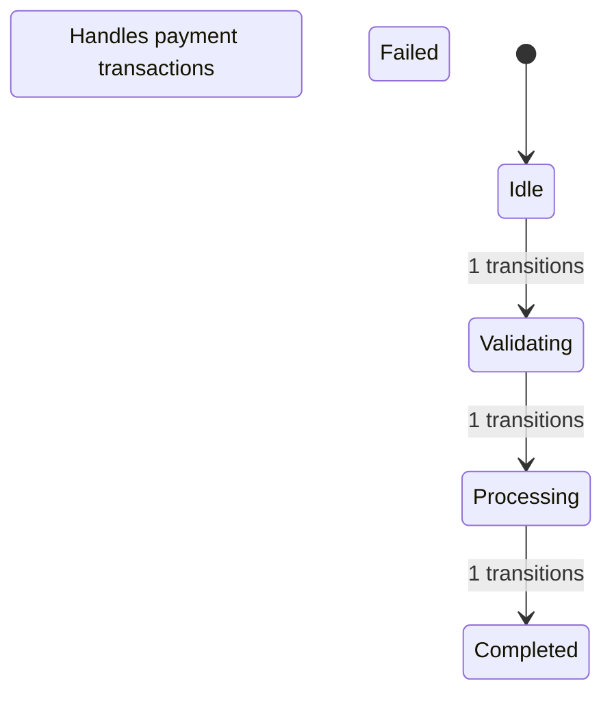

2. SEQUENCE DIAGRAM EXAMPLE:
-----------------------------------
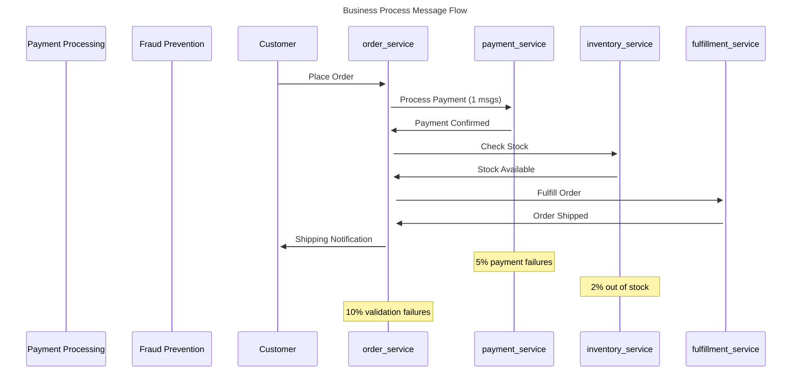

3. THROUGHPUT CHART EXAMPLE:
-----------------------------------
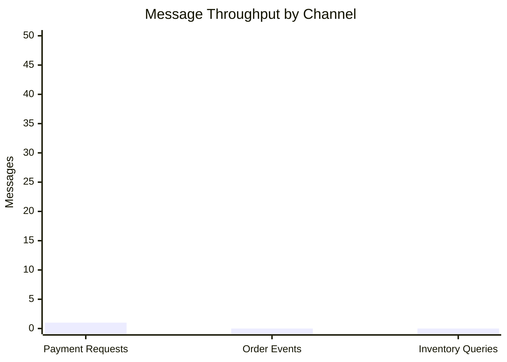

4. BUSINESS EVENTS PIE CHART:
-----------------------------------
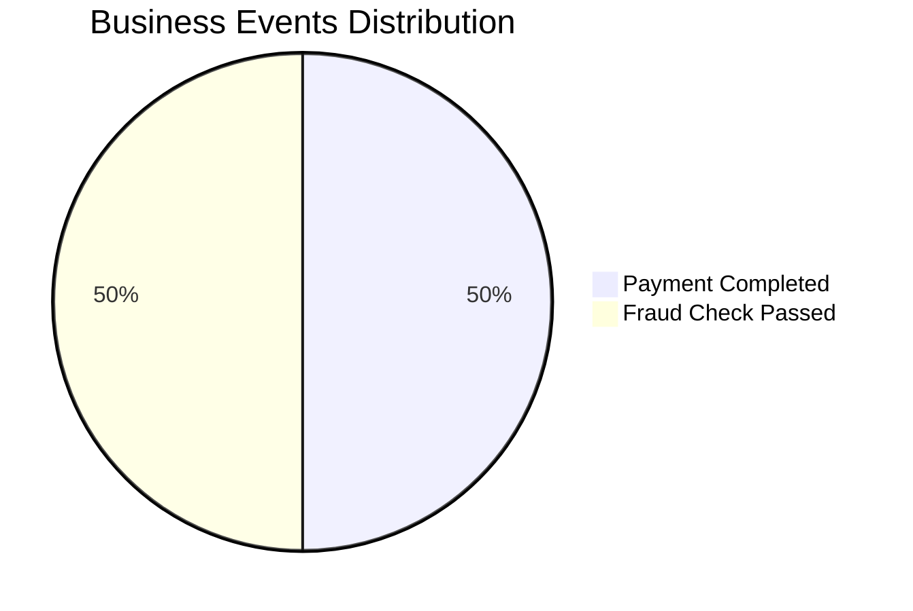

5. PERFORMANCE LINE CHART:
-----------------------------------
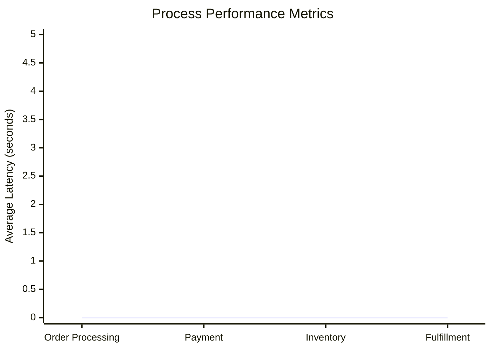

================================================================================
FULL VIBECODE BUSINESS SYSTEM WITH MERMAID DIAGRAMS
================================================================================
Vibecode Business System: E-commerce Order Processing
=======================================================

Simulating business operations...
Processing order 0
Processing order 1
Processing order 2
Processing order 3
Processing order 4
Processing order 5
Processing order 6
Processing order 7
Processing order 8
Processing order 9

Generating business requirements document...

Generating simulation report...

============================================================
MERMAID DIAGRAMS SHOWCASE
============================================================

## 1. PROCESS STATE DIAGRAMS
========================================

### ORDER_SERVICE STATE MACHINE:
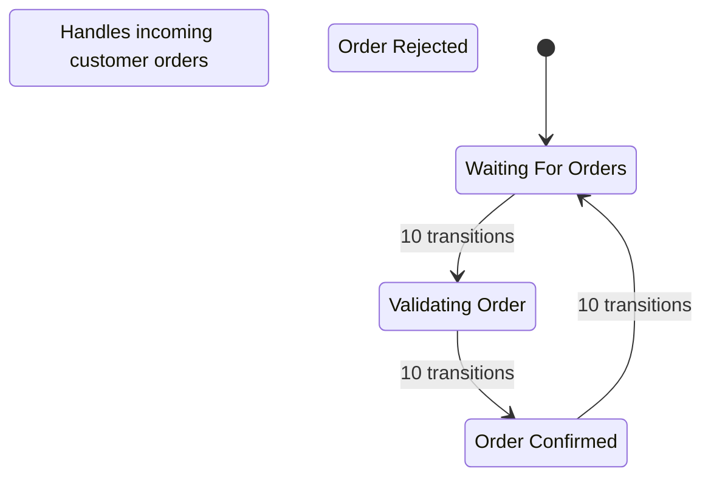

### PAYMENT_SERVICE STATE MACHINE:
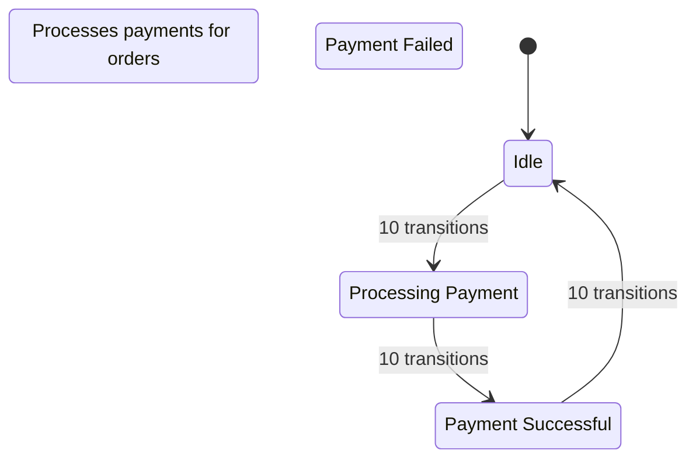

### INVENTORY_SERVICE STATE MACHINE:
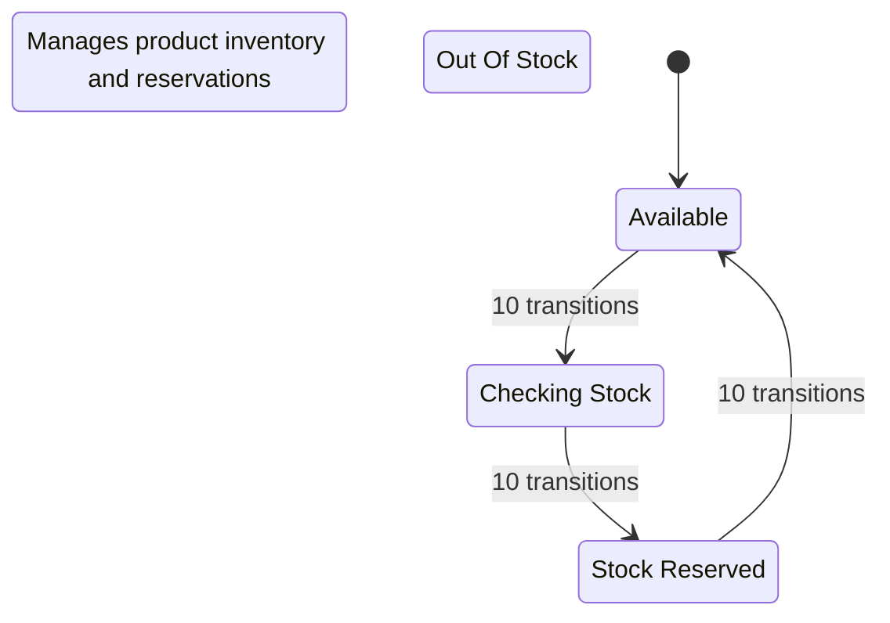

### FULFILLMENT_SERVICE STATE MACHINE:
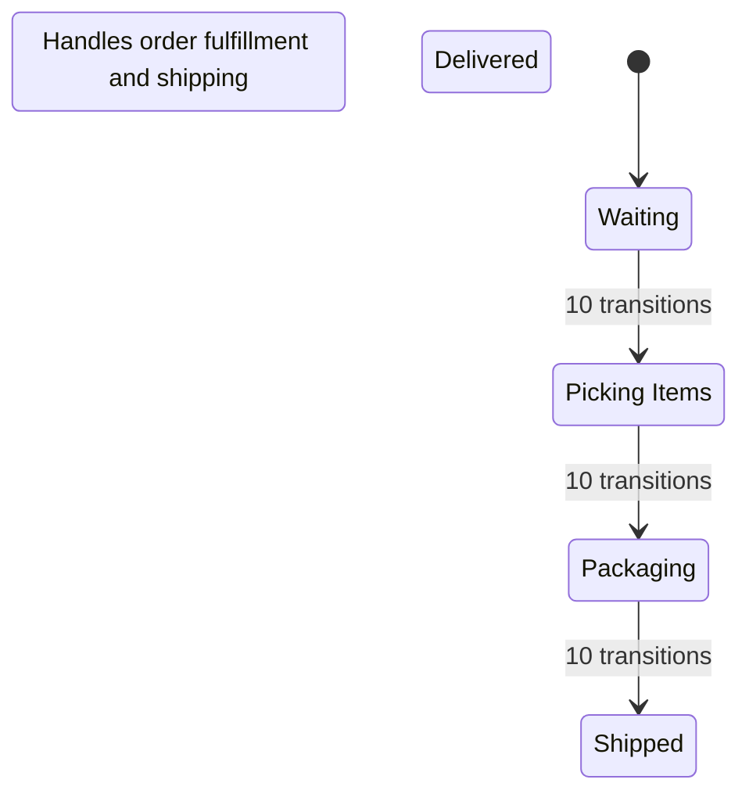

## 2. SEQUENCE DIAGRAM - MESSAGE INTERACTIONS
==================================================
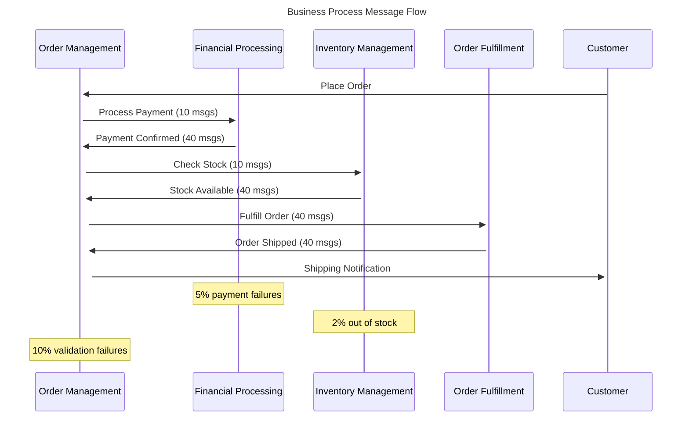

## 3. METRICS CHARTS
=========================

### MESSAGE THROUGHPUT CHART:
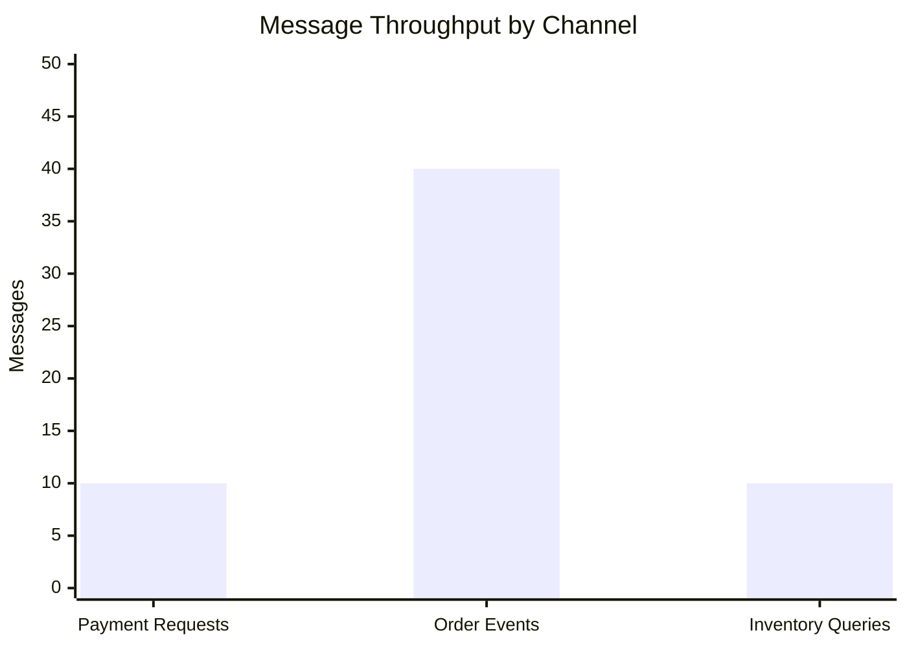

### BUSINESS EVENTS DISTRIBUTION:
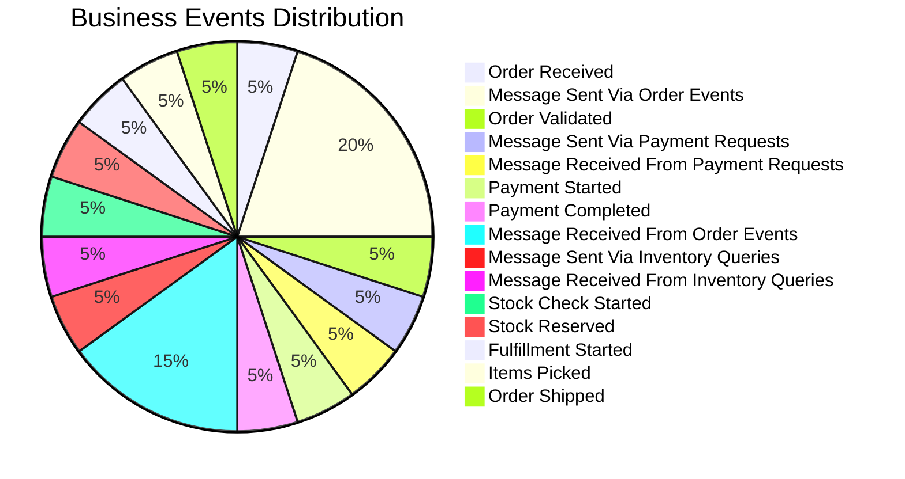

### PERFORMANCE METRICS:
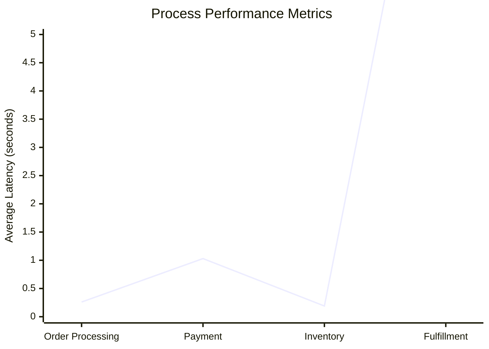

============================================================
BUSINESS REQUIREMENTS DOCUMENT
============================================================
# Business System Requirements: E-commerce Order Processing

*Auto-generated from vibecode business system design*

## System Overview

This document specifies the requirements for the **E-commerce Order Processing** business system.
The system is modeled as communicating Markov chains with formal verification.

## Process Interaction Flow

The following sequence diagram shows how business processes interact:


## Business Processes

### order_service
**Role**: Order Management
**Description**: Handles incoming customer orders
**States**: waiting_for_orders, validating_order, order_confirmed, order_rejected
**Initial State**: waiting_for_orders

#### State Diagram


### payment_service
**Role**: Financial Processing
**Description**: Processes payments for orders
**States**: idle, processing_payment, payment_successful, payment_failed
**Initial State**: idle

#### State Diagram


### inventory_service
**Role**: Inventory Management
**Description**: Manages product inventory and reservations
**States**: available, checking_stock, stock_reserved, out_of_stock
**Initial State**: available

#### State Diagram


### fulfillment_service
**Role**: Order Fulfillment
**Description**: Handles order fulfillment and shipping
**States**: waiting, picking_items, packaging, shipped, delivered
**Initial State**: waiting

#### State Diagram


## Communication Channels

### order_events
**Purpose**: Order lifecycle communication
**Description**: Channel for order-related events
**Capacity**: 100 messages

### payment_requests
**Purpose**: Payment processing coordination
**Description**: Channel for payment processing requests
**Capacity**: 50 messages

### inventory_queries
**Purpose**: Real-time inventory management
**Description**: Channel for inventory availability checks
**Capacity**: 200 messages

## Business Rules

1. Orders must be validated before payment processing
2. Payment must be successful before inventory reservation
3. Inventory must be reserved before fulfillment begins
4. Failed payments must trigger order cancellation within 5 minutes
5. Out-of-stock items must trigger customer notification within 1 minute

## Service Level Agreements (SLAs)

### response_time
**Threshold**: 2.0
**Description**: Order processing response time must be under 2 seconds

### order_completion
**Threshold**: 300.0
**Description**: Order completion must be under 5 minutes

### availability
**Threshold**: 0.999
**Description**: System availability must be 99.9% or higher

### payment_processing
**Threshold**: 10.0
**Description**: Payment processing must complete within 10 seconds

## Formal Verification Properties

The following properties are automatically verified using CTL/PCTL model checking:

### Safety Properties
- **No deadlock**: AG(¬deadlock) - System never reaches a deadlocked state
- **Data integrity**: AG(message_sent → EF message_received) - All messages eventually delivered
- **Mutual exclusion**: AG(¬(process1_critical ∧ process2_critical)) - No resource conflicts

### Liveness Properties
- **Progress**: AG EF progress - System always eventually makes progress
- **Completion**: AF completion - All business processes eventually complete
- **Availability**: AG EF available - System always eventually becomes available

### Performance Properties
- **Response time**: P≥0.95[response_time ≤ threshold] - 95% of responses within SLA
- **Throughput**: P≥0.99[throughput ≥ minimum] - 99% chance of meeting throughput targets
- **Reliability**: P<0.01[G failure] - Less than 1% chance of permanent failure

## Simulation Metrics

The following metrics are tracked during simulation:

### Message Throughput


### Business Events Distribution


### Performance Metrics

```mermaid
xychart-beta
    title "Process Performance Metrics"
    x-axis ["Order Processing", "Payment", "Inventory", "Fulfillment"]
    y-axis "Average Latency (seconds)" 0 --> 5
    line [0.26, 1.03, 0.19, 11.12]
```

### Operational Metrics
- State transitions per process
- Message throughput per channel
- Queue lengths over time
- Error rates and failure events

### Business Metrics
- Business event frequencies
- Process completion rates
- SLA compliance percentages
- End-to-end latencies


============================================================
SIMULATION REPORT
============================================================
# Simulation Report

## State Transitions
- order_service: 30 transitions
- payment_service: 30 transitions
- inventory_service: 30 transitions
- fulfillment_service: 30 transitions

## Message Passing
- payment_requests: 10 sent, 10 received, 0 pending ✅ (efficiency: 100.0%)
- order_events: 40 sent, 30 received, 10 pending ❌ (efficiency: 75.0%)
- inventory_queries: 10 sent, 10 received, 0 pending ✅ (efficiency: 100.0%)

## Message Flow Issues
- ⚠️ Channel 'order_events' has 10 unprocessed messages - potential bottleneck
- ⚠️ Channel 'order_events' has low processing efficiency: 75.0%

## Business Events
- order_received: 10 occurrences
- message_sent_via_order_events: 40 occurrences
- order_validated: 10 occurrences
- message_sent_via_payment_requests: 10 occurrences
- message_received_from_payment_requests: 10 occurrences
- payment_started: 10 occurrences
- payment_completed: 10 occurrences
- message_received_from_order_events: 30 occurrences
- message_sent_via_inventory_queries: 10 occurrences
- message_received_from_inventory_queries: 10 occurrences
- stock_check_started: 10 occurrences
- stock_reserved: 10 occurrences
- fulfillment_started: 10 occurrences
- items_picked: 10 occurrences
- order_shipped: 10 occurrences

## Performance Metrics
- Average Response Time: 2.103s
- Error Rate: 0.0%

## SLA Violations
- response_time: 30 violations

## Business Insights
- Order Completion Rate: 100.0%
- Payment Failure Rate: 0.0%
- Stock Availability: 100.0%

## Business Recommendations
- ✅ Excellent order completion rate
- ✅ Payment processing is reliable
- ✅ Inventory management is effective
Tiny System Test:
====================
Building state space (max_states=1000, max_depth=20)...
State space exploration complete: 3 states
Tiny system: 3 states
EF done: True
EF has_msg: True
All states:
1. State[proc[sent||]] Channels[ch:[Message(sender='proc', content='msg', timestamp=0, message_type='data')]] Globals[]
2. State[proc[done|result=msg|]] Channels[ch:[]] Globals[]
3. State[proc[start||]] Channels[ch:[]] Globals[]

Synchronous Producer-Consumer:
===================================
Building synchronous state space (max_states=5000, max_depth=30)...
Synchronous state space complete: 41 states
Synchronous system: 41 states (much smaller!)

Synchronous CTL Properties:
------------------------------
EF communication_happened: True
EF consumer_has_item: True
Skipping AG EF check (can be expensive)

All reachable states:
1. State[producer[idle|items_made=0|] | consumer[processing|items_consumed=0,last_item=None,received_item=item|]] Channels[] Globals[]
2. State[producer[idle|items_made=0|] | consumer[processing|items_consumed=0,last_item=None,received_item=item|]] Channels[] Globals[]
3. State[producer[idle|items_made=0|] | consumer[processing|items_consumed=0,last_item=None,received_item=item|]] Channels[] Globals[]
4. State[producer[idle|items_made=0|] | consumer[processing|items_consumed=0,last_item=None,received_item=item|]] Channels[] Globals[]
5. State[producer[idle|items_made=0|] | consumer[processing|items_consumed=0,last_item=None,received_item=item|]] Channels[] Globals[]
6. State[producer[idle|items_made=0|] | consumer[processing|items_consumed=0,last_item=None,received_item=item|]] Channels[] Globals[]
7. State[producer[idle|items_made=0|] | consumer[processing|items_consumed=0,last_item=None,received_item=item|]] Channels[] Globals[]
8. State[producer[idle|items_made=0|] | consumer[processing|items_consumed=0,last_item=None,received_item=item|]] Channels[] Globals[]
9. State[producer[idle|items_made=0|] | consumer[processing|items_consumed=0,last_item=None,received_item=item|]] Channels[] Globals[]
10. State[producer[idle|items_made=0|] | consumer[processing|items_consumed=0,last_item=None,received_item=item|]] Channels[] Globals[]
11. State[producer[idle|items_made=0|] | consumer[waiting|items_consumed=0,last_item=None,received_item=item|]] Channels[] Globals[]
... and 30 more states

Skipping dining philosophers for now - try simple async version...
Simple Producer-Consumer (Fast Version):
=============================================
Building state space (max_states=1000, max_depth=20)...
State space exploration complete: 21 states
Explored 21 system states

Fast CTL Properties:
--------------------
EF data_available: True
EF channel_full: True
EF consumer_got_data: True

Sample states (first 3):
1. State[producer[idle|count=0|] | consumer[waiting|item=item,received=0|]] Channels[data:[Message(sender='producer', content='item', timestamp=8, message_type='data')]] Globals[]
2. State[producer[idle|count=0|] | consumer[waiting|received=0|]] Channels[data:[Message(sender='producer', content='item', timestamp=0, message_type='data')]] Globals[]
3. State[producer[idle|count=0|] | consumer[waiting|item=item,received=0|]] Channels[data:[]] Globals[]

All examples completed!
