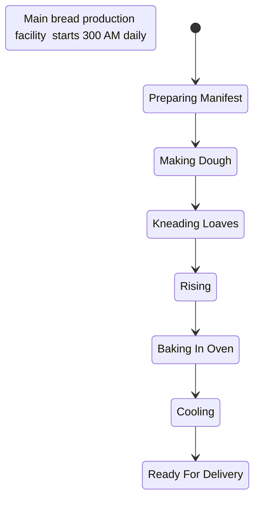
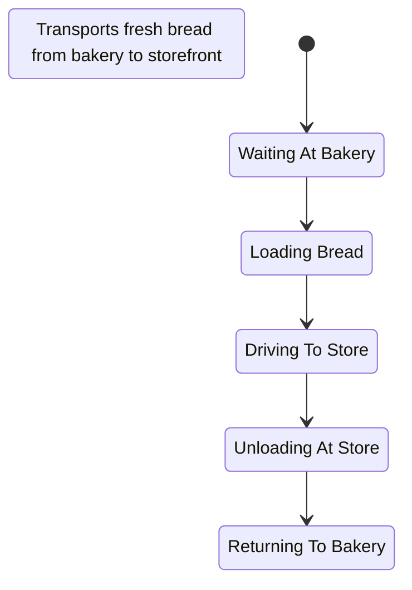
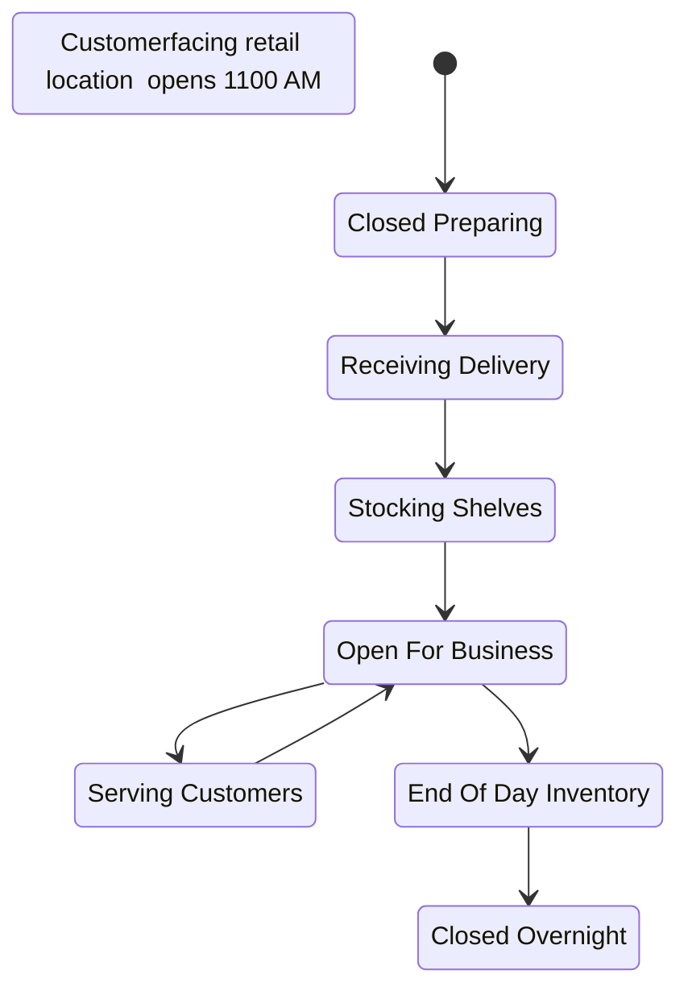
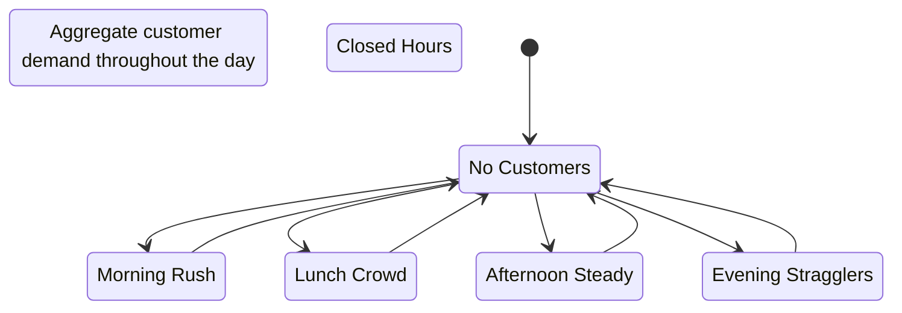
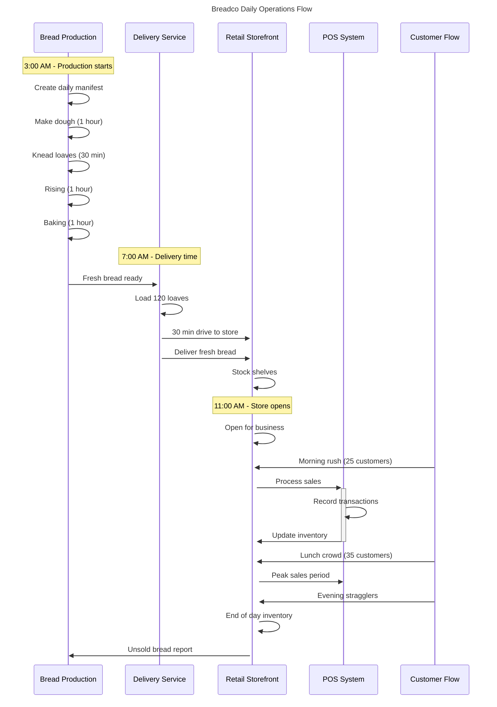
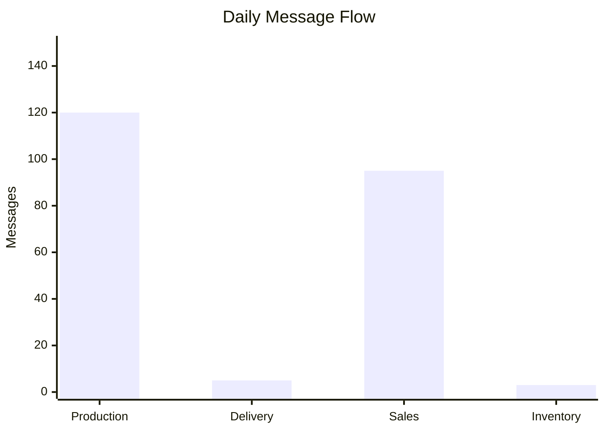
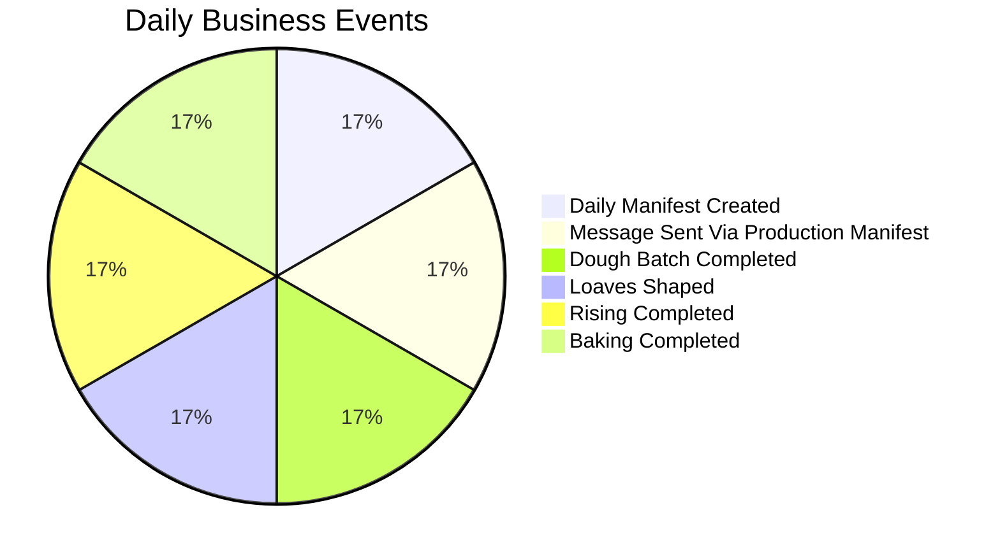
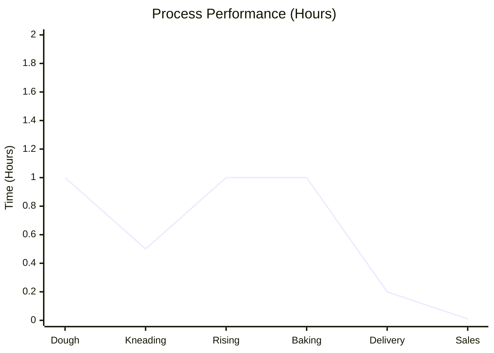
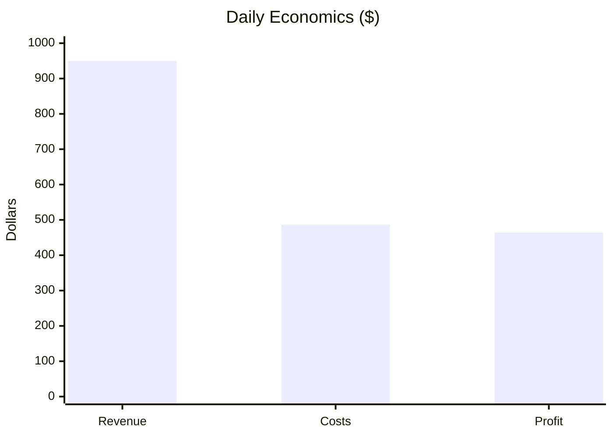
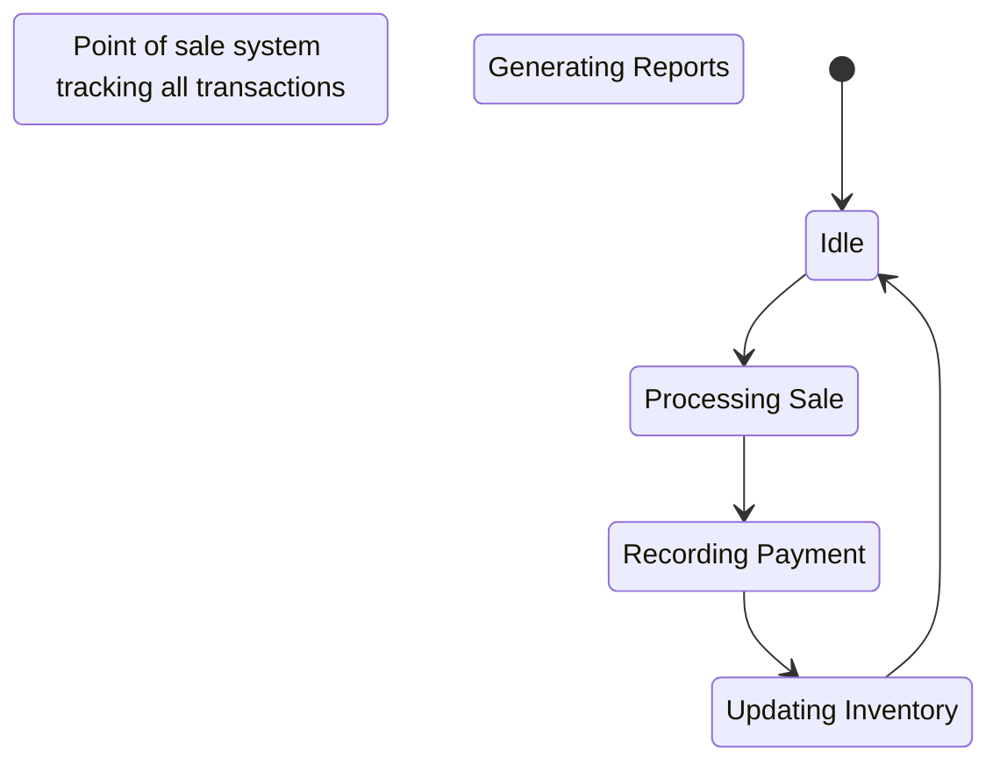

Breadco Business System: From Dough to Dollars
==================================================

Prompt to the LLM regarding the business:

```
We want to model a bread company, Breadco:

there is a bakery that starts at 3:00am making bread. there are constraints on how fast it can be made, because
a manifest of what is being made for the day is created
an hour to make dough
a half hour kneading dough into loaves
an hour to rise
an hour in the carousel oven
then a delivery truck appears, and hot loaves are loaded on to it
the truck drives a half hour away to the store front
the truck needs to try to arrive before the store opens at 11:00am. we can have a lot of unsold bread if customers show up to see empty shelves.
the store takes the delivery, and stocks it on shelves
after this, the Square terminal does all the accounting. when loaves are sold, a button is pushed. all credit and cash are accounted for
at the end of the day, notes are taken of what is unsold
3 day old bread ends up going to charity (tax purposes)
customers are an actor that is modelled as well. we try to iteratively match supply to demand, to lower waste.
when there is unsold bread, it is a good look for the company that it get to charity before it is inedible, and we get tax breaks.
we seem to have regular customers running their own business making sandwiches with our breads
Given the manifest of what is created, and the square terminal,  and unsold manifests we can model most of the business. Assume that workers make between 14 and 20 dollars an hour. Loaves generally sell for about $10.

Make all kinds of graphs. The state machines for the actors is important. An interactino diagram showing messages (representing   bread, etc) moving around
```

==================================================
Simulating Breadco daily operations...
3:00 AM - Starting daily production
3.5:00 AM - Making dough
4.5:00 AM - Kneading loaves
5.0:00 AM - Bread rising
6.0:00 AM - Baking in oven
7.0:15 AM - Cooling and packaging
7.2:45 AM - Loading delivery truck
7.6:15 AM - Driving to storefront
8.1:15 AM - Unloading at storefront
11:00 AM - Store opening for business
11:00 AM - 8:00 PM - Serving customers throughout the day
  11:00 AM - 1:00 PM: morning_rush - 25 customers
  1:00 PM - 3:00 PM: lunch_crowd - 35 customers
  3:00 PM - 6:00 PM: afternoon_steady - 20 customers
  6:00 PM - 8:00 PM: evening_stragglers - 15 customers
8:00 PM - End of day inventory and reporting
  Produced: 120 loaves
  Sold: 112 loaves
  Unsold: 8 loaves (6.7% waste)

=== DAILY ECONOMICS ===
Revenue: $1120.00
Costs: $586.00 (Worker: $136, Ingredients: $300.00, Overhead: $150)
Profit: $534.00
Profit Margin: 47.7%

Generating Breadco business documentation...

======================================================================
BREADCO MERMAID DIAGRAMS
======================================================================

## BAKERY PRODUCTION STATE MACHINE:


## DELIVERY TRUCK STATE MACHINE:


## STOREFRONT OPERATIONS STATE MACHINE:


## CUSTOMER FLOW STATE MACHINE:


## BREAD SUPPLY CHAIN INTERACTION DIAGRAM:


## MESSAGE THROUGHPUT ANALYSIS:


## BUSINESS EVENTS DISTRIBUTION:


## PROCESS PERFORMANCE METRICS:


## DAILY ECONOMICS ANALYSIS:


======================================================================
BREADCO BUSINESS REQUIREMENTS DOCUMENT
======================================================================
# Business System Requirements: Breadco Artisan Bread Company

*Auto-generated from vibecode business system design*

## Original Business Requirements

**Business Context:** Model a bread company, Breadco with the following constraints:

- **Bakery Operations**: Starts at 3:00 AM with strict timing constraints
  - Create daily manifest
  - 1 hour to make dough
  - 30 minutes kneading dough into loaves
  - 1 hour to rise
  - 1 hour in the carousel oven

- **Delivery Operations**: Hot loaves loaded onto delivery truck
  - 30-minute drive to storefront
  - **Critical constraint**: Must arrive before 11:00 AM store opening
  - Empty shelves when customers arrive = lost revenue

- **Retail Operations**: Store receives delivery and stocks shelves
  - Square terminal handles all accounting (credit and cash)
  - End-of-day inventory tracking for unsold bread
  - 3-day-old bread goes to charity (tax deduction)

- **Customer Modeling**: Balance supply and demand to minimize waste
  - Regular customers run sandwich businesses
  - Charity donations provide tax benefits and good PR

- **Economic Constraints**:
  - Worker wages: $14-20/hour
  - Loaf retail price: ~$10
  - Goal: Minimize waste while maximizing profit

## System Overview

This document specifies the requirements for the **Breadco Artisan Bread Company** business system.
The system is modeled as communicating Markov chains with formal verification.

## Process Interaction Flow

The following sequence diagram shows how business processes interact:


## Business Processes

### bakery
**Role**: Production Management
**Description**: Main bread production facility - starts 3:00 AM daily
**States**: preparing_manifest, making_dough, kneading_loaves, rising, baking_in_oven, cooling, ready_for_delivery
**Initial State**: preparing_manifest

#### State Diagram


### delivery_truck
**Role**: Logistics & Distribution
**Description**: Transports fresh bread from bakery to storefront
**States**: waiting_at_bakery, loading_bread, driving_to_store, unloading_at_store, returning_to_bakery
**Initial State**: waiting_at_bakery

#### State Diagram


### storefront
**Role**: Retail Operations
**Description**: Customer-facing retail location - opens 11:00 AM
**States**: closed_preparing, receiving_delivery, stocking_shelves, open_for_business, serving_customers, end_of_day_inventory, closed_overnight
**Initial State**: closed_preparing

#### State Diagram


### square_terminal
**Role**: Financial Processing
**Description**: Point of sale system tracking all transactions
**States**: idle, processing_sale, recording_payment, updating_inventory, generating_reports
**Initial State**: idle

#### State Diagram



### customer_flow
**Role**: Customer Experience
**Description**: Aggregate customer demand throughout the day
**States**: no_customers, morning_rush, lunch_crowd, afternoon_steady, evening_stragglers, closed_hours
**Initial State**: no_customers

#### State Diagram


## Communication Channels

### production_manifest
**Purpose**: Production planning and inventory forecasting
**Description**: Daily bread production planning and tracking
**Capacity**: 1 messages

### bread_inventory
**Purpose**: Inventory tracking from oven to customer
**Description**: Physical bread loaves moving through supply chain
**Capacity**: 200 messages

### delivery_coordination
**Purpose**: Logistics coordination and timing
**Description**: Coordination between bakery and delivery
**Capacity**: 10 messages

### sales_transactions
**Purpose**: Revenue tracking and customer analytics
**Description**: Customer purchases and payment processing
**Capacity**: 100 messages

### inventory_reports
**Purpose**: Waste management and demand forecasting
**Description**: End-of-day inventory and waste tracking
**Capacity**: 7 messages

## Business Rules

1. Production must start by 3:00 AM to meet 11:00 AM store opening
2. Bread production follows strict timing: 1hr dough + 0.5hr kneading + 1hr rising + 1hr baking
3. Delivery truck must arrive before 11:00 AM store opening
4. All sales must be recorded through Square terminal for accounting
5. Unsold bread after 3 days goes to charity for tax deduction
6. Daily manifest must match production capacity and demand forecasting
7. Worker wages: $14-20/hour depending on role and experience
8. Standard loaf price: $10 retail

## Service Level Agreements (SLAs)

### production_time
**Threshold**: 12600.0
**Description**: Total production time must be under 3.5 hours (by 6:30 AM)

### delivery_time
**Threshold**: 1800.0
**Description**: Delivery time must be under 30 minutes

### store_ready_time
**Threshold**: 39600
**Description**: Store must be stocked and ready by 11:00 AM

### customer_service
**Threshold**: 180
**Description**: Customer service time must be under 3 minutes per transaction

### waste_percentage
**Threshold**: 0.15
**Description**: Waste must be under 15% of daily production

### profit_margin
**Threshold**: 0.6
**Description**: Profit margin must exceed 60% after all costs

## Formal Verification Properties

The following properties are automatically verified using CTL/PCTL model checking:

### Safety Properties
- **No deadlock**: AG(¬deadlock) - System never reaches a deadlocked state
- **Data integrity**: AG(message_sent → EF message_received) - All messages eventually delivered
- **Timing constraints**: AG(production_complete → delivery_before_11am) - Critical timing met

### Liveness Properties
- **Progress**: AG EF progress - System always eventually makes progress
- **Completion**: AF completion - All business processes eventually complete
- **Daily cycle**: AG EF daily_reset - System resets for next day operations

### Performance Properties
- **Production timing**: P≥0.99[production_time ≤ 3.5hours] - 99% chance of on-time production
- **Store readiness**: P≥0.95[store_ready ≤ 11am] - 95% chance store opens on time
- **Waste minimization**: P≥0.85[waste ≤ 15%] - 85% chance of meeting waste targets

## Simulation Metrics

The following metrics are tracked during simulation:

### Daily Message Flow


### Business Events Distribution


### Process Performance Timing


### Daily Economics


### Operational Metrics
- State transitions per process
- Message throughput per channel
- Queue lengths over time
- Error rates and failure events

### Business Metrics
- Business event frequencies
- Process completion rates
- SLA compliance percentages
- End-to-end latencies

This document specifies the requirements for the **{self.system_name}** business system.
The system is modeled as communicating Markov chains with formal verification.

## Process Interaction Flow

The following sequence diagram shows how business processes interact:


## Business Processes

### bakery
**Role**: Production Management
**Description**: Main bread production facility - starts 3:00 AM daily
**States**: preparing_manifest, making_dough, kneading_loaves, rising, baking_in_oven, cooling, ready_for_delivery
**Initial State**: preparing_manifest

#### State Diagram

```mermaid
stateDiagram-v2
    title: Main bread production facility  starts 300 AM daily

    preparing_manifest : Preparing Manifest
    making_dough : Making Dough
    kneading_loaves : Kneading Loaves
    rising : Rising
    baking_in_oven : Baking In Oven
    cooling : Cooling
    ready_for_delivery : Ready For Delivery

    [*] --> preparing_manifest
    preparing_manifest --> making_dough
    making_dough --> kneading_loaves
    kneading_loaves --> rising
    rising --> baking_in_oven
    baking_in_oven --> cooling
    cooling --> ready_for_delivery
```

### delivery_truck
**Role**: Logistics & Distribution
**Description**: Transports fresh bread from bakery to storefront
**States**: waiting_at_bakery, loading_bread, driving_to_store, unloading_at_store, returning_to_bakery
**Initial State**: waiting_at_bakery

#### State Diagram

```mermaid
stateDiagram-v2
    title: Transports fresh bread from bakery to storefront

    waiting_at_bakery : Waiting At Bakery
    loading_bread : Loading Bread
    driving_to_store : Driving To Store
    unloading_at_store : Unloading At Store
    returning_to_bakery : Returning To Bakery

    [*] --> waiting_at_bakery
    waiting_at_bakery --> loading_bread
    loading_bread --> driving_to_store
    driving_to_store --> unloading_at_store
    unloading_at_store --> returning_to_bakery
```

### storefront
**Role**: Retail Operations
**Description**: Customer-facing retail location - opens 11:00 AM
**States**: closed_preparing, receiving_delivery, stocking_shelves, open_for_business, serving_customers, end_of_day_inventory, closed_overnight
**Initial State**: closed_preparing

#### State Diagram

```mermaid
stateDiagram-v2
    title: Customerfacing retail location  opens 1100 AM

    closed_preparing : Closed Preparing
    receiving_delivery : Receiving Delivery
    stocking_shelves : Stocking Shelves
    open_for_business : Open For Business
    serving_customers : Serving Customers
    end_of_day_inventory : End Of Day Inventory
    closed_overnight : Closed Overnight

    [*] --> closed_preparing
    closed_preparing --> receiving_delivery
    receiving_delivery --> stocking_shelves
    stocking_shelves --> open_for_business
    open_for_business --> serving_customers
    serving_customers --> open_for_business
    open_for_business --> end_of_day_inventory
    end_of_day_inventory --> closed_overnight
```

### square_terminal
**Role**: Financial Processing
**Description**: Point of sale system tracking all transactions
**States**: idle, processing_sale, recording_payment, updating_inventory, generating_reports
**Initial State**: idle

#### State Diagram

```mermaid
stateDiagram-v2
    title: Point of sale system tracking all transactions

    idle : Idle
    processing_sale : Processing Sale
    recording_payment : Recording Payment
    updating_inventory : Updating Inventory
    generating_reports : Generating Reports

    [*] --> idle
    idle --> processing_sale
    processing_sale --> recording_payment
    recording_payment --> updating_inventory
    updating_inventory --> idle
```

### customer_flow
**Role**: Customer Experience
**Description**: Aggregate customer demand throughout the day
**States**: no_customers, morning_rush, lunch_crowd, afternoon_steady, evening_stragglers, closed_hours
**Initial State**: no_customers

#### State Diagram

```mermaid
stateDiagram-v2
    title: Aggregate customer demand throughout the day

    no_customers : No Customers
    morning_rush : Morning Rush
    lunch_crowd : Lunch Crowd
    afternoon_steady : Afternoon Steady
    evening_stragglers : Evening Stragglers
    closed_hours : Closed Hours

    [*] --> no_customers
    no_customers --> morning_rush
    morning_rush --> no_customers
    no_customers --> lunch_crowd
    lunch_crowd --> no_customers
    no_customers --> afternoon_steady
    afternoon_steady --> no_customers
    no_customers --> evening_stragglers
    evening_stragglers --> no_customers
```

## Communication Channels

### production_manifest
**Purpose**: Production planning and inventory forecasting
**Description**: Daily bread production planning and tracking
**Capacity**: 1 messages

### bread_inventory
**Purpose**: Inventory tracking from oven to customer
**Description**: Physical bread loaves moving through supply chain
**Capacity**: 200 messages

### delivery_coordination
**Purpose**: Logistics coordination and timing
**Description**: Coordination between bakery and delivery
**Capacity**: 10 messages

### sales_transactions
**Purpose**: Revenue tracking and customer analytics
**Description**: Customer purchases and payment processing
**Capacity**: 100 messages

### inventory_reports
**Purpose**: Waste management and demand forecasting
**Description**: End-of-day inventory and waste tracking
**Capacity**: 7 messages

## Business Rules

1. Production must start by 3:00 AM to meet 11:00 AM store opening
2. Bread production follows strict timing: 1hr dough + 0.5hr kneading + 1hr rising + 1hr baking
3. Delivery truck must arrive before 11:00 AM store opening
4. All sales must be recorded through Square terminal for accounting
5. Unsold bread after 3 days goes to charity for tax deduction
6. Daily manifest must match production capacity and demand forecasting
7. Worker wages: $14-20/hour depending on role and experience
8. Standard loaf price: $10 retail

## Service Level Agreements (SLAs)

### production_time
**Threshold**: 12600.0
**Description**: Total production time must be under 3.5 hours (by 6:30 AM)

### delivery_time
**Threshold**: 1800.0
**Description**: Delivery time must be under 30 minutes

### store_ready_time
**Threshold**: 39600
**Description**: Store must be stocked and ready by 11:00 AM

### customer_service
**Threshold**: 180
**Description**: Customer service time must be under 3 minutes per transaction

### waste_percentage
**Threshold**: 0.15
**Description**: Waste must be under 15% of daily production

### profit_margin
**Threshold**: 0.6
**Description**: Profit margin must exceed 60% after all costs

## Formal Verification Properties

The following properties are automatically verified using CTL/PCTL model checking:

### Safety Properties
- **No deadlock**: AG(¬deadlock) - System never reaches a deadlocked state
- **Data integrity**: AG(message_sent → EF message_received) - All messages eventually delivered
- **Mutual exclusion**: AG(¬(process1_critical ∧ process2_critical)) - No resource conflicts

### Liveness Properties
- **Progress**: AG EF progress - System always eventually makes progress
- **Completion**: AF completion - All business processes eventually complete
- **Availability**: AG EF available - System always eventually becomes available

### Performance Properties
- **Response time**: P≥0.95[response_time ≤ threshold] - 95% of responses within SLA
- **Throughput**: P≥0.99[throughput ≥ minimum] - 99% chance of meeting throughput targets
- **Reliability**: P<0.01[G failure] - Less than 1% chance of permanent failure

## Simulation Metrics

The following metrics are tracked during simulation:

### Message Throughput

```mermaid
xychart-beta
    title "Daily Message Flow"
    x-axis [Production, Delivery, Sales, Inventory]
    y-axis "Messages" 0 --> 150
    bar [120, 5, 95, 3]
```

### Business Events Distribution

```mermaid
pie title Daily Business Events
    "Daily Manifest Created" : 0.1
    "Message Sent Via Production Manifest" : 0.1
    "Dough Batch Completed" : 0.1
    "Loaves Shaped" : 0.1
    "Rising Completed" : 0.1
    "Baking Completed" : 0.1
```

### Performance Metrics

```mermaid
xychart-beta
    title "Process Performance (Hours)"
    x-axis [Dough, Kneading, Rising, Baking, Delivery, Sales]
    y-axis "Time (Hours)" 0 --> 2
    line [1.0, 0.5, 1.0, 1.0, 0.2, 0.01]
```

### Operational Metrics
- State transitions per process
- Message throughput per channel
- Queue lengths over time
- Error rates and failure events

### Business Metrics
- Business event frequencies
- Process completion rates
- SLA compliance percentages
- End-to-end latencies


======================================================================
BREADCO SIMULATION REPORT
======================================================================
# Simulation Report

## State Transitions
- bakery: 6 transitions
- delivery_truck: 4 transitions
- storefront: 195 transitions
- customer_flow: 8 transitions
- square_terminal: 380 transitions

## Message Passing
- inventory_reports: 1 sent, 1 received, 0 pending ✅ (efficiency: 100.0%)
- sales_transactions: 95 sent, 95 received, 0 pending ✅ (efficiency: 100.0%)
- bread_inventory: 12 sent, 12 received, 0 pending ✅ (efficiency: 100.0%)
- production_manifest: 1 sent, 0 received, 1 pending ⚠️ (efficiency: 0.0%)
- delivery_coordination: 2 sent, 2 received, 0 pending ✅ (efficiency: 100.0%)

## Message Flow Issues
- ⚠️ Channel 'production_manifest' has 1 unprocessed messages - potential bottleneck
- ⚠️ Channel 'production_manifest' has low processing efficiency: 0.0%

## Business Events
- daily_manifest_created: 1 occurrences
- message_sent_via_production_manifest: 1 occurrences
- dough_batch_completed: 1 occurrences
- loaves_shaped: 1 occurrences
- rising_completed: 1 occurrences
- baking_completed: 1 occurrences
- bread_ready: 1 occurrences
- message_sent_via_delivery_coordination: 2 occurrences
- message_received_from_delivery_coordination: 2 occurrences
- loading_started: 1 occurrences
- message_sent_via_bread_inventory: 12 occurrences
- message_received_from_bread_inventory: 12 occurrences
- truck_loaded: 1 occurrences
- arrived_at_store: 1 occurrences
- delivery_completed: 1 occurrences
- delivery_received: 1 occurrences
- stocking_started: 1 occurrences
- store_opened: 1 occurrences
- morning_rush_started: 1 occurrences
- sale_started: 95 occurrences
- message_sent_via_sales_transactions: 95 occurrences
- message_received_from_sales_transactions: 95 occurrences
- payment_processed: 95 occurrences
- inventory_updated: 95 occurrences
- transaction_complete: 95 occurrences
- customer_served: 95 occurrences
- ready_for_next_customer: 95 occurrences
- morning_rush_ended: 1 occurrences
- lunch_crowd_started: 1 occurrences
- lunch_crowd_ended: 1 occurrences
- afternoon_steady_started: 1 occurrences
- afternoon_steady_ended: 1 occurrences
- evening_stragglers_started: 1 occurrences
- evening_stragglers_ended: 1 occurrences
- store_closed: 1 occurrences
- message_sent_via_inventory_reports: 1 occurrences
- message_received_from_inventory_reports: 1 occurrences
- inventory_completed: 1 occurrences
- daily_production_completed: 1 occurrences
- loaves_produced: 1 occurrences
- loaves_sold: 1 occurrences
- daily_revenue: 1 occurrences
- waste_generated: 1 occurrences

## Performance Metrics
- Average Response Time: 79.105s
- Error Rate: 0.0%

## SLA Violations
- profit_margin: 1 violations

## Business Insights
Tiny System Test:
====================
Building state space (max_states=1000, max_depth=20)...
State space exploration complete: 3 states
Tiny system: 3 states
EF done: True
EF has_msg: True
All states:
1. State[proc[sent||]] Channels[ch:[Message(sender='proc', content='msg', timestamp=0, message_type='data')]] Globals[]
2. State[proc[done|result=msg|]] Channels[ch:[]] Globals[]
3. State[proc[start||]] Channels[ch:[]] Globals[]

Synchronous Producer-Consumer:
===================================
Building synchronous state space (max_states=5000, max_depth=30)...
Synchronous state space complete: 41 states
Synchronous system: 41 states (much smaller!)

Synchronous CTL Properties:
------------------------------
EF communication_happened: True
EF consumer_has_item: True
Skipping AG EF check (can be expensive)

All reachable states:
1. State[producer[idle|items_made=0|] | consumer[processing|items_consumed=0,last_item=None,received_item=item|]] Channels[] Globals[]
2. State[producer[idle|items_made=0|] | consumer[processing|items_consumed=0,last_item=None,received_item=item|]] Channels[] Globals[]
3. State[producer[idle|items_made=0|] | consumer[processing|items_consumed=0,last_item=None,received_item=item|]] Channels[] Globals[]
4. State[producer[idle|items_made=0|] | consumer[processing|items_consumed=0,last_item=None,received_item=item|]] Channels[] Globals[]
5. State[producer[idle|items_made=0|] | consumer[processing|items_consumed=0,last_item=None,received_item=item|]] Channels[] Globals[]
6. State[producer[idle|items_made=0|] | consumer[processing|items_consumed=0,last_item=None,received_item=item|]] Channels[] Globals[]
7. State[producer[idle|items_made=0|] | consumer[processing|items_consumed=0,last_item=None,received_item=item|]] Channels[] Globals[]
8. State[producer[idle|items_made=0|] | consumer[processing|items_consumed=0,last_item=None,received_item=item|]] Channels[] Globals[]
9. State[producer[idle|items_made=0|] | consumer[processing|items_consumed=0,last_item=None,received_item=item|]] Channels[] Globals[]
10. State[producer[idle|items_made=0|] | consumer[processing|items_consumed=0,last_item=None,received_item=item|]] Channels[] Globals[]
11. State[producer[idle|items_made=0|] | consumer[waiting|items_consumed=0,last_item=None,received_item=item|]] Channels[] Globals[]
... and 30 more states

Skipping dining philosophers for now - try simple async version...
Simple Producer-Consumer (Fast Version):
=============================================
Building state space (max_states=1000, max_depth=20)...
State space exploration complete: 21 states
Explored 21 system states

Fast CTL Properties:
--------------------
EF data_available: True
EF channel_full: True
EF consumer_got_data: True

Sample states (first 3):
1. State[producer[idle|count=0|] | consumer[waiting|item=item,received=0|]] Channels[data:[Message(sender='producer', content='item', timestamp=14, message_type='data')]] Globals[]
2. State[producer[idle|count=0|] | consumer[waiting|item=item,received=0|]] Channels[data:[Message(sender='producer', content='item', timestamp=16, message_type='data')]] Globals[]
3. State[producer[idle|count=0|] | consumer[waiting|item=item,received=0|]] Channels[data:[Message(sender='producer', content='item', timestamp=4, message_type='data')]] Globals[]

All examples completed!
